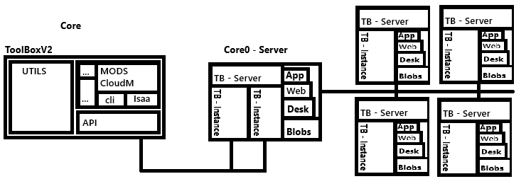

# ToolBoxV2 🧰

[](https://pypi.python.org/pypi/ToolBoxV2)
[](https://www.buymeacoffee.com/markinhaus)

A flexible modular framework for tools, functions, and complete applications – deployable locally, on the web, or as a desktop/mobile app.

---

## 🔍 Overview

ToolBoxV2 combines a Python backend library with a Rust web/desktop server (Actix) and a cross-platform UI framework (Tauri + tbjs). This architecture enables the creation of versatile applications accessible through various interfaces.

```text
+------------------------+
|        Users           |
|  - Web, Desktop, Mobile|
+-----------+------------+
            |
            ▼
+-----------+------------+
|    UI Layer (tbjs)     |
|  - WebAssets (Webpack) |
|  - Tauri App           |
+-----------+------------+
            |
            ▼
+-----------+------------+
|     Rust Server        |
|  - Actix Web           |
|  - PyO3 Integration    |
+-----------+------------+
            |
            ▼
+-----------+------------+
|     Python Backend     |
|  - toolboxv2.mods      |
|  - toolboxv2.utils     |
+------------------------+
```

---

## 🎯 Goal

The primary goal of ToolBoxV2 is to provide a flexible platform that enables developers, end-users, and small to medium-sized businesses to efficiently create, customize, and use applications. It aims to:
*   Execute applications seamlessly.
*   Integrate diverse functionalities.
*   Ensure system-independence.

The underlying system, built on a monolithic modular architecture, combines the advantages of both approaches, enabling intuitive interaction with the digital world. It connects various components and provides utility functions accessible from anywhere. This platform promotes creative collaboration and eases access to digital resources.

---

## 🎯 Target Audiences & Use Cases

### 👩‍💻 For Developers

Utilize ToolBoxV2 as a framework to:
*   Create custom functions, widgets, or complete mini-applications.
*   Leverage existing modules (`mods`) or extend them with new components.
*   Build web, desktop, or mobile applications using a unified code stack (Python, Rust, Web Technologies).
*   Customize the user interface via the web frontend (tbjs).

### 🙋 For End Users

Access and use a variety of pre-built applications and functions:
*   Directly in a web browser, or as a native desktop/mobile application (powered by Tauri).
*   No prior technical knowledge required.
*   Access flexible tools for tasks such as calendar management, note-taking, image diffusion, quote generation, etc.
*   Personalize the user interface to meet individual needs.

### 🏢 For Businesses / Operators

Deploy ToolBoxV2 as a customizable internal management system for:
*   Self-hosted and highly adaptable solutions.
*   Project, process, or employee management.
*   Integration of proprietary modules and functions.
*   Scalability suitable for small to medium-sized enterprises.
*   Modular, API-ready, and easily extensible.

---

## 🚀 Installation

### 🐍 Python Package (Core Library)

To install the core Python library directly via PyPI:
```bash
  pip install ToolBoxV2
```

For development or to get the latest version of the Python components:
```bash
  git clone https://github.com/MarkinHaus/ToolBoxV2.git
  cd ToolBoxV2
  # Recommended: Set up and activate a Python virtual environment here
  pip install -e .
  # or use
  uv pip install -e .
  # or use to install python and setup the env for you
  chmod +x install_python_env.sh
  ./install_python_env.sh

  # init hooks
  bash .github/hooks/setup_hooks.sh
```

### 🖥️ Full Stack Desktop/Web Application (Tauri + Web)

This setup includes the Python backend, Rust server, and Tauri/Web frontend.

**Prerequisites:**
*   Python 3.10 or higher
*   [Rust and Cargo](https://www.rust-lang.org/tools/install)
*   [Node.js](https://nodejs.org/) (which includes npm)
*   Tauri CLI: `cargo install tauri-cli`

for execution details use [package.json](toolboxv2/package.json)
or run tb --help

---


## 🧪 CI/CD & Deployment

Automated processes are managed using GitHub Actions for:
*   🔁 **Build & Test**: Validating both Rust and Python components.
*   🚀 **Release**: Publishing to PyPI, building Tauri applications, and potentially Docker images.

---

## 🌱 Example Projects & Ideas

ToolBoxV2 can be used to build a wide range of applications, including:
*   🔗 Link shortener
*   🧠 Live notes with versioning
*   🎨 Diffusion system for generating visual assets
*   📅 Calendar and scheduling tools
*   📝 Quote/Offer generation system
*   🎮 Multiplayer TicTacToe
*   🤖 Chat/Voice bots with P2P communication capabilities

---

## 📚 Learn More / Further Information

*   [📦 Current Installer (Web Demo/Entry)](https://simplecore.app/web/core0/Installer.html)
*   [📚 Documentation (WIP)](https://markinhaus.github.io/ToolBoxV2/)
*   [🐍 PyPI Package](https://pypi.org/project/ToolBoxV2)
*   [🐙 GitHub Repository](https://github.com/MarkinHaus/ToolBoxV2)

---

## 📄 License

This project is distributed under a custom license. Please refer to the [LICENSE](./LICENSE) file in the repository for detailed terms and conditions.

---

© 2022–2025 Markin Hausmanns – All rights reserved.

