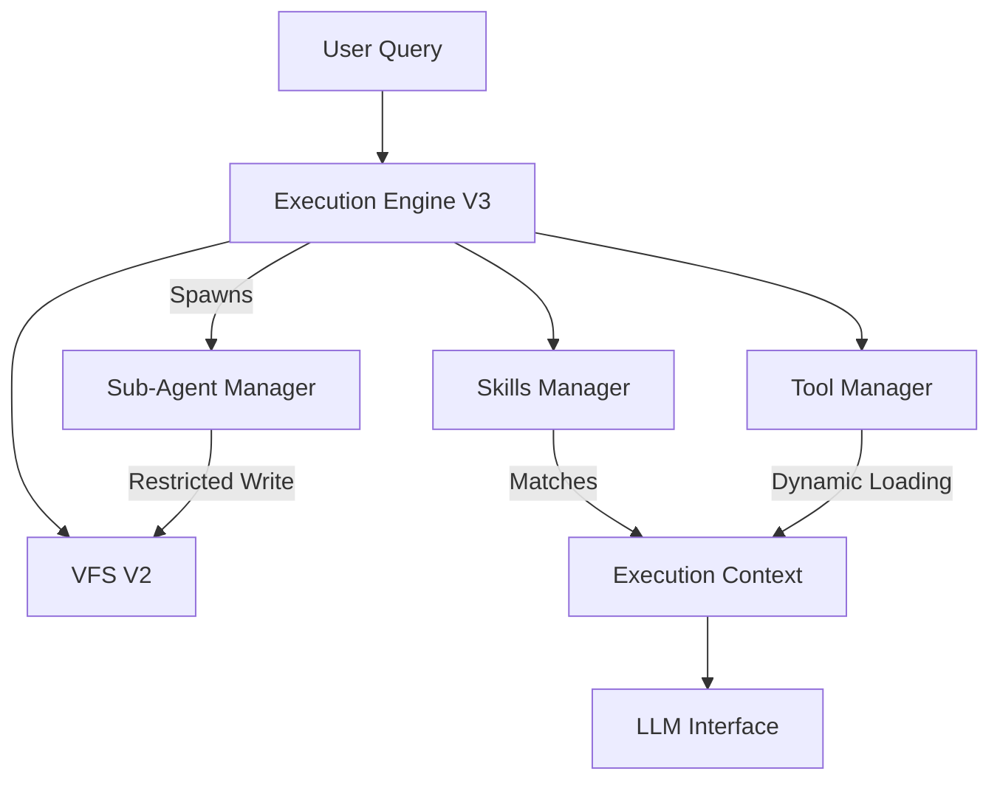

# FlowAgent System Dokumentation

## 1. System-Architektur Übersicht

FlowAgent ist ein autonomes Agentensystem, das auf einer modularen V3-Architektur basiert. Der Fokus liegt auf Token-Effizienz, Sicherheit durch Isolation (Sub-Agents) und gelerntem Verhalten (Skills).



---

## 2. Execution Engine V3

Die `ExecutionEngine` (`execution_engine.py`) orchestriert den Denkprozess des Agenten. Sie löst das Problem des "Context Overflow" und der "Looping Agents".

### Kern-Features

1.  **Dynamic Tool Loading (Slots)**
    *   Der Agent hat ein Limit von (standardmäßig) **5 aktiven Tool-Slots**.
    *   Tools werden basierend auf **Relevanz-Scores** (Keyword-Overlap zwischen Query und Tool-Beschreibung) geladen.
    *   Wenn das Limit erreicht ist, wird das Tool mit der niedrigsten Relevanz automatisch entladen.
    *   *Validiert in `TestExecutionContext.test_add_remove_tool`*.

2.  **History Separation & Compression**
    *   **Working History:** Temporärer Verlauf für den aktuellen Thought-Loop.
    *   **Permanent History:** Langzeitgedächtnis.
    *   **Compression Triggers:**
        *   `final_answer`: Komprimiert den gesamten `working_history` in eine Zusammenfassung und speichert sie permanent.
        *   `load_tools` (bei Kategorie-Wechsel): Führt eine partielle Kompression durch, um Token zu sparen, wenn der Agent das Thema wechselt.
    *   *Validiert in `TestHistoryCompressor`*.

3.  **Auto Focus Tracker**
    *   Verhindert, dass kleine Modelle vergessen, was sie gerade getan haben.
    *   Injiziert eine kurze Liste der letzten 5 Aktionen (z.B. "✏️ Wrote /app.py (45 lines)") direkt vor die User-Query im Prompt.
    *   *Validiert in `TestAutoFocusTracker`*.

4.  **Loop Detector**
    *   Erkennt zwei Muster:
        1.  **Exact Repeat:** 3x das gleiche Tool mit exakt gleichen Argumenten.
        2.  **Ping-Pong:** Alternierende Calls (A -> B -> A -> B).
    *   Intervention: Injiziert eine System-Warnung, die den Agenten auffordert, den Ansatz zu ändern oder ehrlich aufzugeben.
    *   *Validiert in `TestLoopDetector`*.

---

## 3. Skills System

Der `SkillsManager` (`skills.py`) ersetzt starre Regelwerke durch dynamisch gelernte oder vordefinierte Verhaltensmuster.

### Funktionsweise
1.  **Hybrid Matching:** Sucht Skills zuerst per Keyword (schnell), dann per Embedding (falls Memory verfügbar).
2.  **Instruction Injection:** Wenn ein Skill passt (z.B. "Daten speichern"), wird eine spezifische Anleitung in den System-Prompt injiziert (z.B. "Nutze `vfs_write` und bestätige den Pfad").
3.  **Auto-Learning:** Nach erfolgreichen Runs analysiert der Agent seinen eigenen Erfolg und erstellt bei Bedarf einen neuen Skill (startet mit niedriger Confidence).

### Wichtige Predefined Skills
Das System kommt mit 12 vordefinierten Skills (`_init_predefined_skills`):
*   `parallel_subtasks`: Anleitung zur Nutzung von Sub-Agents.
*   `vfs_knowledge_base`: Strukturierte Ablage von Wissen in `/info/`.
*   `error_recovery`: Strategien bei Fehlern.
*   `user_preference_save`: Merken von Nutzerdaten.

---

## 4. Sub-Agent System

Das `SubAgentSystem` (`sub_agent.py`) ermöglicht echte Parallelisierung und Aufgaben-Isolation.

### Architektur & Einschränkungen
*   **Max Depth = 1:** Ein Sub-Agent kann keine weiteren Sub-Agents starten (verhindert Rekursions-Explosionen).
*   **Write Isolation:** Ein Sub-Agent darf **NUR** in sein zugewiesenes Verzeichnis schreiben (`/sub/<task_id>/`). Schreibversuche woanders werden vom `RestrictedVFSWrapper` blockiert.
*   **Global Read:** Sub-Agents können das gesamte VFS lesen (Kontext-Zugriff).
*   **Keine Rückfragen:** Sub-Agents sind "Fire-and-Forget". Sie können den User nicht um Klärung bitten.

### Workflow
1.  Main Agent ruft `spawn_sub_agent(task="...", output_dir="res_a", wait=False)` auf.
2.  Engine startet einen isolierten Prozess mit eigenem `ExecutionEngine` Kontext.
3.  Main Agent macht weiter (z.B. startet zweiten Sub-Agent).
4.  Main Agent ruft `wait_for(["sub_id_1", "sub_id_2"])`.
5.  Ergebnisse werden aus den `result.md` Dateien der Sub-Agents zusammengeführt.

*Validiert in `TestSubAgentManager` und `TestRestrictedVFSWrapper`.*

---

## 5. Virtual File System V2

Das VFS (`vfs_v2.py`) wurde massiv erweitert, um wie ein echtes Dateisystem zu agieren.

### Neue Features
*   **Hierarchien:** Echte Verzeichnisse (`mkdir`, `rmdir`, `mv` funktionieren rekursiv).
*   **Shadow Mounts:** Lokale Ordner können ins VFS "gemountet" werden. Änderungen werden synchronisiert (`FileBackingType.SHADOW`).
*   **LSP Integration:** Dateien haben Typen (`FileTypeInfo`). Wenn `enable_lsp=True`, werden Syntax-Fehler und Warnungen (via `LSPManager`) direkt im VFS-Objekt gespeichert.
*   **System Context:** Dateien wie `/system_context` und `/active_rules` sind read-only und enthalten dynamische Agenten-Metadaten.

---

## 6. Verfügbare Tools

Der Agent unterscheidet zwischen statischen (immer verfügbar) und dynamischen (müssen geladen werden) Tools.

### Statische Tools (Core)
| Tool | Beschreibung |
|------|--------------|
| `think` | Reasoning-Schritt. Wird im AutoFocus getrackt. |
| `final_answer` | Abschluss der Aufgabe. Triggert History Compression. |
| `list_tools` | Zeigt verfügbare dynamische Tools (nach Kategorie). |
| `load_tools` | Lädt dynamische Tools in die Slots. |
| `vfs_read/write/...` | Voller VFS-Zugriff (Read, Write, List, Mkdir, Mv). |
| `spawn_sub_agent` | (Nur Main Agent) Startet parallele Tasks. |
| `wait_for` | (Nur Main Agent) Wartet auf Sub-Agents. |

### Dynamische Tools
Diese werden über den `ToolManager` registriert (lokal, MCP oder A2A) und müssen vom Agenten bei Bedarf geladen werden.
*   Beispiel: `discord_send`, `github_pull`, `web_search`.

---

## 7. Python API Beispiele

### Initialisierung des Builders
```python
from toolboxv2.mods.isaa.base.Agent.builder import FlowAgentBuilder

agent = await (FlowAgentBuilder()
    .with_name("DevBot")
    .with_models("claude-3-haiku", "gpt-4o")
    .with_developer_persona()     # Lädt Persona-Regeln in RuleSet
    .with_checkpointing(enabled=True)
    .with_vfs_window_lines(300)
    .build())
```

### Manuelle Ausführung (Low-Level)
```python
from toolboxv2.mods.isaa.base.Agent.execution_engine import ExecutionEngine

engine = ExecutionEngine(agent)

# Startet eine Session und führt Query aus
result = await engine.execute(
    query="Analysiere die Logs in /logs und erstelle einen Report",
    session_id="session_dev_1",
    max_iterations=20
)
```

### Streaming Response
```python
# Für UI/Voice Integration
stream_gen, ctx = await engine.execute_stream(
    query="Erstelle eine Python Datei",
    session_id="stream_sess"
)

async for chunk in stream_gen(ctx):
    if chunk["type"] == "content":
        print(chunk["chunk"], end="")
    elif chunk["type"] == "tool_start":
        print(f"\n[Tool: {chunk['name']}]")
```

---

## 8. Checkpoints & State

Das System nutzt den `CheckpointManager` für volle Persistenz:
*   **VFS State:** Alle Dateien (Memory & Shadow Mount Configs).
*   **Skills:** Gelernte Skills und Confidence-Scores.
*   **Session State:** Chat History und aktive Tool-Einschränkungen.

*Validiert in `TestCheckpointManager`.*
