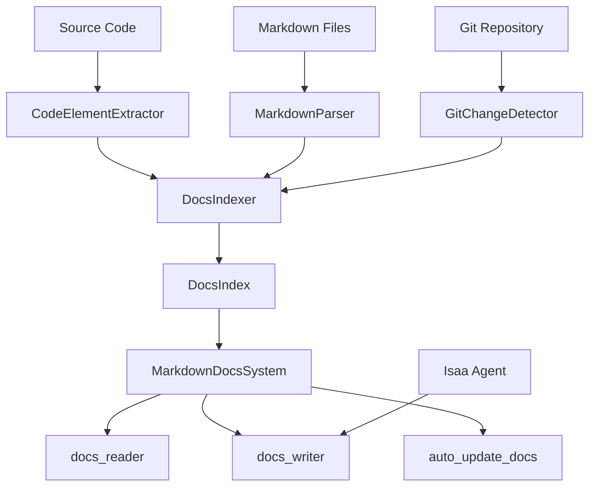

# MarkdownDocsSystem - Bidirectional Documentation System

**Tags:** documentation, markdown, indexing, automation, ai-integration

## Overview

The MarkdownDocsSystem is a sophisticated bidirectional documentation management system that intelligently connects source code with markdown documentation. It provides automated indexing, change detection, and AI-powered content generation while maintaining precise programmatic control over documentation structure.

### Key Features

- **Bidirectional Sync**: Automatically detects changes in code and suggests documentation updates
- **Git Integration**: Tracks changes using git commits for efficient incremental updates
- **AI-Powered Generation**: Uses LLM agents to generate high-quality documentation content
- **Index-Based Operations**: Fast lookups and operations using comprehensive documentation index
- **Source Code Linking**: Maintains references between documentation sections and code elements
- **MCP Integration**: Full integration with Model Context Protocol for tool access

## Architecture



### Core Components

The system consists of several specialized components working together:

#### DocsIndexer (`toolboxv2/mods/markdown_docs_system.py:DocsIndexer`)

Responsible for building and maintaining the comprehensive documentation index.

```python
# Example: Initialize with custom directories
indexer = DocsIndexer(
    project_root=Path.cwd(),
    docs_root=Path("docs"),
    include_dirs=["toolboxv2", "src", "modules"],
    exclude_dirs=["__pycache__", "node_modules", ".venv"]
)
```

**Key Methods:**
- `build_initial_index()`: Creates complete index on first run
- `update_index()`: Incremental updates based on git changes
- `_get_filtered_files()`: Applies include/exclude directory filters

#### CodeElementExtractor (`toolboxv2/mods/markdown_docs_system.py:CodeElementExtractor`)

Extracts classes, functions, and other code elements from Python source files.

```python
# Example: Extract elements from a Python file
extractor = CodeElementExtractor()
elements = extractor.extract_python_elements(Path("toolboxv2/app.py"))

for element in elements:
    print(f"{element.element_type}: {element.name} at line {element.line_start}")
```

#### MarkdownParser (`toolboxv2/mods/markdown_docs_system.py:MarkdownParser`)

Parses markdown files into structured sections with metadata extraction.

```python
# Example: Parse markdown file
parser = MarkdownParser()
sections = parser.parse_file(Path("docs/api.md"))

for section in sections:
    print(f"Section: {section.title} (Level {section.level})")
    print(f"Source refs: {section.source_refs}")
    print(f"Tags: {section.tags}")
```

## Installation & Setup

### Basic Setup

```python
from toolboxv2 import get_app
from markdown_docs_system import add_to_app

# Initialize your toolbox app
app = get_app("my_docs_app")

# Add documentation system
docs_system = add_to_app(
    app,
    include_dirs=["src", "lib", "modules"],  # Directories to scan
    exclude_dirs=["tests", "build", "dist"]  # Directories to ignore
)

# Access through app
await app.docs_reader(query="installation guide")
```

### MCP Integration

The system automatically integrates with MCP servers:

```python
# In your MCP server class
class MyMCPServer:
    def __init__(self):
        self.tb_app = get_app("mcp-server")
        # Documentation system is automatically available
        # through self.tb_app.mkdocs
```

### Configuration Options

| Parameter | Type | Default | Description |
|-----------|------|---------|-------------|
| `docs_root` | str | "docs" | Root directory for documentation files |
| `source_root` | str | "toolboxv2" | Root directory for source code |
| `include_dirs` | List[str] | ["toolboxv2", "src", "lib"] | Directories to include in indexing |
| `exclude_dirs` | List[str] | [Standard excludes] | Directories to exclude from indexing |

## Usage Examples

### Reading Documentation

```python
# Basic search
result = await app.docs_reader(query="authentication")
print(f"Found {result.data['metadata']['matching_sections']} sections")

# Specific section lookup
result = await app.docs_reader(section_id="api.md#Authentication")

# Filter by tags
result = await app.docs_reader(
    tags=["api", "authentication"],
    format_type="markdown"
)

# Include source code references
result = await app.docs_reader(
    query="Agent class",
    include_source_refs=True
)
```

### Writing Documentation

```python
# Create new documentation file
await app.docs_writer(
    action="create_file",
    file_path="new_feature.md",
    content="# New Feature\n\nOverview of the new feature."
)

# Add section to existing file
await app.docs_writer(
    action="add_section",
    file_path="api.md",
    section_title="Authentication Methods",
    content="Details about authentication...",
    position="after:Overview",
    level=2
)

# Generate from source code with AI
await app.docs_writer(
    action="generate_from_code",
    source_file="toolboxv2/auth.py",
    file_path="auth_guide.md",
    auto_generate=True
)

# Update existing section
await app.docs_writer(
    action="update_section",
    file_path="api.md",
    section_title="Authentication Methods",
    content="Updated authentication details...",
    auto_generate=False
)
```

### Automated Maintenance
### Advanced Analysis

```python
# Parse existing TOCs and analyze completeness
result = await app.docs_init(force_rebuild=True)
print(f"Completion rate: {result.data['completion_rate']}")

# Find unclear or missing documentation
analysis = await app.find_unclear_and_missing(analyze_tocs=True)
print(f"Found {analysis.data['summary']['total_unclear']} unclear sections")

# Clean rebuild with options
result = await app.rebuild_clean_docs(
    keep_unclear=True,
    keep_missing=False,
    keep_level=3,
    update_mkdocs=True
)
```

## API Reference

### Core Functions

#### `docs_reader(query, section_id, file_path, tags, include_source_refs, format_type)`

**Source:** `toolboxv2/mods/markdown_docs_system.py:MarkdownDocsSystem.docs_reader`

Reads documentation using index-based lookups (no AI required).

**Parameters:**
- `query` (str, optional): Search text for titles and content
- `section_id` (str, optional): Specific section identifier
- `file_path` (str, optional): Filter by documentation file
- `tags` (List[str], optional): Filter by section tags
- `include_source_refs` (bool): Include code references (default: True)
- `format_type` (str): Output format - "structured", "markdown", or "json"

**Returns:** `Result` with matched sections and metadata

**Example:**
```python
result = await app.docs_reader(
    query="API endpoints",
    tags=["api"],
    format_type="structured"
)

if result.is_ok():
    for section in result.data['sections']:
        print(f"Found: {section['title']}")
```

#### `docs_writer(action, file_path, section_title, content, source_file, auto_generate, position, level)`

**Source:** `toolboxv2/mods/markdown_docs_system.py:MarkdownDocsSystem.docs_writer`

Writes documentation with precise programmatic control.

**Parameters:**
- `action` (str): Action type - "create_file", "add_section", "update_section", "generate_from_code"
- `file_path` (str, optional): Target documentation file
- `section_title` (str, optional): Section title for add/update operations
- `content` (str, optional): Section content (if not auto-generating)
- `source_file` (str, optional): Source code file for generation
- `auto_generate` (bool): Use AI for content generation (default: False)
- `position` (str, optional): Section position - "top", "bottom", "after:SectionName"
- `level` (int): Header level for new sections (default: 2)

**Returns:** `Result` with operation details and index updates

### Analysis Functions

#### `get_update_suggestions(force_scan, priority_filter)`

Analyzes code changes and suggests documentation updates.

#### `find_unclear_and_missing(analyze_tocs)`

Identifies unclear documentation and missing implementations.

#### `source_code_lookup(element_name, file_path, element_type)`

Searches code elements and their documentation references.

## Advanced Features

### Git Integration

### Directory Filtering

Precise control over which files are indexed:

```python
docs_system = add_to_app(
    app,
    include_dirs=[
        "toolboxv2",      # Main source code
        "plugins",        # Plugin modules
        "docs"           # Existing documentation
    ],
    exclude_dirs=[
        "__pycache__",   # Python cache
        ".git",          # Git metadata
        "node_modules",  # Node dependencies
        ".venv",         # Virtual environment
        "build",         # Build artifacts
        "dist",          # Distribution files
        "temp"           # Temporary files
    ]
)
```

### AI Agent Integration

Seamless integration with Isaa agents for content generation:

```python
# The system automatically uses available agents
# No manual configuration needed for basic usage

# For custom agent selection:
isaa = app.get_mod("isaa")
custom_agent = await isaa.get_agent("documentation-specialist")
```

### Index Persistence

The system maintains a persistent index for fast operations:

```json
{
  "version": "1.0",
  "last_git_commit": "a1b2c3d4...",
  "last_indexed": "2024-01-15T10:30:00",
  "sections": {
    "api.md#Authentication": {
      "title": "Authentication",
      "content": "...",
      "source_refs": ["toolboxv2/auth.py:AuthManager"],
      "tags": ["api", "security"]
    }
  },
  "code_elements": {
    "toolboxv2/auth.py:AuthManager": {
      "name": "AuthManager",
      "element_type": "class",
      "signature": "class AuthManager",
      "line_start": 15
    }
  }
}
```

## Integration Patterns

### With ToolBoxV2 Apps

```python
from toolboxv2 import App

class MyToolboxApp(App):
    def __init__(self):
        super().__init__()
        # Documentation system automatically available as self.mkdocs

    async def document_feature(self, feature_name: str):
        """Document a specific feature"""
        return await self.docs_writer(
            action="add_section",
            file_path="features.md",
            section_title=feature_name,
            auto_generate=True
        )
```

### With MCP Servers

```python
@server.call_tool()
async def handle_call_tool(name: str, arguments: dict):
    if name == "generate_docs":
        result = await self.tb_app.docs_writer(
            action="generate_from_code",
            source_file=arguments["source_file"],
            auto_generate=True
        )
        return [types.TextContent(type="text", text=str(result.data))]
```

## Troubleshooting

### Common Issues

#### Index Not Building
```python
# Check directory permissions and filters
docs_system = add_to_app(app, include_dirs=["your_source_dir"])

# Force rebuild
result = await app.docs_init(force_rebuild=True)
```

#### AI Generation Failures
```python
# Check agent availability
isaa = app.get_mod("isaa")
agents = await isaa.list_agents()
print("Available agents:", agents)

# Manual content as fallback
await app.docs_writer(
    action="add_section",
    file_path="manual.md",
    section_title="Manual Section",
    content="Manually written content...",
    auto_generate=False
)
```

### Performance Optimization

For large codebases:

```python
# Limit included directories
docs_system = add_to_app(
    app,
    include_dirs=["src"],  # Only essential directories
    exclude_dirs=[         # Comprehensive exclusions
        "__pycache__", "node_modules", ".git",
        "build", "dist", ".venv", "tests"
    ]
)

```

## Contributing

### Adding New Extractors

To support additional file types:

```python
class JavaScriptExtractor:
    def extract_js_elements(self, file_path: Path) -> List[CodeElement]:
        # Implementation for JavaScript/TypeScript
        pass

# Register in DocsIndexer._update_file_in_index()
```

### Extending Analysis

```python
class CustomAnalyzer(DocsAnalyzer):
    def find_outdated_examples(self) -> List[str]:
        # Custom analysis logic
        pass
```

### Custom AI Prompts

```python
async def _generate_section_content(self, title: str, source_file: str) -> str:
    # Override with custom prompts
    custom_prompt = f"Generate technical documentation for {title}..."
    # ... implementation
```

---

**Source References:**
- `toolboxv2/utils/extras/mkdocs.py:MarkdownDocsSystem`
- `toolboxv2/utils/extras/mkdocs.py:DocsIndexer`
- `toolboxv2/utils/extras/mkdocs.py:CodeElementExtractor`
- `toolboxv2/utils/extras/mkdocs.py:MarkdownParser`

**Last Updated:** 2024-01-15
**Version:** 1.0.0
**Maintainer:** ToolBoxV2
