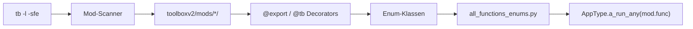

# All Functions Enums (`utils/system/all_functions_enums.py`)

> **⚠️ AUTO-GENERIERT** — Diese Datei wird von `tb -l -sfe` generiert.
> **NICHT manuell bearbeiten!** Inhalt ändert sich je nach installierten Mods.

## Why This Matters

`all_functions_enums.py` ist die **Brücke** zwischen Mod-Code und dem ToolBoxV2 Dispatch-System. Wenn ein Mod eine Funktion mit `@app.tb(name="do_thing")` exportiert, wird diese Funktion hier als Enum-Member registriert. Das Dispatch-System nutzt diese Enums, um API-Aufrufe (`/api/ModName/do_thing`) zu den richtigen Python-Funktionen zu routen.

Ohne diese Datei wüsste `AppType.a_run_any()` nicht, welche Funktionen existieren.

## Konzept

`all_functions_enums.py` ist die **Dispatch-Tabelle** von ToolBoxV2. Für jedes installierte Mod wird eine `Enum`-Klasse generiert, deren Member die exportierten Funktionen des Mods abbilden.



## Generierung

### Befehl

```bash
tb -l -sfe
```

| Flag | Bedeutung |
|------|-----------|
| `-l` | Lädt alle installierten Mods |
| `-sfe` | **s**can **f**or **e**nums — generiert die Enum-Datei |

### Prozess

1. **Mod-Discovery**: `toolboxv2/mods/` wird gescannt
2. **Export-Extraktion**: Jedes `@app.tb(name=..., mod_name=...)` wird registriert
3. **Enum-Konstruktion**: Pro Mod wird eine `Enum`-Klasse erstellt
4. **Datei-Write**: `all_functions_enums.py` wird überschrieben

### Wann regenerieren?

- Nach Installation/Deinstallation eines Mods
- Nach Hinzufügen/Entfernen von `@export`-Funktionen
- Nach Mod-Updates mit neuen Funktionen

## Enum-Struktur

Jede Enum-Klasse folgt diesem Muster:

```python
class CLOUDM_AUTHMANAGER(Enum):
    NAME = 'CloudM.AuthHelper'                    # Mod-Name
    DELETE_USER = 'delete_user'                   # Funktions-Name
    CREATE_USER = 'create_user'                   # Input: (['app', 'data', ...])
    AUTHENTICATE_USER_GET_SYNC_KEY = '...'        # Output: ApiResult
    # ...
```

### Enum-Naming-Konvention

`<MOD>_<SUBMODULE>` in UPPER_CASE:

| Enum-Klasse | Mod-Pfad |
|------------|---------|
| `CLOUDM_AUTHMANAGER` | `CloudM.AuthHelper` |
| `CLOUDM_USERINSTANCES` | `CloudM.UserInstances` |
| `CLOUDM_DASHBOARDS` | `CloudM.Dashboards` |
| `DB` | `DB` |
| `ISAA` | `isaa` |
| `CHATMODULE` | `ChatModule` |

### Enum-Member

Jede Enum hat Standard-Member:

| Member | Beschreibung |
|--------|-------------|
| `NAME` | Vollqualifizierter Mod-Name (z.B. `'CloudM.AuthHelper'`) |
| `APP_INSTANCE` | `app_instance` Funktion (Lifecycle) |
| `APP_INSTANCE_TYPE` | `app_instance_type` Funktion |
| `<FUNC>` | Eine exportierte Funktion des Mods |
| `ON_EXIT` | `on_exit` Cleanup-Funktion (falls vorhanden) |

## Runtime-Nutzung

Der Dispatch-Mechanismus nutzt diese Enums um Funktionsaufrufe zu routen:

```python
# Direkter Aufruf über AppType
result = await app.a_run_any("CloudM.AuthHelper.create_user", data=user_data)

# Äquivalent über Enum (wenn importiert)
from toolboxv2.utils.system.all_functions_enums import CLOUDM_AUTHMANAGER
func_name = CLOUDM_AUTHMANAGER.CREATE_USER.value  # → 'create_user'
mod_name = CLOUDM_AUTHMANAGER.NAME.value           # → 'CloudM.AuthHelper'
result = await app.a_run_any(CLOUDM_AUTHMANAGER.CREATE_USER, data=user_data)
```

## Warum konzeptionell dokumentieren?

Der konkrete Inhalt von `all_functions_enums.py` ist ein **Snapshot** der aktuell installierten Mods. Er ist:
- **Reproduzierbar** — `tb -l -sfe` regeneriert ihn jederzeit
- **Instanz-spezifisch** — verschiedene Installationen haben verschiedene Enums
- **Nicht versioniert** — sollte nicht in Git committed werden

Daher: Die tatsächlichen Mod-Funktionen müssen **pro Mod** in `docs/mods/` dokumentiert werden, NICHT hier.

## Mod-Funktionen dokumentieren

Für jedes Mod sollte die Mod-Doku folgende Informationen enthalten:

1. **Mod-Name** (z.B. `CloudM.AuthHelper`)
2. **Exportierte Funktionen** mit Input-Signaturen und Output-Typen
3. **Access-Level** (public/admin)
4. **API-Verfügbarkeit** (CLI, REST, WebSocket)

Beispiel-Sektion in einer Mod-Doc:

```markdown
## Exported Functions

| Function | Input | Output | Access | API |
|----------|-------|--------|--------|-----|
| `create_user` | `(app, data, username, email, pub_key, invitation)` | `ApiResult` | Admin | POST /api/users |
| `validate_persona` | `(app, data)` | `ApiResult` | Public | POST /api/auth/validate |
```

## Related

- [Core Types](types.md) — `AppType.a_run_any()` Dispatch
- [ISAA Overview](../mods/isaa/index.md) — Agent Tool-Registration
- [CloudM Index](../mods/CloudM/index.md) — CloudM Sub-Module
