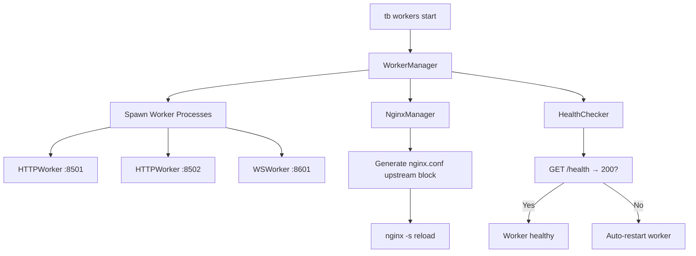

# WorkerManager & NginxManager (`utils/clis/cli_worker_manager.py`)

> **File:** `toolboxv2/utils/clis/cli_worker_manager.py` (~1598 Zeilen)
> **Typ:** Reference + Explanation
> Worker-Prozess-Management + Nginx-Config-Generierung + Health-Checks.

## Why This Matters

Wenn `tb workers` aufgerufen wird, ist der WorkerManager dafür verantwortlich:
1. HTTP/WS Worker-Prozesse zu starten/stoppen
2. Nginx-Upstream-Configs zu generieren und zu reloaden
3. Health-Checks durchzuführen (HTTP 200 auf `/health`)
4. Pre-allocated Ports zu verwalten

Ohne WorkerManager kein funktionierendes Multi-Worker-Setup.



## WorkerManager

Verwaltet Worker-Prozesse (HTTP, WS, Broker, Event).

### Configuration

```python
WorkerManager(
    app_id="main-DESKTOP",
    config_dir="~/.local/share/ToolBoxV2/.config/",
    worker_base_port=8500,
    max_workers=10,
)
```

### Key Methods

| Method | Signature | Description |
|--------|-----------|-------------|
| `start_worker` | `(worker_type, name=None) → int` | Start single worker, returns PID |
| `stop_worker` | `(worker_id) → bool` | Stop worker by ID |
| `stop_all` | `() → List[str]` | Stop all workers |
| `restart_worker` | `(worker_id) → int` | Restart, returns new PID |
| `get_workers` | `() → List[Dict]` | All workers with status |
| `get_worker_info` | `(worker_id) → Dict` | Single worker details |
| `scale_workers` | `(worker_type, count) → List[int]` | Scale to N workers |
| `allocate_port` | `(worker_type) → int` | Next available port |
| `save_state` | `()` | Persist worker state to JSON |
| `load_state` | `()` | Restore worker state |

### Worker Types

| Type | Base Port | Description |
|------|-----------|-------------|
| `http_worker` | 8500 | WSGI HTTP Worker |
| `ws_worker` | 8600 | WebSocket Worker |
| `broker` | 8700 | ZeroMQ Broker |
| `event` | 8800 | Event Manager |

## NginxManager

Generiert und verwaltet Nginx-Konfiguration für Worker-Upstreams.

### Key Methods

| Method | Signature | Description |
|--------|-----------|-------------|
| `__init__` | `(config)` | Init with worker config |
| `generate_upstream` | `(workers) → str` | Generate upstream block |
| `generate_location` | `(path, upstream) → str` | Generate location block |
| `write_config` | `(nginx_conf_path) → bool` | Write nginx.conf |
| `reload` | `() → bool` | `nginx -s reload` |
| `validate` | `() → bool` | `nginx -t` syntax check |

### Generated Config Structure

```nginx
upstream tb_http {
    server 127.0.0.1:8501 weight=1;
    server 127.0.0.1:8502 weight=1;
}

upstream tb_ws {
    server 127.0.0.1:8601;
}

server {
    listen 80;
    
    location / {
        proxy_pass http://tb_http;
        proxy_set_header X-Real-IP $remote_addr;
    }
    
    location /ws {
        proxy_pass http://tb_ws;
        proxy_http_version 1.1;
        proxy_set_header Upgrade $http_upgrade;
        proxy_set_header Connection "upgrade";
    }
}
```

## HealthChecker

```mermaid
sequenceDiagram
    participant HC as HealthChecker
    participant W as Worker (:8501)
    
    loop Every 10s
        HC→>W: GET /health
        alt 200 OK
            W-->>HC: {"status": "healthy"}
            HC→>HC: mark healthy, reset fail_count
        else Timeout / 5xx
            W-->>HC: error
            HC→>HC: fail_count++
            alt fail_count >= 3
                HC→>HC: trigger restart
            end
        end
    end
```

### Key Methods

| Method | Signature | Description |
|--------|-----------|-------------|
| `_check_worker` | `(worker_info) → bool` | Single health check |
| `check_all` | `() → Dict[str, bool]` | Check all workers |
| `start_monitoring` | `(interval=10)` | Background monitoring thread |
| `stop_monitoring` | `()` | Stop monitoring |
| `get_unhealthy` | `() → List[str]` | Currently unhealthy workers |

## How-to: Start Workers via CLI

```bash
# Start 2 HTTP workers + 1 WS worker
tb workers start --type http --count 2
tb workers start --type ws --count 1

# Check status
tb workers status

# Scale HTTP workers to 4
tb workers scale --type http --count 4

# Stop all
tb workers stop --all
```

## Used By

- `tb workers` CLI command
- [Runtime Config](../runtime/config.md) — worker ports
- [Server Worker](../runtime/server_worker.md) — workers connect to nginx

## Related

- [HTTPWorker](../runtime/server_worker.md)
- [WS Worker](ws_worker.md)
- [Event Manager](../runtime/event_manager.md) — ZeroMQ broker
- [Runtime Config](../runtime/config.md)
