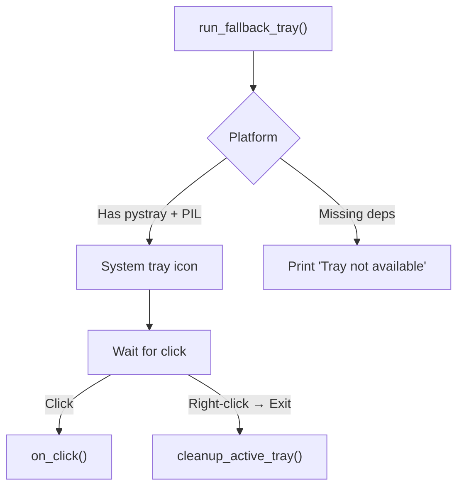

# Fallback Tray (`utils/extras/fallback_tray.py`)

> **File:** `toolboxv2/utils/extras/fallback_tray.py` (~129 Zeilen)
> **Typ:** Reference
> System-Tray Icon (Fallback) wenn keine GUI verfügbar ist.

## API Reference

| Function | Signature | Description |
|----------|-----------|-------------|
| `create_gear_icon` | `() → PIL.Image` | Generate gear icon bitmap |
| `run_fallback_tray` | `(on_click=None, tooltip="ToolBoxV2")` | Start system tray with callback |
| `cleanup_active_tray` | `()` | Remove tray icon, stop tray thread |

## How-to: Use

```python
from toolboxv2.utils.extras.fallback_tray import run_fallback_tray

def on_tray_click():
    print("Tray clicked!")

# Blocks until tray is closed
run_fallback_tray(on_click=on_tray_click, tooltip="TB running")
```

## Architecture



## Common Pitfalls

- **No pystray**: Falls back to print-only. `pip install pystray Pillow` to enable.
- **Headless**: No display → silent fallback. Don't rely on tray for headless servers.
- **Blocking**: `run_fallback_tray` blocks the calling thread. Run in background thread.

## Used By

- `tb gui` — fallback when CustomTkinter fails to start
- [Notifications](notification.md) — tray notification fallback

## Related

- [Notifications](notification.md) — higher-level notification API
- [Style](style.md) — terminal counterpart
