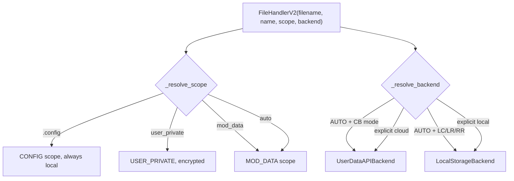

# FileHandlerV2 (`utils/system/file_handler.py`)

> **File:** `toolboxv2/utils/system/file_handler.py` (~999 Zeilen)
> Unified Storage Handler mit Auto-Backend-Erkennung, Scope-Detection, Verschlüsselung.

## Why This Matters

Jedes Mod das Daten speichert — Configs, User-Daten, Mod-States — nutzt `FileHandlerV2`. Es abstrahiert:
- **Wo** gespeichert wird (lokal vs CloudM UserDataAPI)
- **Wie** gespeichert wird (verschlüsselt vs plain)
- **Für wen** gespeichert wird (User-Private vs Mod-Data)

Ohne FileHandlerV2 müsste jedes Mod selbst Verschlüsselung, Backend-Auswahl und Serialisierung implementieren.

## How It Works

`FileHandlerV2` wählt automatisch den richtigen Storage-Backend (Local JSON oder CloudM UserDataAPI) basierend auf:
1. **Dateiendung** (`.config` → immer lokal, `.data` → auto)
2. **Manifest DB-Modus** (CB → Cloud, andere → Local)
3. **Expliziter Parameter** (`backend="local"` oder `backend="cloud"`)



## Constructor

```python
FileHandlerV2(
    filename: str,                    # muss auf .config oder .data enden
    name: str = "mainTool",           # Mod-Name für Namespacing
    keys: Optional[Dict[str, str]] = None,      # Legacy key-mapping
    defaults: Optional[Dict[str, Any]] = None,  # Default-Werte
    scope: Optional[Union[str, StorageScope]] = None,  # Storage-Scope
    backend: Union[str, StorageBackend] = StorageBackend.AUTO,
    encrypt: Optional[bool] = None,   # Auto für .config + USER_PRIVATE
    request: Optional["RequestData"] = None,     # Für User-Context
    user_context: Optional[UserContext] = None,  # Direkter User-Context
    base_path: Optional[Path] = None, # Basis-Pfad für lokales Storage
)
```

## StorageScope (Enum)

| Wert | Beschreibung | Standard-Verschlüsselung |
|------|-------------|------------------------|
| `CONFIG` | Mod-Konfiguration (`.config`) | ✅ Ja |
| `MOD_DATA` | Mod-Daten (`.data`) | ❌ Nein |
| `USER_PRIVATE` | Private User-Daten | ✅ Ja |
| `USER_PUBLIC` | Öffentliche User-Daten | ❌ Nein |

## StorageBackend (Enum)

| Wert | Beschreibung |
|------|-------------|
| `AUTO` | Auto-Detection via Manifest |
| `LOCAL` | Lokale JSON-Dateien |
| `USER_DATA_API` | CloudM UserDataAPI |

## Core API

### Sync

```python
fh = FileHandlerV2("mymod.data", name="MyMod")
fh.load()
value = fh.get("key", default="fallback")
fh.set("key", {"nested": "data"})
fh.save()
```

### Async

```python
fh = FileHandlerV2("mymod.data", name="MyMod")
await fh.aload()
await fh.aset("key", "value")
await fh.asave()
```

### Context Manager

```python
# Sync context manager (auto load/save)
with FileHandlerV2("mymod.data", name="MyMod") as fh:
    fh["key"] = "value"  # __setitem__
    val = fh["key"]       # __getitem__

# Async context manager
async with FileHandlerV2("mymod.data", name="MyMod") as fh:
    await fh.aset("key", "value")
```

### Dict-like Access

```python
fh["key"] = value        # __setitem__
val = fh["key"]          # __getitem__
del fh["key"]            # __delitem__
"key" in fh              # __contains__
len(fh)                  # __len__
for key in fh: ...       # __iter__
```

## Method Reference

| Method | Sync | Async | Beschreibung |
|--------|------|-------|-------------|
| `load()` / `aload()` | ✅ | ✅ | Lädt alle Daten vom Backend |
| `save()` / `asave()` | ✅ | ✅ | Speichert alle Daten |
| `get(key, default)` / `aget(key, default)` | ✅ | ✅ | Wert abfragen |
| `set(key, value)` / `aset(key, value)` | ✅ | ✅ | Wert setzen |
| `delete(key)` | ✅ | — | Schlüssel löschen |
| `keys()` / `list_keys()` | ✅ | — | Alle Schlüssel |
| `items()` / `list_items()` | ✅ | — | Alle Key-Value-Paare |
| `to_dict()` | ✅ | — | Alles als Dict |
| `update(dict)` | ✅ | — | Mehrere Werte setzen |
| `delete_file()` | ✅ | — | Gesamte Datei löschen |

## Backends

### LocalStorageBackend

- Speichert JSON-Dateien unter `<base_path>/.{data|config}/<mod_name>/`
- Optionale Verschlüsselung via `Code.encrypt_symmetric` (Device Key)
- Dateinamen: `<sanitized_key>.json`

### UserDataAPIBackend

- Delegiert an CloudM `UserDataAPI`
- Nutzt `UserContext` für Authentifizierung
- Scope-basierter Zugriff (USER_PRIVATE, USER_PUBLIC, MOD_DATA)

## UserContext

Kapselt User-Identität für Storage-Operationen:

```python
ctx = UserContext.from_request(request)
fh = FileHandlerV2("user.data", name="MyMod", user_context=ctx)
```

## Auto-Scope Detection

Scope wird aus dem Dateinamen abgeleitet, falls nicht explizit angegeben:

| Dateiname-Muster | Erkannter Scope |
|-----------------|----------------|
| `*.config` | `CONFIG` |
| `private*`, `user_private*` | `USER_PRIVATE` |
| `public*`, `user_public*` | `USER_PUBLIC` |
| sonstige `*.data` | `MOD_DATA` |

## Related

- [Core Types](types.md) — `AppType`, `Result`
- [Crypto Utilities](cryp.md) — `Code` class (Verschlüsselung)
- [CloudM UserDataAPI](../mods/CloudM/user_data.md) — Cloud-Backend
- [Session Management](../runtime/session.md) — nutzt `file_handler.py`
- [Storage Overview](../storage/index.md) — DB-Modi
