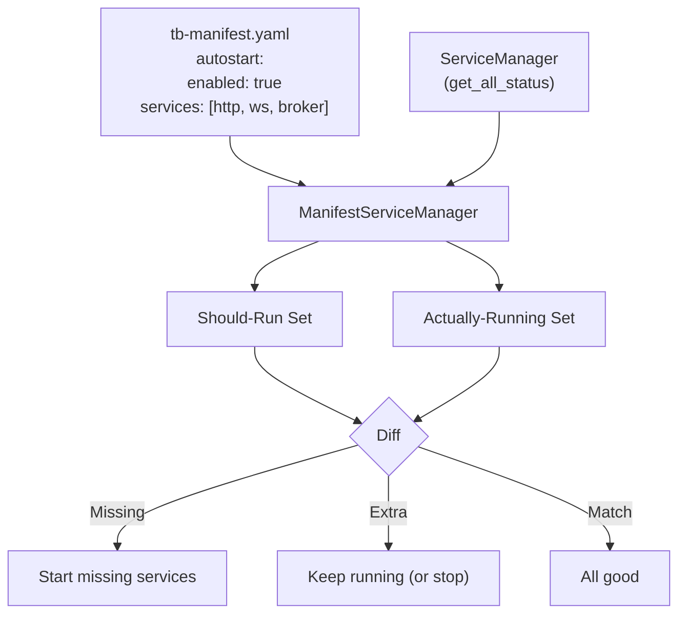

# ManifestServiceManager (`utils/manifest/service_manager.py`)

> **File:** `toolboxv2/utils/manifest/service_manager.py` (~262 Zeilen)
> **Typ:** Reference + Explanation
> Manifest-driven Service-Management — synchronisiert Manifest mit laufenden Services.

## Why This Matters

Der ManifestServiceManager ist die Brücke zwischen der statischen Manifest-Konfiguration (`tb-manifest.yaml`) und der dynamischen Service-Laufzeit. Er beantwortet:

> "Welche Services SOLLTEN laufen (laut Manifest) vs. welche LAUFEN tatsächlich?"

Und synchronisiert beides: Startet fehlende Services, stoppt überschüssige.



## API Reference

### Query Methods

| Method | Signature | Description |
|--------|-----------|-------------|
| `get_manifest` | `() → TBManifest?` | Load manifest from file |
| `get_autostart_config` | `() → AutostartConfig` | Autostart section from manifest |
| `get_enabled_services` | `() → List[str]` | Services that should run |
| `get_autostart_commands` | `() → List[str]` | Shell commands to execute on start |
| `get_running_services` | `() → Dict[str, int]` | Currently running: name → PID |
| `get_status_report` | `() → Dict[str, dict]` | Full comparison: manifest vs reality |

### Sync Operations

| Method | Signature | Description |
|--------|-----------|-------------|
| `sync_services` | `(dry_run=False) → ServiceSyncResult` | Start missing, optionally stop extra |
| `start_from_manifest` | `() → ServiceSyncResult` | Start all manifest services |
| `stop_all_manifest_services` | `(graceful=True) → List[str]` | Stop all manifest services |
| `restart_manifest_services` | `() → ServiceSyncResult` | Stop all, wait, start all |

### Config Sync

| Method | Signature | Description |
|--------|-----------|-------------|
| `apply_manifest_to_services_json` | `() → Path` | Update services.json from manifest |

## ServiceSyncResult

```python
@dataclass
class ServiceSyncResult:
    started: List[str]           # Services that were started
    stopped: List[str]           # Services that were stopped
    already_running: List[str]   # Services already running
    failed: Dict[str, str]       # Service → error message
    commands_executed: List[str] # Autostart commands that ran
```

## Status Report

`get_status_report()` returns per-service status:

```python
{
    "http_worker": {
        "running": True,
        "pid": 12345,
        "in_manifest": True,
        "should_run": True,
        "status": "running"        # running | running_extra | not_started | stopped
    },
    "old_service": {
        "running": True,
        "pid": 999,
        "in_manifest": False,
        "should_run": False,
        "status": "running_extra"  # Running but not in manifest
    }
}
```

| Status | Meaning |
|--------|---------|
| `running` | Running AND in manifest ✅ |
| `running_extra` | Running but NOT in manifest ⚠️ |
| `not_started` | In manifest but not running ❌ |
| `stopped` | Not running and not in manifest ✅ |

## How-to: Dry-Run Before Applying

```python
from toolboxv2.utils.manifest.service_manager import ManifestServiceManager

msm = ManifestServiceManager()

# What WOULD happen?
result = msm.sync_services(dry_run=True)
print(f"Would start: {result.started}")
print(f"Already running: {result.already_running}")
print(f"Would fail: {result.failed}")

# Actually do it
result = msm.sync_services(dry_run=False)
```

## How-to: Configure via Manifest

```yaml
# tb-manifest.yaml
autostart:
  enabled: true
  services:
    - http_worker
    - ws_worker
    - broker
  commands:
    - "tb workers start --type http --count 2"
    - "tb workers start --type ws --count 1"
```

## Used By

- `tb services` CLI — auto-start on boot
- [Manifest System](../runtime/config.md) — reads autostart section
- [CLI Worker Manager](cli_worker_manager.md) — starts actual workers

## Related

- [Manifest Config](../runtime/config.md) — `autostart.*` keys
- [WorkerManager](cli_worker_manager.md) — starts/stops workers
- [Service Manager CLI](../services/cli.md) — `tb services` commands
