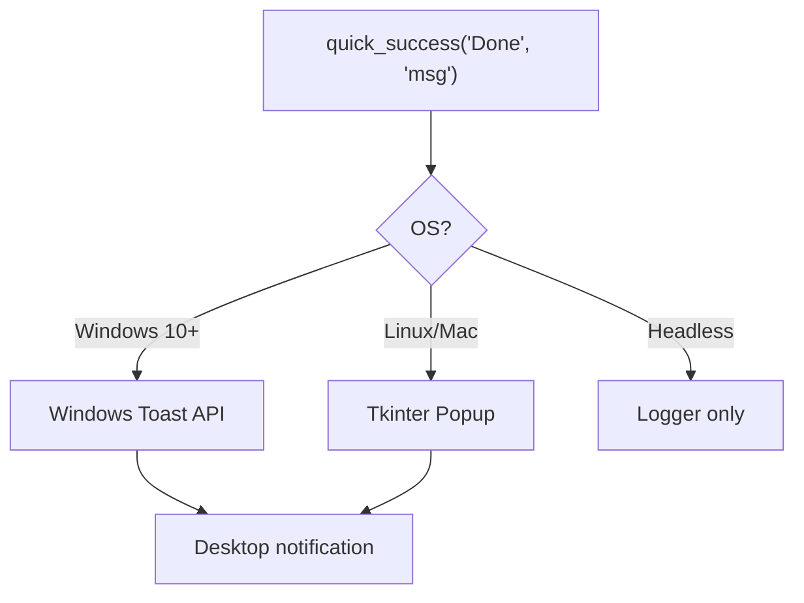

# Notifications (`utils/extras/notification.py`)

> **File:** `toolboxv2/utils/extras/notification.py` (~1016 Zeilen)
> **Typ:** Reference
> Desktop-Notifications (Windows toast, fallback popup), Progress bars, Messageboxes.

## Why This Matters

Wenn ein langer Prozess (Mod-Install, DB-Migration, ISAA-Agent) fertig ist, nutzt der User nicht das `notification` Modul um benachrichtigt zu werden — ToolBoxV2 nutzt es intern. `notification.py` bietet eine einheitliche API für Desktop-Alerts unabhängig vom OS.

## API Reference

### Quick Functions

| Function | Signature | Description |
|----------|-----------|-------------|
| `quick_success` | `(title, message, duration=3)` | Green toast notification |
| `quick_warning` | `(title, message, duration=5)` | Yellow toast notification |
| `quick_error` | `(title, message, duration=0)` | Red toast (stays until clicked) |
| `show_messagebox` | `(title, message, icon="info")` | Modal dialog box |

```python
from toolboxv2.utils.extras.notification import quick_success, show_messagebox

quick_success("Upload Complete", "3 files synced to MinIO")
show_messagebox("Critical Error", "Database unreachable", icon="error")
```

### Notification System

| Function | Signature | Description |
|----------|-----------|-------------|
| `create_notification_system` | `(app_name="ToolBoxV2") → Notifier` | Create persistent notifier |
| `create_auto_close` | `(window, timeout)` | Auto-close timer for popup |
| `update_progress` | `(window, percent, status)` | Update progress bar |
| `close_window` | `(window)` | Close notification window |

### Fallback Tray

| Function | Description |
|--------|-------------|
| `create_gear_icon()` | System tray icon (from `fallback_tray.py`) |
| `run_fallback_tray(on_click)` | Start tray with callback |

## Architecture



## Common Pitfalls

- **Headless servers**: No display → silently falls back to logging. Don't rely on UI for critical alerts.
- **Duration=0**: Toast stays until clicked. Use only for errors.
- **Threading**: `show_messagebox` is blocking. Call from main thread or use `create_auto_close`.

## Used By

- ISAA agents — task completion notifications
- CloudM — upload/download status
- SchedulerManager — job completion alerts

## Related

- [Style](style.md) — terminal output counterpart
- [Core Types](types.md) — `AppType.logger`
