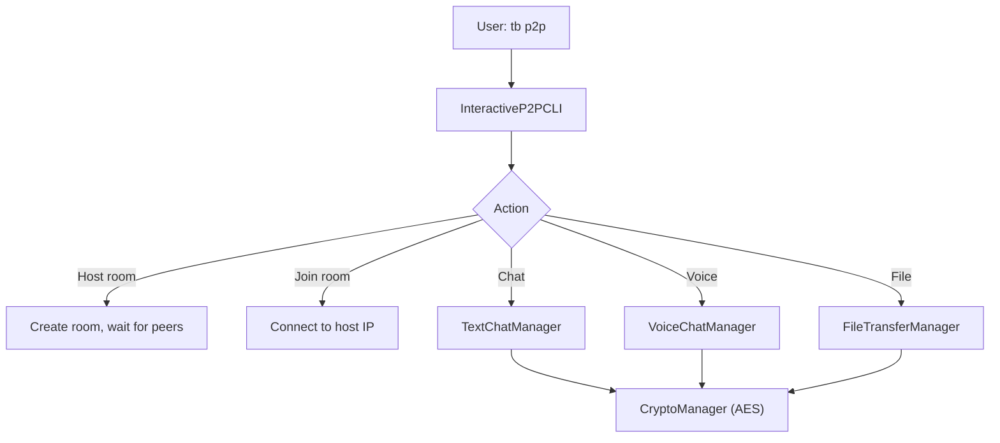

# P2P CLI (`utils/clis/tcm_p2p_cli.py`)

> **File:** `toolboxv2/utils/clis/tcm_p2p_cli.py` (~1683 Zeilen)
> **Typ:** Reference + Explanation
> Interactive P2P Chat, Voice, File Transfer mit Ende-zu-Ende-Verschlüsselung.

## Why This Matters

`tcm_p2p_cli` ist ToolBoxV2's eingebautes P2P-Kommunikationstool. Es bietet:
- **Encrypted Text Chat** (Fernet/AES, Session Key Exchange)
- **Voice Chat** (Live streaming, Voice Activity Detection)
- **File Transfer** (verschlüsselt, Chunk-basiert)

Alle Features sind optional (graceful degradation wenn `pyaudio` nicht installiert).



## Key Classes

### CryptoManager

Ende-zu-Ende Verschlüsselung für alle P2P-Kommunikation.

| Method | Description |
|--------|-------------|
| `generate_key_pair() → (pub, priv)` | RSA key pair for session key exchange |
| `encrypt_bytes(data, key) → bytes` | Fernet encrypt binary data |
| `decrypt_bytes(enc, key) → bytes` | Fernet decrypt binary data |
| `derive_session_key(their_pub, my_priv) → bytes` | ECDH/RSA session key derivation |

### InteractiveP2PCLI

Haupt-CLI mit interaktivem Menü.

| Method | Description |
|--------|-------------|
| `start()` | Start interactive menu loop |
| `host_room(room_id)` | Create room, display IP for sharing |
| `join_room(host_ip, room_id)` | Connect to host |
| `send_message(text)` | Send encrypted text |
| `list_connected_peers()` | Show connected peers |

### VoiceChatManager

Live Voice mit RMS-basierter Voice Activity Detection.

| Method | Description |
|--------|-------------|
| `start_voice_server(port=0) → int` | Start TCP relay server, return port |
| `connect_to_voice_server(host, port)` | Connect to relay |
| `start_recording_stream()` | Stream mic → encrypt → send |
| `calculate_rms(audio_data) → float` | Voice activity detection |
| `get_current_speaker() → str?` | Who's speaking right now |
| `cleanup()` | Close all sockets + PyAudio |

Audio Format: 16-bit PCM, 44100 Hz, Mono. Threshold: RMS > 500 = speaking.

### FileTransferManager

| Method | Description |
|--------|-------------|
| `send_file(filepath, peer)` | Encrypt + chunk + transfer |
| `receive_file(save_dir)` | Receive + decrypt + save |
| `get_transfer_progress() → float` | Progress 0.0–1.0 |

## How-to: Start a P2P Session

```bash
# Host a room
tb p2p
# → Interactive menu:
#   1) Host room
#   2) Join room
#   3) Exit
# > 1
# → Room created! Share this IP: 192.168.1.42

# Join from another machine
tb p2p
# > 2
# Enter host IP: 192.168.1.42
```

## Common Pitfalls

- **Firewall**: TCP relay needs open ports. Host binds to `0.0.0.0`, but NAT/firewall may block.
- **pyaudio not installed**: Voice features silently disabled. `pip install pyaudio`.
- **Latency**: Voice relay is single-hop TCP, not WebRTC. Expect 50–200ms latency on LAN.

## Used By

- `tb p2p` CLI command
- Can be imported as library for custom P2P apps

## Related

- [Crypto Utilities](cryp.md) — Fernet/AES encryption
- [Style](style.md) — Terminal formatting for CLI
