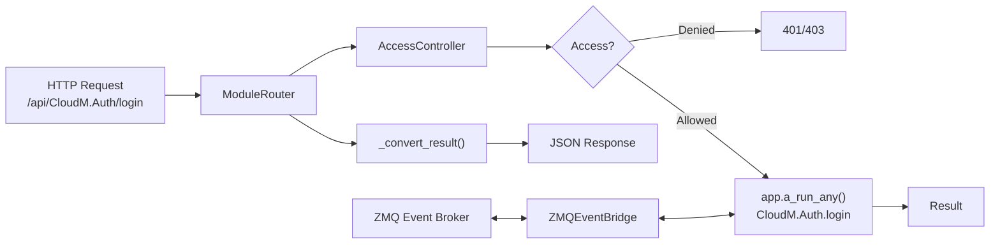

# Toolbox Integration (`utils/workers/toolbox_integration.py`)

> **File:** `toolboxv2/utils/workers/toolbox_integration.py` (~516 Zeilen)
> **Typ:** Reference + Explanation
> Glue Layer: AccessController, ModuleRouter, ZMQEventBridge.

## Why This Matters

Diese Datei ist das **Scharnier** zwischen HTTP-Requests und ToolBoxV2-Mod-Funktionen. Wenn ein Request hereinkommt:

1. `AccessController` prüft: Hat der User die nötigen Rechte?
2. `ModuleRouter` routet: Welche Mod-Funktion wird aufgerufen?
3. `ZMQEventBridge` bridged: Events zwischen ZMQ und ToolBoxV2 App

Ohne diese Komponenten könnten HTTP-Requests keine Mod-Funktionen erreichen.



## AccessController

### Konzept

Access-Kontrolle basiert auf 4 Ebenen:

| Ebene | Wert | Beschreibung |
|-------|------|-------------|
| `NOT_LOGGED_IN` | 0 | Nicht authentifiziert |
| `LOGGED_IN` | 1 | Eingeloggt |
| `TRUSTED` | 2 | Vertrauenswürdiger User |
| `ADMIN` | -1 | Vollzugriff |

### Access-Regeln (Prioritäts-Reihenfolge)

1. **Public Endpoints**: Mod in `open_modules` ODER Funktion startet mit `open` → immer erlaubt
2. **CloudM Auth Helper**: Bestimmte Auth-Funktionen (`login_discord`, `verify_magic_link` etc.) → immer erlaubt
3. **Admin-Only**: Mod in `admin_modules` (Default: `CloudM.Auth`, `ToolBox`) → nur Admin
4. **Level Check**: `user_level >= required_level` → erlaubt

### Key Methods

| Method | Signature | Description |
|--------|-----------|-------------|
| `is_public_endpoint` | `(module_name, function_name) → bool` | Open module or `open*` function? |
| `is_admin_only` | `(module_name, function_name) → bool` | In admin_modules list? |
| `get_required_level` | `(module_name, function_name) → int` | Resolve required level |
| `check_access` | `(module_name, function_name, user_level) → (bool, str?)` | Full access check |
| `get_user_level` | `(session) → int` [static] | Extract level from session |
| `reload_config` | `(config)` | Hot-reload access rules |

### Config Keys

```python
config.toolbox.open_modules = ["PublicMod", "Health"]
config.toolbox.admin_modules = ["CloudM.Auth", "ToolBox"]
config.toolbox.default_required_level = AccessLevel.LOGGED_IN  # 1
config.toolbox.level_requirements = {
    "CloudM.UserDataAPI.get_private_data": AccessLevel.TRUSTED,  # 2
    "CloudM.Dashboards": AccessLevel.ADMIN,  # -1
}
```

## ModuleRouter

Routet `/api/Module/function` Pfade zu Mod-Funktionen.

### Path Parsing

```
/api/CloudM.Auth/login_discord  →  module="CloudM.Auth", function="login_discord"
/api/DB/get                     →  module="DB", function="get"
/api/Health                     →  module="Health", function=None
```

### Key Methods

| Method | Signature | Description |
|--------|-----------|-------------|
| `parse_path` | `(path) → (module, function)` | Parse URL path |
| `check_access` | `(module, function, session) → (bool, str?, level)` | Access + level |
| `call_function` | `async (module, function, data, session) → Dict` | Async: access check + dispatch |
| `call_function_sync` | `(module, function, data, session) → Dict` | Sync version |

### Response Format

`_convert_result()` wandelt ToolBoxV2 `Result` in API-JSON:

```json
{
    "error": null,
    "origin": ["CloudM.Auth", "login_discord"],
    "result": {
        "data": {"token": "...", "user_id": "..."},
        "data_type": "dict",
        "data_info": "login successful"
    },
    "info": {
        "exec_code": 1,
        "help_text": "OK"
    }
}
```

Error codes: `401` (unauthorized), `403` (forbidden), `500` (internal error).

## ZMQEventBridge

Verbindet ZeroMQ-Events mit der ToolBoxV2-App.

### Key Methods

| Method | Signature | Description |
|--------|-----------|-------------|
| `_register_bridges` | `()` | Register ZMQ ↔ TB event mappings |
| `on_zmq_event` | `(event: Event)` | Convert ZMQ Event → TB app event |
| `publish_to_zmq` | `(event_type, payload)` | Convert TB event → ZMQ publish |

## How-to: Add a Public Endpoint

```python
# In your mod:
@app.tb(name="open_health_check", mod_name="MyMod", api=True)
async def open_health_check():
    """Public endpoint — no auth required because name starts with 'open'."""
    return Result.ok(data={"status": "healthy"})
```

Oder via config:

```python
# In config:
config.toolbox.open_modules = ["MyMod"]  # All MyMod functions are public
```

## Common Pitfalls

- **Function naming**: Only functions starting with `open` (case-insensitive) are auto-public. `Open` works, `public_health` does NOT.
- **Session extraction**: `get_user_level` tries `session.level`, then `session.live_data['level']`, then `session.to_dict()['level']`. If none work → NOT_LOGGED_IN.
- **Async vs Sync**: `call_function` is async, `call_function_sync` is sync. Use the correct one for your context.

## Used By

- [HTTPWorker](../runtime/server_worker.md) — uses AccessController + ModuleRouter for every request
- [Server Worker](../runtime/server_worker.md) — integrates all three components
- [Event Manager](../runtime/event_manager.md) — ZMQEventBridge connects to broker

## Related

- [Core Types](types.md) — `Result`, `AppType.a_run_any()`
- [Session Management](../runtime/session.md) — provides session for level extraction
- [HTTPWorker](../runtime/server_worker.md) — main consumer
- [Event Manager](../runtime/event_manager.md) — ZMQ side of the bridge
