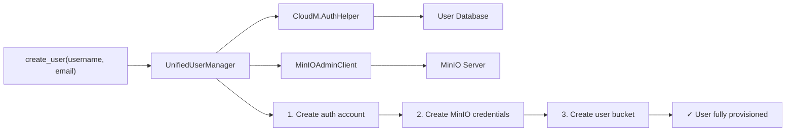

# User Manager (`utils/clis/user_manager.py`)

> **File:** `toolboxv2/utils/clis/user_manager.py` (~304 Zeilen)
> **Typ:** Reference
> Unified User Management — kombiniert CloudM Auth + MinIO Admin.

## Why This Matters

`UnifiedUserManager` ist die Single-Point-of-Entry für User-Verwaltung. Es kombiniert:
1. **CloudM Auth** — Account creation, authentication, device management
2. **MinIO Admin** — Storage credentials, bucket policies

Ohne UnifiedUserManager müsste man Auth und Storage separat verwalten, was zu inkonsistenten States führt (User existiert in Auth aber nicht in MinIO).



## API Reference

### UnifiedUserManager

| Method | Signature | Description |
|--------|-----------|-------------|
| `__init__` | `(app)` | Init with AppType instance |
| `create_user` | `(username, email, invitation=None) → Result` | Full provisioning: auth + storage |
| `delete_user` | `(username) → Result` | Remove auth + revoke storage |
| `get_user` | `(username) → Dict` | Combined user info |
| `list_users` | `() → List[Dict]` | All users with storage status |
| `reset_credentials` | `(username) → Result` | Regenerate MinIO keys |
| `update_email` | `(username, new_email) → Result` | Change email |

### MinIOAdminClient

Wraps MinIO admin API:

| Method | Description |
|--------|-------------|
| `create_user(access_key, secret_key)` | Register MinIO user |
| `delete_user(access_key)` | Remove MinIO user |
| `set_policy(name, policy_json)` | Define access policy |
| `attach_policy(user, policy)` | Assign policy to user |

## How-to: Provision a New User

```python
from toolboxv2.utils.clis.user_manager import UnifiedUserManager

mgr = UnifiedUserManager(app)
result = mgr.create_user("alice", "alice@example.com")
if result.is_ok():
    print(f"User created: {result.get()}")
    # → {"username": "alice", "minio_access_key": "...", "bucket": "user-alice"}
```

## Common Pitfalls

- **Partial failure**: If MinIO is down during `create_user`, auth account is created but storage isn't. Use `reset_credentials` to retry the storage part.
- **MinIO admin keys**: Need root MinIO credentials, not regular user credentials.
- **Username sanitization**: Usernames are lowercased + sanitized for MinIO keys.

## Used By

- `tb user` CLI command
- [CloudM Auth](../mods/CloudM/auth.md) — auth-side operations
- [CloudM UserAccountManager](../mods/CloudM/user_account_manager.md) — account lifecycle

## Related

- [DB CLI Manager](db_cli_manager.md) — MinIO CLI layer
- [CloudM Auth](../mods/CloudM/auth.md) — auth provider
- [Storage Overview](../storage/index.md) — MinIO backend
