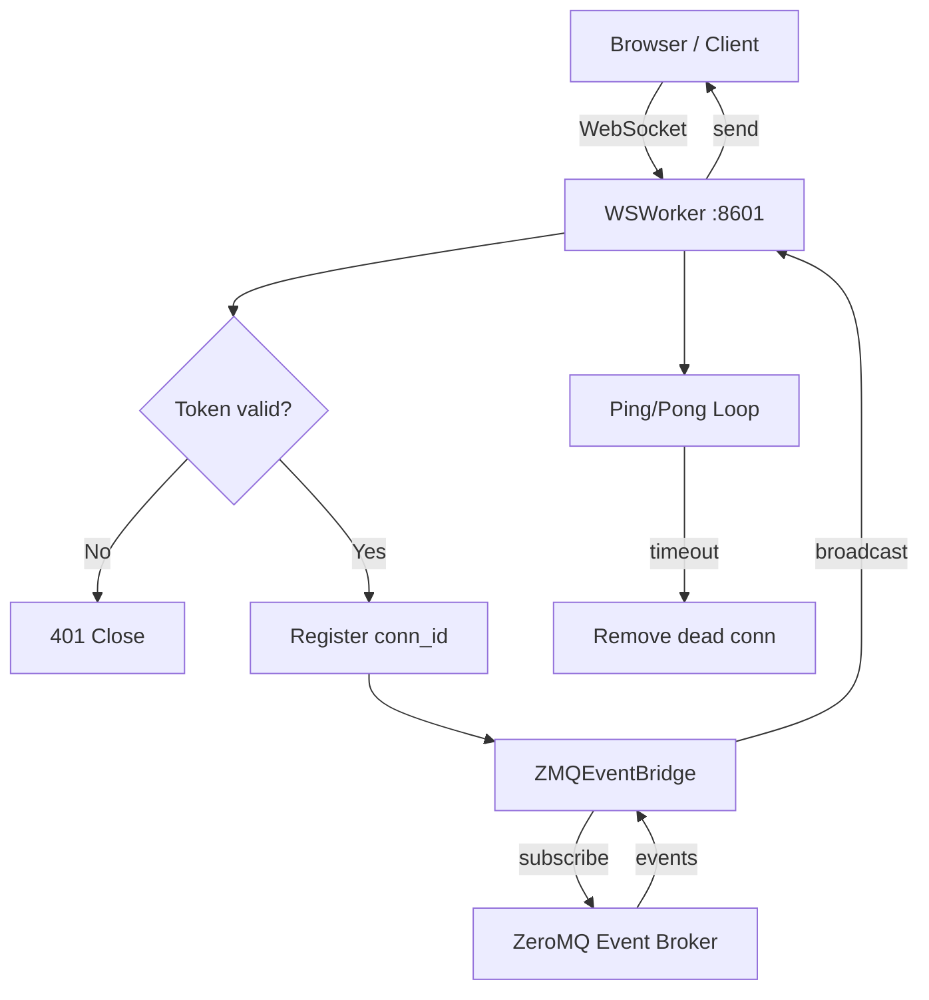

# WSWorker (`utils/workers/ws_worker.py`)

> **File:** `toolboxv2/utils/workers/ws_worker.py` (~909 Zeilen)
> **Typ:** Reference + Explanation
> Asyncio WebSocket Worker — Multi-Client-Verbindungen, Heartbeat, Event-Bridge.

## Why This Matters

Der WSWorker ist der **einzige** WebSocket-fähige Worker in ToolBoxV2. Er:
1. Akzeptiert WebSocket-Verbindungen von Browsern/Clients
2. Authentifiziert Clients via Session-Token
3. Briidget WebSocket ↔ ZeroMQ Event System
4. Führt Heartbeat/Ping-Pong für Dead-Connection-Detection durch
5. Broadcastet Events an alle oder spezifische Clients



## WSWorker

### Constructor

```python
WSWorker(
    worker_id="ws-1",
    host="127.0.0.1",
    port=8601,
    app=None,
    ping_interval=30,
    ping_timeout=10,
    max_connections=1000,
)
```

### Key Methods

| Method | Signature | Description |
|--------|-----------|-------------|
| `start` | `async start()` | Start WebSocket server |
| `stop` | `async stop()` | Graceful shutdown |
| `handle_connection` | `async handle_connection(ws, path)` | Main per-connection handler |
| `_authenticate` | `async _authenticate(ws) → SessionData` | Token-based auth |
| `_register_client` | `(conn_id, ws, session)` | Register in client map |
| `_unregister_client` | `(conn_id)` | Remove from client map |
| `_broadcast` | `async _broadcast(event)` | Send to all clients |
| `_send_to_client` | `async _send_to_client(conn_id, message)` | Send to specific client |
| `_ping_loop` | `async _ping_loop()` | Periodic ping to detect dead connections |
| `_safe_publish` | `async _safe_publish(event)` | Publish to ZMQ, ignore errors |

### Connection Lifecycle

```mermaid
sequenceDiagram
    participant C as Client
    participant W as WSWorker
    participant Z as ZMQ Broker

    C→>W: WS Connect (ws://host:8601/?token=xxx)
    W→>W: _authenticate(token)
    alt Valid token
        W→>W: _register_client(conn_id)
        W→>Z: Subscribe to events
        W-->>C: {"type": "connected", "conn_id": "..."}
        
        loop Active connection
            C→>W: {"type": "message", "data": ...}
            W→>Z: publish event
            Z-->>W: broadcast from others
            W-->>C: {"type": "event", ...}
        end
        
        W→>C: ping
        C-->>W: pong
    else Invalid token
        W-->>C: close(4001, "Unauthorized")
    end
```

### Message Protocol

| Message Type | Direction | Description |
|-------------|-----------|-------------|
| `connected` | S→C | Connection confirmed with `conn_id` |
| `message` | C→S | Client sends data |
| `event` | S→C | Server pushes event from ZMQ |
| `broadcast` | S→C | Server broadcasts to all |
| `ping` | S→C | Heartbeat check |
| `pong` | C→S | Heartbeat response |
| `error` | S→C | Error notification |
| `close` | S→C | Connection closing |

### Legacy HTTP Support

`_process_request_legacy` handles non-WebSocket requests (pre-protocol-13.0):
- Health check: `GET /health` → `200 OK`
- Other: Falls through to WS handshake

## How-to: Connect from Browser

```javascript
const ws = new WebSocket('ws://localhost:8601/?token=' + authToken);

ws.onopen = () => console.log('Connected');
ws.onmessage = (event) => {
    const msg = JSON.parse(event.data);
    if (msg.type === 'event') {
        console.log('Event:', msg.data);
    }
};

// Send a message
ws.send(JSON.stringify({type: 'message', data: {action: 'ping'}}));
```

## How-to: Broadcast from a Mod

```python
# Inside any mod function with app access
await app.ws_broadcast_all({
    "type": "notification",
    "data": {"message": "System update available"}
})
```

## Common Pitfalls

- **Token in query string**: WebSocket API doesn't support custom headers. Token must be in `?token=` query parameter.
- **Ping timeout**: If client doesn't respond to ping within `ping_timeout` seconds, connection is dropped.
- **Max connections**: Default 1000. Increase via constructor for high-traffic deployments.
- **ZMQ not ready**: `_safe_publish` swallows errors if ZMQ broker isn't started yet. Start broker first.

## Used By

- `tb workers start --type ws` → starts WSWorker
- [CloudM Dashboards](../mods/CloudM/dashboards.md) — real-time dashboard updates
- [CloudM UserInstances](../mods/CloudM/user_instances.md) — per-user WebSocket sessions

## Related

- [WorkerManager](cli_worker_manager.md) — manages WSWorker lifecycle
- [Event Manager](../runtime/event_manager.md) — ZMQ broker, event routing
- [HTTPWorker](../runtime/server_worker.md) — HTTP counterpart
- [Session Management](../runtime/session.md) — token-based auth
