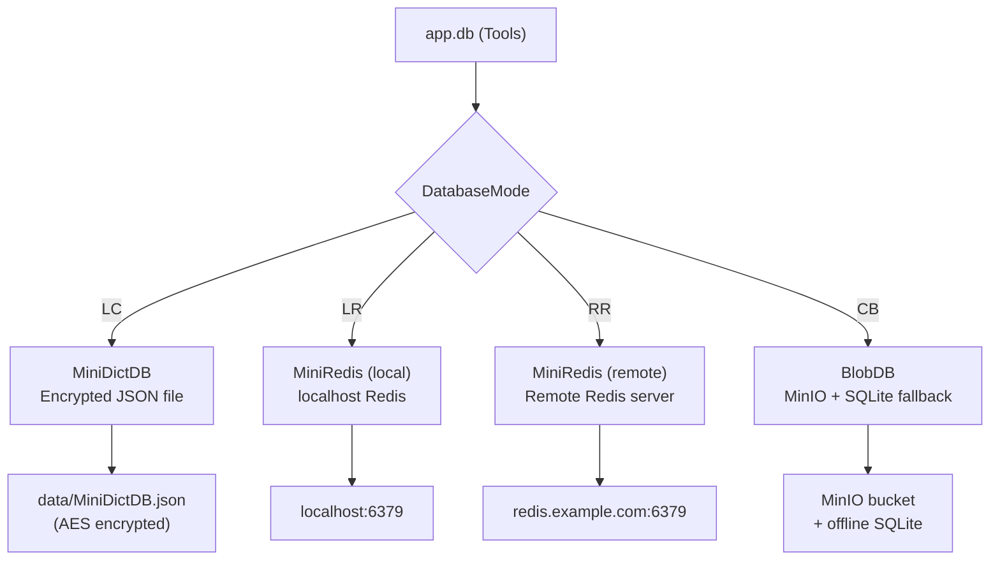

# DB Mod

> **File:** `toolboxv2/mods/DB/`
> **Version:** 0.0.3
> Datenbank-Modul mit 4 Backend-Modi: Local Dict, Local/Remote Redis, Cluster Blob (MinIO).

## Why This Matters

Das DB-Modul ist die **primäre Daten-Schicht** für alle ToolBoxV2-Mods. Jede Mod-Funktion die Daten persistiert (User-Settings, Mod-States, Session-Daten) nutzt `app.db`. Es abstrahiert 4 komplett verschiedene Backends hinter einer einheitlichen API.



## Dateien

| Datei | Klasse | Backend | Beschreibung |
|-------|--------|---------|-------------|
| `tb_adapter.py` | `Tools` | (alle) | Haupt-Adapter, route zu Backend, `@export` Decorators |
| `local_instance.py` | `MiniDictDB` | LC | Local encrypted JSON, `save_to_json`, `load_from_json` |
| `reddis_instance.py` | `MiniRedis` | LR/RR | Redis Client (sync), `rcon: redis.Redis` |
| `blob_instance.py` | `BlobDB` | CB | MinIO + SQLite offline fallback, `Config`, `SQLiteCache` |

## Exported Functions (`@export`)

| Function | Interface | Input | Output | Beschreibung |
|----------|-----------|-------|--------|-------------|
| `get` | internal | `query: str` | `Result` | Daten abfragen |
| `set` | internal | `query: str, data: Any` | `Result` | Daten speichern |
| `if_exist` | internal | `query: str` | `Result` | Existenz prüfen |
| `delete` | internal | `query: str, matching: bool` | `Result` | Löschen (optional pattern match) |
| `append_on_set` | internal | `query: str, data: Any` | `Result` | Zu Liste appenden |
| `edit_programmable` | native | `mode: DatabaseModes` | `Result` | Mode wechseln (programmatisch) |
| `edit_cli` | cli | `mode: str` | `Result` | Mode wechseln (CLI: LC/LR/RR/CB) |
| `edit_dev_web_ui` | remote | `mode: str` | `Result` | Mode wechseln (Web UI) |
| `Version` | — | — | `Result` | DB Version |
| `test` | test_only | — | `Result` | Self-test (CRUD round-trip) |

## DatabaseModes

| Key | Enum Value | Backend | Auth Type |
|-----|-----------|---------|-----------|
| `LC` | `LOCAL_DICT` | MiniDictDB (JSON) | `location` (Device Key) |
| `LR` | `LOCAL_REDIS` | MiniRedis (localhost) | `Uri` / `PassKey` |
| `RR` | `REMOTE_REDIS` | MiniRedis (remote) | `Uri` / `UserNamePassword` |
| `CB` | `CLUSTER_BLOB` | BlobDB (MinIO) | `location` (Server ID) |

## BlobDB (CB Mode) Details

```python
# blob_instance.py
class BlobDB:
    _local_minio: Optional[Minio]    # Lokaler MinIO
    _cloud_minio: Optional[Minio]    # Remote/Cloud MinIO (optional)
    _sqlite: Optional[SQLiteCache]   # Offline fallback
    _server_prefix: str              # Key prefix (Server ID)
```

### Key → MinIO Path

```
DB Key: "users::123::settings"
→ MinIO Path: "{server_id}/users/123/settings.json"
```

### SQLiteCache (Offline Fallback)

Wenn MinIO nicht erreichbar:
- Schreibt in `~/.tb_server_cache/offline.db`
- `sync_status='dirty'` für Pending-Sync
- `get_dirty()` → Liste aller unsynchronisierten Keys

### Config (Environment Variables)

| Variable | Default | Beschreibung |
|----------|---------|-------------|
| `MINIO_ENDPOINT` | `localhost:9000` | Lokaler MinIO |
| `MINIO_ACCESS_KEY` | — | Access Key |
| `MINIO_SECRET_KEY` | — | Secret Key |
| `MINIO_SECURE` | `false` | HTTPS |
| `CLOUD_ENDPOINT` | — | Remote MinIO (optional) |
| `IS_OFFLINE_DB` | `false` | SQLite-only mode |
| `DB_CACHE_TTL` | `300` | Cache TTL in Sekunden |

## How-to: Mode setzen

```bash
# Permanent Via Manifest
tb manifest set database.mode LC    # Local JSON
tb manifest set database.mode CB    # MinIO Blob
tb manifest set database.mode LR    # Local Redis

# Only for the current run
# Via CLI
tb -c DB edit_cli --kwargs mode=LC -c MyMod my_fuction

# Via Code
result = app.a_run_any("DB.edit_programmable", mode="CB")
```

## How-to: Daten lesen/schreiben

```python
# In any mod function with app access
# Set
await app.a_run_any("DB.set", query="users::alice::theme", data="dark")

# Get
result = await app.a_run_any("DB.get", query="users::alice::theme")
theme = result.get()  # → "dark"

# Check existence
result = await app.a_run_any("DB.if_exist", query="users::alice::theme")

# Delete
await app.a_run_any("DB.delete", query="users::alice::theme")
```

## Terminal

```bash
# Interactive DB Shell — `tb db` ohne args
tb db
# → 🗄️ DB Explorer (mode=LC, keys=12)
# → Namespaces:
#   [1] user:: (5 entries)
#   [2] mod:: (3 entries)
#   [3] system:: (4 entries)
#   [f] Search  [s] Set key  [a] Show all  [q] Quit

# Direct function calls
tb -c DB get --query "users::alice::theme"
tb -c DB set --query "users::alice::theme" --data '"dark"'
tb -c DB if_exist --query "users::alice::theme"
tb -c DB delete --query "users::alice::theme"

# Mode switch
tb -c DB edit_cli --mode CB
```

## Interactive DB Shell (`tb db` ohne Argumente)

Wenn `tb db` ohne Argumente aufgerufen wird, öffnet sich eine **interaktive Datenbank-Umgebung**.

### Übersicht

Die Shell zeigt alle Keys **gruppiert nach Namespaces** (dem Teil vor `::`):

```
🗄️  DB Explorer
   mode=LC  keys=12

  Namespaces:
    [1] user:: (5 entries)
    [2] mod:: (3 entries)
    [3] system:: (4 entries)

    [f] Search/filter  [s] Set key  [a] Show all  [q] Quit
  >
```

### Befehle

| Taste | Aktion | Beschreibung |
|-------|--------|-------------|
| `1-9` | Namespace öffnen | Keys der Rubrik anzeigen |
| `f` | Search | Keys nach Substring filtern |
| `s` | Set key | Neuen Key-Value-Paar anlegen |
| `a` | Show all | Alle Keys anzeigen (paginiert) |
| `q` | Quit | Shell beenden |

### Key Browser

Innerhalb eines Namespaces (oder Search/All):

```
  📂 user::  (5 entries, page 1/1)

     1  user::alice::theme  =  "dark"
     2  user::alice::last_login  =  1705612...
     3  user::bob::theme  =  "light"
     4  user::bob::settings  =  {"notifications": true}
     5  user::guest::theme  =  "default"

   [e<N>] edit  [d<N>] del  [b] back  [q] quit
```

| Taste | Aktion |
|-------|--------|
| `e3` | Key #3 bearbeiten (Wert ändern) |
| `d3` | Key #3 löschen (mit Bestätigung) |
| `p` / `n` | Paginierung (prev/next) |
| `b` | Zurück zur Namespace-Übersicht |
| `q` | Quit |

### Value-Format

- **Strings**: Direkt angezeigt (z.B. `"dark"`)
- **JSON**: Formatiert als JSON (dicts, lists)
- **Long values**: Truncated mit `…` (60 chars in Browse, 80 in Search)
- **Null**: Als `(null)` in Grau

### Value setzen/bearbeiten

Beim Setzen oder Bearbeiten wird der aktuelle Wert angezeigt:

```
   Key: user::alice::theme
   Current: "dark"
   Value (JSON or plain): dark_blue
   ✓ Set user::alice::theme
```

Eingabe wird als **JSON geparst** wenn möglich, sonst als **plain string** gespeichert.

```json
{"notifications": true, "volume": 0.8}    // → als dict gespeichert
hello                                      // → als string gespeichert
42                                         // → als int gespeichert
```

### Unterstützte DB-Modi

Die Shell funktioniert mit **allen 4 Modi** (LC, LR, RR, CB). Sie nutzt `app.db.get('all-k')` für Key-Listing und `app.db.get(key)` / `app.db.set(key, value)` / `app.db.delete(key)` für Operationen.

## Related

- [Storage Overview](../../storage/index.md) — DB Modi, BlobStorage facade
- [BlobDB Reference](../../storage/ref_blobdb.md) — MobileDB layer
- [Blob Sharing API](../../storage/blob_sharing_api.md) — User-to-User sharing
- [Core Types](../../devdocs/types.md) — `Result`, `ToolBoxInterfaces`
- [DB CLI Manager](../../devdocs/db_cli_manager.md) — MinIO CLI management
