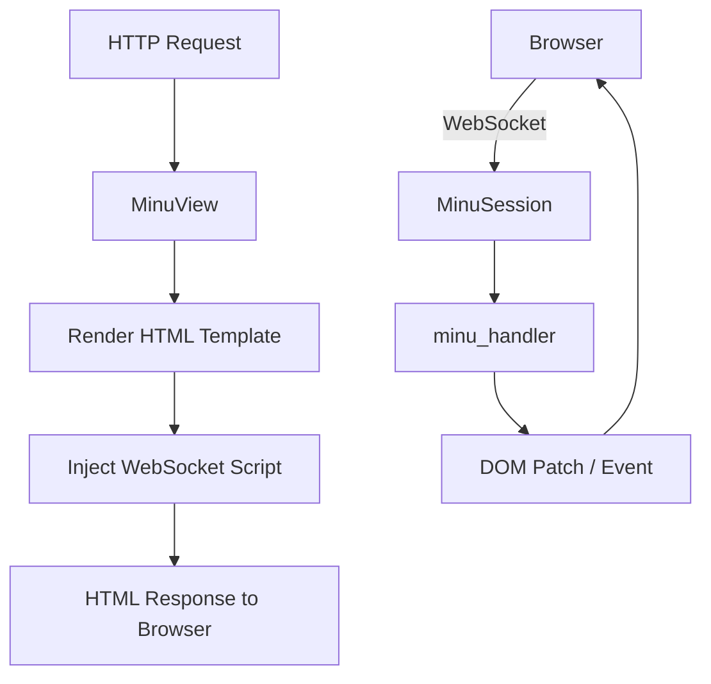

# Minu Mod

> **File:** `toolboxv2/mods/Minu/`
> Mini web UI framework — Server-Side Rendering, WebSocket integration, Live-Updates.

## Why This Matters

Minu ist ein leichtgewichtiges **Server-Side Rendering Framework** das in ToolBoxV2 integriert ist. Es ermöglicht Mods, HTML-Seiten mit Live-Updates über WebSocket zu rendern — ohne React/Vue Frontend-Build-Step.

Features:
- HTML Template Rendering mit Python
- WebSocket-basierte Live-Updates (DOM Patching)
- Session-spezifische Views
- Minimal dependencies (stdlib + jinja2 optional)

## Architecture



## Key Components

### MinuSession

Verwaltet eine WebSocket-Sitzung für Live-Updates.

```python
from toolboxv2.mods.Minu.core import MinuSession

session = MinuSession(conn_id="abc123")
session.send_update("counter", value=42)  # → browser patches #counter
session.close()
```

| Method | Description |
|--------|-------------|
| `send_update(element_id, **data)` | Send DOM patch to browser |
| `broadcast(event_type, payload)` | Broadcast to all sessions |
| `close()` | End session |

### MinuView

Rendert HTML-Templates.

```python
from toolboxv2.mods.Minu.core import MinuView

view = MinuView("dashboard.html")
view.set("title", "My Dashboard")
view.set("items", [{"name": "Task 1"}, {"name": "Task 2"}])
html = view.render()
```

| Method | Description |
|--------|-------------|
| `set(key, value)` | Set template variable |
| `render() → str` | Render HTML |
| `add_script(src)` | Inject `<script>` tag |
| `add_style(href)` | Inject `<link>` tag |

### minu_handler

WebSocket-Event-Handler für eingehende Browser-Events.

```python
from toolboxv2.mods.Minu.core import minu_handler

@minu_handler("button_click")
async def handle_click(session, data):
    counter = data.get("counter", 0) + 1
    session.send_update("counter", value=counter)
```

## WebSocket Integration

`__init__.py` registriert WebSocket-Handler:

```python
# Automatic WebSocket endpoint: /ws/minu
# Events flow: Browser → WSWorker → MinuSession → minu_handler
```

## How-to: Create a Live Page

```python
from toolboxv2.mods.Minu.core import MinuView, MinuSession, minu_handler

@app.tb(name="live_dashboard", mod_name="MyMod", api=True)
async def live_dashboard():
    view = MinuView("dashboard.html")
    view.set("title", "Live Counter")
    view.set("count", 0)
    return Result.ok(data=view.render(), data_type="html")

@minu_handler("increment")
async def handle_increment(session, data):
    new_count = data.get("count", 0) + 1
    session.send_update("counter", value=new_count)
```

HTML Template (`dashboard.html`):

```html
<div id="counter" data-minu="counter">0</div>
<button onclick="minu.send('increment', {count: parseInt(document.getElementById('counter').innerText)})">
    +1
</button>
```

## Terminal

```bash
# Minu Mod laden
tb -l

# Minu-Funktion aufrufen
tb -c Minu live_dashboard
```

## Common Pitfalls

- **Template path**: Templates müssen unter `toolboxv2/mods/Minu/templates/` oder Mod-eigenem templates Ordner liegen.
- **WebSocket required**: Live-Updates funktionieren nur wenn WSWorker läuft (`tb workers start --type ws`).
- **Session cleanup**: `MinuSession.close()` MUSS aufgerufen werden, sonst Memory Leak.

## Related

- [FastTB](../../runtime/fasttb.md) — decorator-based routing für HTML endpoints
- [WSWorker](../../devdocs/ws_worker.md) — WebSocket Worker
- [Event Manager](../../runtime/event_manager.md) — ZMQ Event System
- [How-to: Mod erstellen](../../devdocs/howto-create-mod.md) — Tutorial
