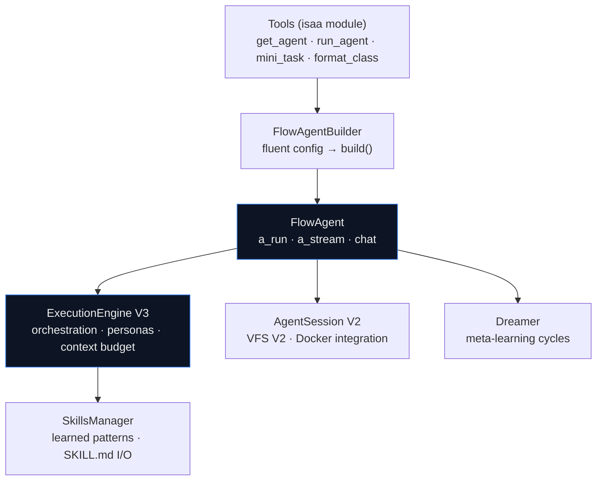

# ISAA — Intelligent System Agent Architecture

###### AGENT FRAMEWORK · VERIFIED AGAINST `31a117e`

ISAA is the agent layer of ToolBoxV2: a production-oriented framework built around **FlowAgent** — an autonomous agent with session isolation, a dynamic execution engine, learned skills, and meta-learning. It is the largest subsystem in the repository.

```python
from toolboxv2 import get_app

isaa = get_app().get_mod("isaa")
await isaa.init_isaa(name="self")
answer = await isaa.run_agent("self", "Summarize the open TODOs in this repo")
```

## Architecture



| Layer | What it does | Doc |
|---|---|---|
| **Tools facade** | Module-level API: init, builders, one-shot completions | [Quickstart](quickstart.md) |
| **FlowAgent** | The agent: run/stream/pause/resume, VFS coding, audio, dreaming | [Agents](agents.md) |
| **ExecutionEngine V3** | Orchestration: loop detection, context budget, persona routing, history compression | [Agents § Engine](agents.md#execution-engine-v3) |
| **Chains** | Composable task pipelines with operator DSL (`>>`, `+`, `&`, `|`, `%`) | [Chains](chains.md) |
| **Sessions** | Per-session isolation with VFS V2 and optional Docker sandboxes | [Agents § Sessions](agents.md#sessions) |
| **Skills** | Learned behavioral patterns, Anthropic-compatible SKILL.md import/export | [Agents § Skills](agents.md#skills) |
| **Legacy reference** | The pre-restructure full reference (historical, being split up) | [Full Reference](reference.md) |

## Package layout

```
toolboxv2/mods/isaa/
  module.py            # Tools facade — the public entry point
  base/Agent/          # FlowAgent, builder, execution_engine, chain,
                       # skills, sessions, sub_agent, observability
  base/                # KnowledgeBase, memory, llm_router, dreamer, rl
  CodingAgent/         # code-focused agent
  ui/                  # ISAA web UI
```

<!-- verified: toolboxv2/mods/isaa/ layout @ 31a117e -->
