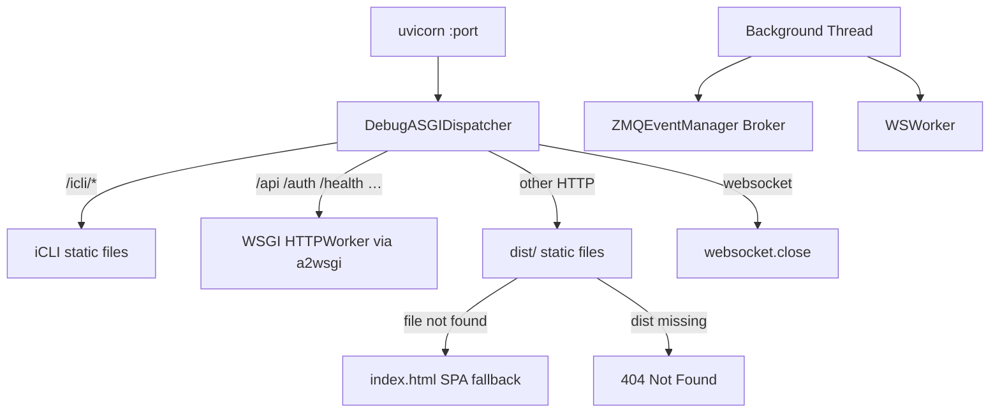

# debug_runner

A development-only ASGI server that bundles a static-file dispatcher, a ZMQ event broker, and a WebSocket worker into a single process — replicating the production Nginx routing logic for local debugging.

## Why This Matters

During development you need the full stack (API, WebSocket, frontend) without setting up Nginx, a separate WS worker, or a ZMQ broker. This module launches everything in one process so you can iterate on the frontend and backend together with a single command.

## Quick Start

```python
from toolboxv2.utils.workers.debug_runner import run_debug_server

run_debug_server("./dist", port=5000)
```

Requires `a2wsgi` and `uvicorn` (`pip install a2wsgi uvicorn`).

## Usage Guide

### Basic Usage

Run the debug server against a built frontend distribution:

```python
from toolboxv2.utils.workers.debug_runner import run_debug_server

run_debug_server(dist_path="/path/to/frontend/dist", port=5000)
```

This starts:
1. A **ZMQ event broker** in a background thread.
2. A **WebSocket worker** (if `TB_WS_ENABLED` is not `false`) on the port from config.
3. A **uvicorn** HTTP server on the given `port`, serving the frontend and proxying API requests.

### Advanced Usage

Control which subsystems start via environment variables:

```bash
TB_WS_ENABLED=false python -c "from toolboxv2.utils.workers.debug_runner import run_debug_server; run_debug_server('./dist', 5000)"
```

This disables the WS worker — only the ZMQ broker and HTTP server start.

## How It Works

The module has two layers:

1. **Background thread** (`start_infrastructure`) creates a dedicated asyncio event loop, starts a `ZMQEventManager` in broker mode, optionally starts a `WSWorker`, and runs `loop.run_forever()`.
2. **Main thread** wraps the existing WSGI-based HTTPWorker via `a2wsgi` into an ASGI app, hands it to `DebugASGIDispatcher`, and launches `uvicorn`.

`DebugASGIDispatcher` acts as a pure request router — it is intentionally blind to ToolBoxV2 business logic and mirrors the Nginx routing rules: iCLI static routes are served first, then API-prefixed paths are forwarded to the WSGI app, then unmatched HTTP paths resolve to static files in `dist_path` with an SPA fallback to `index.html`, and finally WebSocket connections on this port are closed (the WS worker listens on its own port).



## API Reference

### Classes

#### `DebugASGIDispatcher`

A pure ASGI dispatcher that replicates production Nginx routing. Blind to ToolBoxV2 logic; passes requests through strictly.

| Method | Signature | Description |
|--------|-----------|-------------|
| `__init__` | `def __init__(self, api_asgi_app, dist_path)` | Stores the ASGI-wrapped API app and the absolute path to the frontend dist directory. |
| `__call__` | `async def __call__(self, scope, receive, send)` | Main ASGI entry point. Routes: iCLI static routes → API prefixes → static files (SPA fallback) → 404. Handles lifespan events and closes WebSocket connections. |
| `_serve_file` | `async def _serve_file(self, file_path, send)` | Streams a file in 64 KB chunks with MIME auto-detection and `no-cache` headers for debug-mode freshness. |
| `_send_status` | `async def _send_status(self, send, status_code, message)` | Sends a plain-text HTTP status response with the given code and message body. |

### Functions

#### `run_debug_server(dist_path: str, port: int) -> None`

Entry point for the debug stack. Checks for `a2wsgi` availability, applies the Windows selector-event-loop fix, loads config, starts ZMQ broker + WS worker in a background thread, and launches uvicorn with `DebugASGIDispatcher`.

**Parameters:**
- `dist_path` — filesystem path to the built frontend distribution directory.
- `port` — TCP port for the uvicorn HTTP server.

**Behavior:** Returns immediately (with an error message) if `a2wsgi` is not installed. Otherwise blocks the main thread running uvicorn.

## Dependencies

- [`get_metrics`](event_manager.md) from `toolboxv2/utils/workers/event_manager.py` — ZMQ event broker and metrics.
- [`get_user_id_from_body`](server_worker.md) from `toolboxv2/utils/workers/server_worker.py` — HTTP/WS worker infrastructure.
- `a2wsgi` (third-party) — converts the WSGI HTTPWorker into an ASGI app.
- `uvicorn` (third-party) — ASGI server.

## Used By

- Referenced by `adaptive_prompt_system` in `toolboxv2/flows/adaptive_prompt_system.py`
- Referenced by `chain` in `toolboxv2/flows/chain.py`
- Referenced by `minicli` in `toolboxv2/flows/minicli.py`
- Referenced by `pyshell` in `toolboxv2/flows/pyshell.py`
