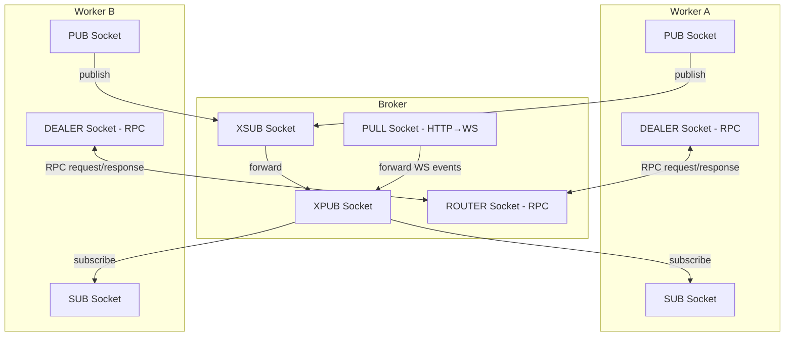

# Event Manager

ZeroMQ-based event manager for inter-worker communication supporting PUB/SUB broadcasts, REQ/REP RPC calls, and PUSH/PULL task distribution. Built around a central broker pattern with XPUB/XSUB proxying.

## Why This Matters

When you need multiple processes (HTTP workers, WebSocket workers, background jobs) to coordinate in real time, this module provides the messaging backbone. It handles event routing, RPC calls with timeouts, channel subscriptions, and WebSocket broadcast forwarding — all over ZeroMQ for low-latency, brokered communication.

## Quick Start

```python
from toolboxv2.utils.workers.event_manager import ZMQEventManager, Event, EventType

# Start a worker
manager = ZMQEventManager(worker_id="my_worker")
await manager.start()

# Publish an event
await manager.publish(Event(
    type=EventType.WORKER_START,
    source="my_worker",
    target="*",
    payload={"status": "ready"},
))

# Register a handler
@manager.on(EventType.WS_MESSAGE)
async def handle_ws(event: Event):
    print(f"Got WS message: {event.payload}")
```

## Usage Guide

### Starting a Broker

```python
# As a standalone broker process (CLI)
# python -m toolboxv2.utils.workers.event_manager --pub tcp://127.0.0.1:5555 --sub tcp://127.0.0.1:5556

# Or programmatically
from toolboxv2.utils.workers.event_manager import ZMQEventManager

broker = ZMQEventManager(
    worker_id="broker",
    pub_endpoint="tcp://127.0.0.1:5555",
    sub_endpoint="tcp://127.0.0.1:5556",
    req_endpoint="tcp://127.0.0.1:5557",
    is_broker=True,
)
await broker.start()
```

### Registering Handlers with Priority and Filters

```python
# High-priority handler runs first
manager.register_handler(
    event_types=[EventType.WS_CONNECT, EventType.WS_DISCONNECT],
    callback=on_connection_change,
    priority=10,
)

# One-shot handler (auto-unregisters after first call)
manager.register_handler(
    event_types=EventType.SHUTDOWN,
    callback=on_shutdown,
    once=True,
)

# Handler with filter function
manager.register_handler(
    event_types=EventType.WS_MESSAGE,
    callback=on_admin_message,
    filter_func=lambda e: e.payload.get("role") == "admin",
)
```

### RPC Calls Between Workers

```python
# Client side — send request and await response
response = await manager.rpc_call(
    Event(
        type=EventType.RPC_REQUEST,
        source="http_worker",
        target="data_worker",
        payload={"action": "get_stats"},
    ),
    timeout=5.0,
)
```

### WebSocket Event Helpers

```python
from toolboxv2.utils.workers.event_manager import (
    create_ws_send_event,
    create_ws_broadcast_event,
    create_ws_broadcast_all_event,
)

# Send to a specific WebSocket connection
event = create_ws_send_event(source="http_worker", conn_id="abc123", payload={"msg": "hi"})

# Broadcast to a channel, excluding certain connections
event = create_ws_broadcast_event(
    source="http_worker",
    channel="chat_room_1",
    payload={"msg": "hello room"},
    exclude_conn_ids=["abc123"],
)

# Broadcast to all WebSocket connections
event = create_ws_broadcast_all_event(source="system", payload={"type": "reload"})
```

### Synchronous Sending from Non-Async Code

```python
# From synchronous context (e.g., Flask route)
manager.send_to_ws_sync(event)
```

## How It Works

The system uses a **broker/worker topology** over ZeroMQ. A single broker process binds XPUB/XSUB sockets to form a pub/sub proxy: workers publish events to the XSUB endpoint, and the broker forwards them to all subscribers via XPUB. RPC uses ROUTER/DEALER sockets — the broker routes requests to handlers and returns responses. An HTTP→WS forwarding path (PUSH/PULL) allows non-WebSocket workers to send messages to WebSocket clients through the broker.

Internally, `EventHandlerRegistry` manages typed and global handlers sorted by priority (higher first). Incoming events are deserialized, checked for expiry (TTL-based), filtered by target and ownership, then dispatched to matching handlers. Each handler supports optional filter functions and a `once` flag for one-shot registration.



## API Reference

### Classes

#### `EventType(str, Enum)`

Event types for routing. String-backed enum with predefined categories.

| Value | Description |
|-------|-------------|
| `WORKER_START` | `"worker.start"` |
| `WORKER_STOP` | `"worker.stop"` |
| `WORKER_HEALTH` | `"worker.health"` |
| `WORKER_READY` | `"worker.ready"` |
| `SESSION_CREATE` | `"session.create"` |
| `SESSION_VALIDATE` | `"session.validate"` |
| `SESSION_INVALIDATE` | `"session.invalidate"` |
| `SESSION_SYNC` | `"session.sync"` |
| `WS_CONNECT` | `"ws.connect"` |
| `WS_DISCONNECT` | `"ws.disconnect"` |
| `WS_MESSAGE` | `"ws.message"` |
| `WS_BROADCAST` | `"ws.broadcast"` |
| `WS_BROADCAST_CHANNEL` | `"ws.broadcast_channel"` |
| `WS_BROADCAST_ALL` | `"ws.broadcast_all"` |
| `WS_SEND` | `"ws.send"` |
| `WS_JOIN_CHANNEL` | `"ws.join_channel"` |
| `WS_LEAVE_CHANNEL` | `"ws.leave_channel"` |
| `CONFIG_RELOAD` | `"system.config_reload"` |
| `SHUTDOWN` | `"system.shutdown"` |
| `ROLLING_UPDATE` | `"system.rolling_update"` |
| `HEALTH_CHECK` | `"system.health_check"` |
| `MODULE_CALL` | `"module.call"` |
| `MODULE_RESULT` | `"module.result"` |
| `CUSTOM` | `"custom"` |
| `RPC_REQUEST` | `"rpc.request"` |
| `RPC_RESPONSE` | `"rpc.response"` |

#### `Event`

Event payload for ZeroMQ messages. Serialized to JSON bytes for wire transport.

| Field | Type | Default | Description |
|-------|------|---------|-------------|
| `type` | `EventType` | — | Event type for routing |
| `source` | `str` | — | Worker ID of sender |
| `target` | `str` | — | Worker ID, channel, or `"*"` for broadcast |
| `payload` | `Dict[str, Any]` | `{}` | Event data |
| `correlation_id` | `str` | `uuid4()` | Unique correlation ID for RPC |
| `timestamp` | `float` | `time.time()` | Creation timestamp |
| `ttl` | `int` | `60` | Time-to-live in seconds |

| Method | Signature | Description |
|--------|-----------|-------------|
| `to_bytes` | `def to_bytes(self) -> bytes` | Serialize event to bytes |
| `from_bytes` | `classmethod from_bytes(cls, data: bytes) -> Event` | Deserialize event from bytes |
| `is_expired` | `def is_expired(self) -> bool` | Check if event TTL has expired |
| `to_dict` | `def to_dict(self) -> Dict[str, Any]` | Convert to dictionary |

#### `EventHandler`

Handler registration for events. Dataclass storing callback reference and dispatch metadata.

| Field | Type | Default | Description |
|-------|------|---------|-------------|
| `callback` | `Callable` | — | Handler function |
| `event_types` | `Set[EventType]` | — | Event types this handler covers |
| `filter_func` | `Callable[[Event], bool] \| None` | `None` | Optional filter predicate |
| `priority` | `int` | `0` | Higher priority runs first |
| `once` | `bool` | `False` | Auto-unregister after first call |
| `_called` | `bool` | `False` | Internal: tracks if `once` handler fired |

#### `EventHandlerRegistry`

Registry for event handlers. Thread-safe storage with priority-sorted lookup.

| Method | Signature | Description |
|--------|-----------|-------------|
| `register` | `def register(self, event_types: EventType \| List[EventType], callback: Callable, filter_func: Callable \| None = None, priority: int = 0, once: bool = False) -> EventHandler` | Register an event handler |
| `register_global` | `def register_global(self, callback: Callable, filter_func: Callable \| None = None, priority: int = 0) -> EventHandler` | Register a global handler for all events |
| `unregister` | `def unregister(self, handler: EventHandler)` | Unregister an event handler |
| `get_handlers` | `def get_handlers(self, event_type: EventType) -> List[EventHandler]` | Get all handlers for an event type (includes global handlers) |
| `clear` | `def clear(self)` | Clear all handlers |

#### `ZMQEventManager`

ZeroMQ-based event manager for inter-worker communication. Supports PUB/SUB for broadcasts, REQ/REP for RPC calls, PUSH/PULL for task distribution.

**Constructor Parameters:**

| Parameter | Type | Default | Description |
|-----------|------|---------|-------------|
| `worker_id` | `str` | — | Unique worker identifier |
| `pub_endpoint` | `str` | `"tcp://127.0.0.1:5555"` | Broker binds XPUB, workers connect SUB |
| `sub_endpoint` | `str` | `"tcp://127.0.0.1:5556"` | Broker binds XSUB, workers connect PUB |
| `req_endpoint` | `str` | `"tcp://127.0.0.1:5557"` | Broker binds ROUTER for RPC |
| `rep_endpoint` | `str` | `"tcp://127.0.0.1:5557"` | Workers connect DEALER |
| `http_to_ws_endpoint` | `str` | `"tcp://127.0.0.1:5558"` | HTTP→WS forwarding |
| `is_broker` | `bool` | `False` | Whether this instance is the broker |
| `hwm_send` | `int` | `10000` | Send high-water mark |
| `hwm_recv` | `int` | `10000` | Receive high-water mark |

| Method | Signature | Description |
|--------|-----------|-------------|
| `start` | `async def start(self)` | Start the event manager (as broker or worker) |
| `stop` | `async def stop(self)` | Stop the event manager and clean up all sockets |
| `publish` | `async def publish(self, event: Event)` | Publish an event to all subscribers |
| `send_to_ws` | `async def send_to_ws(self, event: Event)` | Send event to WS workers via PUSH socket |
| `send_to_ws_sync` | `def send_to_ws_sync(self, event: Event)` | Synchronous version of send_to_ws |
| `rpc_call` | `async def rpc_call(self, event: Event, timeout: float = 5.0) -> Dict[str, Any]` | Make an RPC call and wait for response |
| `subscribe` | `def subscribe(self, channel: str)` | Subscribe to a channel |
| `unsubscribe` | `def unsubscribe(self, channel: str)` | Unsubscribe from a channel |
| `on` | `def on(self, event_types: EventType \| List[EventType], filter_func: Callable \| None = None, priority: int = 0, once: bool = False)` | Decorator to register event handlers |
| `register_handler` | `def register_handler(self, event_types: EventType \| List[EventType], callback: Callable, filter_func: Callable \| None = None, priority: int = 0, once: bool = False) -> EventHandler` | Register an event handler |
| `get_metrics` | `def get_metrics(self) -> Dict[str, Any]` | Get event manager metrics |

### Functions

#### `create_ws_send_event(source: str, conn_id: str, payload: str | Dict) -> Event`

Create a `WS_SEND` event targeting a specific WebSocket connection. Automatically serializes dict payloads to JSON.

**Parameters:**
- `source` — Worker ID of the sender
- `conn_id` — Target WebSocket connection ID
- `payload` — Message payload (string or dict)

**Returns:** `Event` with type `EventType.WS_SEND`

#### `create_ws_broadcast_event(source: str, channel: str, payload: str | Dict, exclude_conn_ids: List[str] | None = None) -> Event`

Create a `WS_BROADCAST_CHANNEL` event for channel-scoped broadcast. Automatically serializes dict payloads to JSON.

**Parameters:**
- `source` — Worker ID of the sender
- `channel` — Target channel name
- `payload` — Message payload (string or dict)
- `exclude_conn_ids` — Connection IDs to exclude from broadcast

**Returns:** `Event` with type `EventType.WS_BROADCAST_CHANNEL`

#### `create_ws_broadcast_all_event(source: str, payload: str | Dict, exclude_conn_ids: List[str] | None = None) -> Event`

Create a `WS_BROADCAST_ALL` event for global WebSocket broadcast. Automatically serializes dict payloads to JSON.

**Parameters:**
- `source` — Worker ID of the sender
- `payload` — Message payload (string or dict)
- `exclude_conn_ids` — Connection IDs to exclude from broadcast

**Returns:** `Event` with type `EventType.WS_BROADCAST_ALL`

#### `async run_broker(config)`

Run ZMQ broker as standalone process. Accepts a dict with `"zmq"` key or an object with a `zmq` attribute containing endpoint configuration.

#### `async main()`

CLI entry point for broker. Parses `--pub`, `--sub`, `--req`, and `--config` arguments.

## Dependencies

No indexed upstream dependencies (depends on standard library and `zmq` third-party package).

## Used By

- Referenced by `broadcast_coro` in Canvas
- Referenced by `fire_lifecycle` in job_manager
- Referenced by `on_ready` in discord_interface
- Referenced by `_build_custom_func_step` in chain_tools
- Referenced by `_system_checkpoint` in _isaa_cli_lagicy
- Referenced by `_stats_for_keys` in intelligent_rate_limiter
- Referenced by `_process_zmq_events` in cli_worker_manager
- Referenced by `stop_all_servers` in lsp_manager
- Referenced by `RunChainRequest` in chainUi
- Referenced by `Message` in server
- Referenced by `__init__` in [adaptive_prompt_system](../flows/adaptive_prompt_system.md)
- Referenced by `__init__` in [chain](../flows/chain.md)
- Referenced by `__init__` in [icli](../flows/icli.md)
