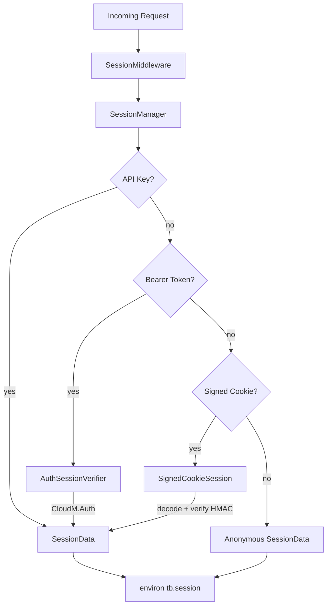

# Session

Stateless session management for ToolBoxV2 using signed cookies, Bearer token verification via CloudM.Auth, and API key authentication. Designed for multi-worker deployments with no server-side storage.

## Why This Matters

Any web endpoint that needs to know *who* is calling needs session management. This module provides a unified layer that checks API keys, Bearer tokens, and signed cookies in a single call, returning a consistent `SessionData` object. It is fully stateless — all session state lives in HMAC-SHA256-signed cookies, making it safe to run behind multiple workers without shared storage.

## Quick Start

```python
from toolboxv2.utils.workers.session import (
    SessionManager, SessionMiddleware, AccessLevel, generate_secret
)

# Generate a secret (do this once, store in env)
secret = generate_secret(64)

# Create manager
manager = SessionManager(cookie_secret=secret, app=app_instance)

# Wrap your WSGI app
app = SessionMiddleware(app, session_manager=manager)
```

## Usage Guide

### Creating an Authenticated Session

```python
session, cookie_header = manager.create_authenticated_session(
    user_id="user_123",
    user_name="alice",
    level=AccessLevel.TRUSTED,
)
# Return cookie_header as Set-Cookie in your response
```

### Extracting Session from a Request (Async)

```python
session = await manager.get_session_from_request(environ)
if session.is_authenticated:
    print(f"Hello, {session.user_name} (level={session.level})")
```

### Protecting Endpoints with Decorators

```python
from toolboxv2.utils.workers.session import require_auth, require_level, AccessLevel

@require_auth(min_level=AccessLevel.LOGGED_IN)
async def my_handler(environ, session, *args, **kwargs):
    # Only reaches here if session.is_authenticated and level >= LOGGED_IN
    return 200, {}, b"OK"

@require_level(AccessLevel.ADMIN)
async def admin_handler(environ, session, *args, **kwargs):
    return 200, {}, b"Admin OK"
```

## How It Works

The architecture is layered: `SessionMiddleware` wraps any WSGI app, extracting the session from every incoming request via `SessionManager`. The manager delegates to three strategies in priority order — API key lookup, Bearer token verification (via `AuthSessionVerifier` → CloudM.Auth), and signed cookie decoding (via `SignedCookieSession`). All paths produce a `SessionData` dataclass. On the response path, the middleware checks if the session is dirty and injects a `Set-Cookie` header automatically. The signed cookie format is `base64(json_payload).HMAC-SHA256-signature`, fully stateless.



## API Reference

### Classes

#### `AccessLevel`

User access levels for authorization. Integer constants:

| Constant | Value | Meaning |
|----------|-------|---------|
| `ADMIN` | `-1` | Full access to everything |
| `NOT_LOGGED_IN` | `0` | Anonymous user, only public endpoints |
| `LOGGED_IN` | `1` | Authenticated user |
| `TRUSTED` | `2` | Trusted/verified user |

---

#### `SessionData`

Session payload stored in signed cookie. A dataclass with fields for user identity, authorization, expiration, and custom data.

| Method | Signature | Description |
|--------|-----------|-------------|
| `is_authenticated` (property) | `def is_authenticated(self) -> bool` | Check if session represents an authenticated user. Requires validated, not anonymous, level ≥ `LOGGED_IN`, non-empty user_id, and not expired. |
| `is_expired` (property) | `def is_expired(self) -> bool` | Check if session has expired. Returns `False` if `exp <= 0`. |
| `mark_dirty` | `def mark_dirty(self)` | Mark session as modified (needs to be saved). |
| `is_dirty` (property) | `def is_dirty(self) -> bool` | Check if session has unsaved changes. |
| `to_dict` | `def to_dict(self) -> Dict[str, Any]` | Convert to dictionary for serialization. |
| `from_dict` (classmethod) | `def from_dict(cls, data: Dict[str, Any]) -> SessionData` | Create from dictionary. |
| `anonymous_session` (classmethod) | `def anonymous_session(cls, session_id: str = None) -> SessionData` | Create anonymous session. |
| `anonymous` (classmethod) | `def anonymous(cls) -> SessionData` | Alias for `anonymous_session`. |
| `authenticated_session` (classmethod) | `def authenticated_session(cls, user_id, user_name, level, provider_user_id, spec, max_age, **extra) -> SessionData` | Create authenticated session. |
| `invalidate` | `def invalidate(self)` | Invalidate this session — sets validated=False, anonymous=True, clears user identity, marks dirty. |

**Key fields:** `user_id`, `session_id`, `user_name`, `level`, `spec`, `exp`, `provider_user_id`, `validated`, `anonymous`, `extra` (dict), `live_data` (dict), `_dirty` (bool).

---

#### `SignedCookieSession`

Stateless session manager using signed cookies. Cookie format: `base64(json_payload).signature` where signature is HMAC-SHA256.

| Method | Signature | Description |
|--------|-----------|-------------|
| `__init__` | `(secret, cookie_name, max_age, secure, httponly, samesite, path, domain)` | Construct. `secret` must be ≥ 32 characters. |
| `encode` | `def encode(self, session: SessionData) -> str` | Encode session data to signed cookie value. |
| `decode` | `def decode(self, cookie_value: str) -> Optional[SessionData]` | Decode and verify signed cookie value. Returns `None` on invalid signature or expired session. |
| `create_cookie_header` | `def create_cookie_header(self, session: SessionData, max_age: Optional[int]) -> str` | Create `Set-Cookie` header value. |
| `create_logout_cookie_header` | `def create_logout_cookie_header(self) -> str` | Create `Set-Cookie` header that clears the session (`Max-Age=0`). |
| `get_from_cookie_header` | `def get_from_cookie_header(self, cookie_header: str) -> Optional[SessionData]` | Extract session from `Cookie` header string. |
| `get_from_environ` | `def get_from_environ(self, environ: Dict) -> Optional[SessionData]` | Extract session from WSGI environ dict. |

---

#### `AuthSessionVerifier`

Verify sessions using CloudM.Auth from ToolBoxV2. Provider-agnostic: works with any auth backend that implements `validate_session(token=...)` returning `{authenticated, user_id, ...}`. Falls back to signed cookie if auth module is not available.

| Method | Signature | Description |
|--------|-----------|-------------|
| `__init__` | `(app, auth_module, verify_func)` | `app` is a ToolBoxV2 App instance. Defaults: `auth_module="CloudM.Auth"`, `verify_func="validate_session"`. |
| `verify_session_async` | `async def verify_session_async(self, session_token: str) -> Tuple[bool, Optional[SessionData]]` | Verify session token via auth module (async). Returns `(is_valid, session_data)`. |
| `verify_session_sync` | `def verify_session_sync(self, session_token: str) -> Tuple[bool, Optional[SessionData]]` | Synchronous version of `verify_session`. |

---

#### `SessionManager`

Combined session manager supporting signed cookies, Bearer token auth (via `AuthSessionVerifier`), and API key auth. For multi-worker setup, all session state is in the signed cookie — no server-side storage needed.

| Method | Signature | Description |
|--------|-----------|-------------|
| `__init__` | `(cookie_secret, cookie_name, cookie_max_age, ..., app, auth_module, ...)` | Construct with cookie settings and optional app for auth verification. |
| `create_session` | `def create_session(self, user_id, user_name, level, ..., **extra) -> str` | Create a new session and return the session ID. Session data is stored in a signed cookie, not server-side. |
| `create_authenticated_session` | `def create_authenticated_session(self, user_id, user_name, level, ...) -> Tuple[SessionData, str]` | Create an authenticated session and return both session and `Set-Cookie` header. |
| `get_session` | `def get_session(self, session_id: str) -> SessionData` | Get session by ID. Returns from pending updates or creates anonymous. |
| `get_session_from_request` | `async def get_session_from_request(self, environ, headers) -> SessionData` | Extract and verify session from request. Checks API key → Bearer token → signed cookie → anonymous. |
| `get_session_from_request_sync` | `def get_session_from_request_sync(self, environ, headers) -> SessionData` | Synchronous version of `get_session_from_request`. |
| `update_session` | `def update_session(self, session: SessionData)` | Mark session for update. Queues the session for cookie update. |
| `set_session_data` | `def set_session_data(self, session, user_id, user_name, level, ..., **extra) -> SessionData` | Update session fields and mark as dirty. Returns the updated session. |
| `delete_session` | `def delete_session(self, session_id: str)` | Delete/invalidate a session. Removes from pending updates. |
| `invalidate_session` | `def invalidate_session(self, session: SessionData) -> str` | Invalidate session and return `Set-Cookie` header that clears the cookie. |
| `get_set_cookie_header` | `def get_set_cookie_header(self, session: SessionData) -> Optional[str]` | Get `Set-Cookie` header if session needs updating, or `None`. |
| `create_cookie_header_for_session` | `def create_cookie_header_for_session(self, session, max_age) -> str` | Create `Set-Cookie` header for a specific session, regardless of dirty state. |
| `get_logout_cookie_header` | `def get_logout_cookie_header(self) -> str` | Get `Set-Cookie` header that clears the session cookie. |
| `register_api_key` | `def register_api_key(self, api_key: str, session: SessionData)` | Register an API key with associated session data. |
| `revoke_api_key` | `def revoke_api_key(self, api_key: str)` | Revoke an API key. |
| `verify_session_token` | `def verify_session_token(self, token: str) -> Tuple[bool, Optional[SessionData]]` | Verify a session token (sync). Returns `(is_valid, session_data)`. |
| `verify_session_token_async` | `async def verify_session_token_async(self, token: str) -> Tuple[bool, Optional[SessionData]]` | Verify a session token (async). |
| `clear_pending_updates` | `def clear_pending_updates(self)` | Clear all pending session updates. |

---

#### `SessionMiddleware`

WSGI middleware that adds session to environ and handles cookie updates.

| Method | Signature | Description |
|--------|-----------|-------------|
| `__init__` | `(app, session_manager, environ_key)` | Wrap a WSGI app. Session is available at `environ[environ_key]` (default: `"tb.session"`). |
| `__call__` | `def __call__(self, environ, start_response)` | Process request — extracts session, injects into environ, adds `Set-Cookie` on response if session was modified. |

### Functions

#### `require_auth(min_level: int = AccessLevel.LOGGED_IN)`

Decorator to require authentication for async handlers. Returns 401 if not authenticated, 403 if level is insufficient (unless `ADMIN`). Wrapped function receives `(environ, session, *args, **kwargs)`.

#### `require_level(level: int)`

Decorator to require specific access level. Alias for `require_auth(level)`.

#### `generate_secret(length: int = 64) -> str`

Generate a secure random secret (base64-encoded `os.urandom`). Use this to create cookie secrets.

#### `main()`

CLI for session management tools. Subcommands: `generate-secret` (with `-l`/`--length`), `test` (with `-s`/`--secret` for encode/decode round-trip testing).

## Dependencies

- `pem_to_public_key` from `toolboxv2/utils/security/cryp.py`
- `DataAccessLog` from `toolboxv2/mods/CloudM/UserDataAPI.py`
- `generate_authorization_url` from `toolboxv2/mods/WhatsAppTb/client.py`
- `save_user_stats` from `toolboxv2/mods/UltimateTTT.py`
- `add_collection_to_group_wrapper` from `toolboxv2/mods/MinimalHtml.py`
- `get_search_only_tools` from `toolboxv2/mods/isaa/extras/web_helper/tooklit.py`
- `a_format_class` from `toolboxv2/mods/isaa/base/Agent/flow_agent.py`
- `register_api_endpoints` from `toolboxv2/mods/videoFlow/api/generation.py`
- `_needs_continuation` from `toolboxv2/flows/pyshell.py`
- `_stats_for_keys` from `toolboxv2/mods/isaa/base/IntelligentRateLimiter/intelligent_rate_limiter.py`

## Used By

- `markdown_to_svg` in `toolboxv2/mods/Canvas.py`
- `speak` in `toolboxv2/mods/TTS.py`
- `create_server` in `toolboxv2/mods/isaa/extras/tools/discord_tools.py`
- `_encode` in `toolboxv2/utils/system/file_handler.py`
- `encode_code` in `toolboxv2/utils/security/cryp.py`
- `from_dict` in `toolboxv2/mods/PasswordManager.py`
- `from_dict` in `toolboxv2/mods/Minu/shared.py`
- `_get_task_status_icon_from_dict` in `toolboxv2/mods/isaa/extras/terminal_progress2.py`
- `_get_task_status_color_from_dict` in `toolboxv2/mods/isaa/extras/terminal_progress2.py`

## Known Issues

- **Deprecated field**: `SessionManager.custom_verifier` is set to `None` with a comment marking it deprecated. `auth_verifier` handles all verification.
- **`get_session` limitation**: In stateless mode, `get_session(session_id)` can only return sessions from `_pending_updates` (in-flight updates within the same process). It cannot reconstruct a session from a session ID alone — the actual data lives in the client's cookie.
