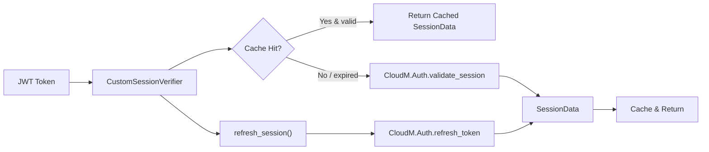

# Session Custom

> **Scope:** Auth-provider session verification with in-memory caching (`CustomSessionVerifier`).  
> For the **stateless cookie-based session infrastructure** (`SessionManager`, `SignedCookieSession`), see [Session](session.md).

Provider-agnostic session verification and management for ToolBoxV2. Validates JWT tokens via the CloudM.Auth module, caches session data thread-safely, and supports Discord, Google, and Passkey authentication providers.

## Why This Matters

Any flow or worker that needs to know *who is making a request* relies on this module. It abstracts away the specifics of OAuth providers and token validation into a single `verify_session()` call with built-in caching, so repeated requests for the same token don't hit the auth backend every time.

## Quick Start

```python
from toolboxv2.utils.workers.session_custom import get_session_verifier

verifier = get_session_verifier(app)
session = await verifier.verify_session(jwt_token)

if session.is_valid():
    print(f"Authenticated as {session.username} (provider: {session.provider})")
```

## Usage Guide

### Basic Usage

**Verify a token and extract user info:**

```python
verifier = get_session_verifier(app)
session = await verifier.verify_session(token)

user_id = session.user_id
email = session.email
level = session.level
```

**Serialize session data for storage or transmission:**

```python
data_dict = session.to_dict()
restored = SessionData.from_dict(data_dict)
```

**Send session data to the frontend:**

```python
frontend_payload = session.to_frontend_format()
# Contains isAuthenticated, userId, username, userLevel, provider, userData, etc.
```

### Advanced Usage

**Refresh an expired session using a refresh token:**

```python
new_session = await verifier.refresh_session(old_refresh_token)
if new_session.is_valid():
    # Use new_session.token for subsequent requests
```

**Invalidate a cached session (e.g., on logout):**

```python
was_invalidated = verifier.invalidate_session(token)  # Returns True if found and removed
```

**Reset singleton for isolated tests:**

```python
CustomSessionVerifier.reset_instance()  # Clears singleton, enables test mode
verifier = CustomSessionVerifier(app, auth_module="CloudM.Auth")  # Fresh instance
# ... run test ...
verifier.clear_cache()
```

## How It Works

`CustomSessionVerifier` is a thread-safe singleton with double-checked locking. On `verify_session()`, it first checks an in-memory token-to-`SessionData` cache. If the cached entry exists and `is_valid()` returns `True` (expiration timestamp in the future), it returns immediately. Otherwise it delegates to `CloudM.Auth.validate_session` via the app's `a_run_any()` async dispatch. The response is mapped into a `SessionData` instance and cached. `refresh_session()` follows the same pattern but calls `CloudM.Auth.refresh_token`. All cache mutations are protected by a dedicated `threading.Lock`. In test mode (`reset_instance()`), the singleton restriction is disabled so each call creates a fresh instance.



## API Reference

### Classes

#### `SessionData`

Session data structure for custom authentication. Provider-agnostic session data format (dataclass).

| Method | Signature | Description |
|--------|-----------|-------------|
| `is_valid` | `def is_valid(self) -> bool` | Check if session is still valid based on expiration. |
| `to_dict` | `def to_dict(self) -> Dict[str, Any]` | Convert session data to dictionary for storage/transmission. |
| `from_dict` | `def from_dict(cls, data: Dict[str, Any]) -> SessionData` | Create SessionData from dictionary. *(classmethod)* |
| `to_frontend_format` | `def to_frontend_format(self) -> Dict[str, Any]` | Convert to frontend-compatible format. Maintains compatibility with existing frontend state structure. |

**Fields:** `user_id: str`, `username: str`, `email: str`, `level: int`, `provider: str`, `provider_user_id: str`, `token: str`, `refresh_token: str`, `expires_at: float`, `created_at: float`, `last_validated: float`, `provider_data: Dict[str, Any]`

#### `CustomSessionVerifier`

Custom session verifier with caching support. Uses the CloudM.Auth module for token validation and user data retrieval. Provider-agnostic — works with Discord, Google, and Passkeys. Implements the Singleton pattern with test-mode reset support.

| Method | Signature | Description |
|--------|-----------|-------------|
| `__new__` | `def __new__(cls, app=None, auth_module: str = "CloudM.Auth")` | Singleton pattern with test-mode reset support. |
| `reset_instance` | `def reset_instance(cls)` | Reset singleton instance (for testing with IsolatedTestCase). *(classmethod)* |
| `__init__` | `def __init__(self, app=None, auth_module: str = "CloudM.Auth")` | Initialize the verifier with app instance and auth module name. |
| `verify_session` | `async def verify_session(self, token: str) -> SessionData` | Verify a JWT token and retrieve session data. Checks cache first, then delegates to CloudM.Auth. |
| `refresh_session` | `async def refresh_session(self, refresh_token: str) -> SessionData` | Refresh an expired session using refresh token. Returns new SessionData with updated tokens. |
| `invalidate_session` | `def invalidate_session(self, token: str) -> bool` | Invalidate a cached session. Returns True if session was found and removed. |
| `clear_cache` | `def clear_cache(self)` | Clear all cached sessions (for testing). |

### Functions

#### `get_session_verifier(app=None, auth_module: str = "CloudM.Auth") -> CustomSessionVerifier`

Get or create the session verifier instance.

**Parameters:**
- `app` — ToolBoxV2 application instance
- `auth_module` — Auth module name (default: `"CloudM.Auth"`)

**Returns:** `CustomSessionVerifier` instance

## Dependencies

- `CloudM.Auth` module — invoked dynamically via `app.a_run_any()` for `validate_session` and `refresh_token` calls
- `user_id` from `toolboxv2/utils/system/types.py`

## Used By

- Referenced by `invalidate_session` in [session](session.md)
- Referenced by `__init__` in [adaptive_prompt_system](../flows/adaptive_prompt_system.md)
- Referenced by `__init__` in [chain](../flows/chain.md)
- Referenced by `__init__` in [minicli](../flows/minicli.md)
- Referenced by `__init__` in pyshell
