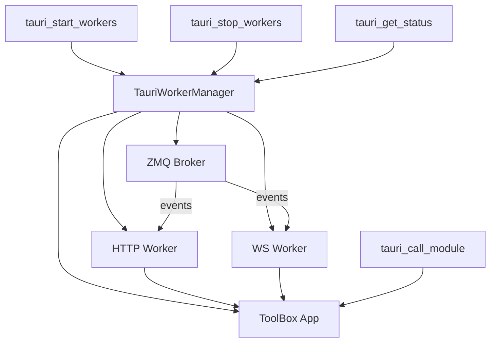

# Tauri Integration

Unified worker manager for Tauri desktop apps. Manages both HTTP and WebSocket workers in a single process, optimized for single-user local operation. The HTTP worker handles ToolBox calls, auth, and core logic, while the WS worker provides real-time WebSocket connections.

## Why This Matters

This module bridges ToolBoxV2 and the Tauri desktop runtime. If you are building or maintaining a Tauri-based desktop app that needs ToolBox backend services — HTTP endpoints, WebSocket real-time events, or direct IPC module calls — this is the integration layer. It bundles both server types into a single process, removing the need to manage separate worker binaries in production builds.

## Quick Start

```python
from toolboxv2.utils.workers.tauri_integration import (
    tauri_start_workers,
    tauri_get_status,
    tauri_stop_workers,
)

# Start both HTTP and WS workers
result = tauri_start_workers()
# {"status": "ok", "http_url": "http://...", "ws_url": "ws://..."}

# Check current status
status = tauri_get_status()

# Shut down cleanly
tauri_stop_workers()
```

## Usage Guide

### Starting and Stopping Workers

```python
from toolboxv2.utils.workers.tauri_integration import (
    tauri_start_workers,
    tauri_stop_workers,
    tauri_get_status,
)

tauri_start_workers()  # Returns {"status": "ok", "http_url": ..., "ws_url": ...}
status = tauri_get_status()
# {"running": True, "http_url": "http://0.0.0.0:5000", "ws_url": "ws://0.0.0.0:5001", "ws_enabled": True}

tauri_stop_workers()  # Returns {"status": "ok"}
```

### Direct IPC Module Calls

```python
from toolboxv2.utils.workers.tauri_integration import tauri_call_module

result = tauri_call_module(
    module="example_module",
    function="some_function",
    args={"key": "value"},
)
# {"status": "ok", "data": ...}
```

### Standalone Sidecar Execution

```bash
tb-worker --http-port 5000 --ws-port 5001 --mode tauri --verbose
```

## How It Works

`TauriWorkerManager` runs an internal ZMQ broker, an HTTP worker, and optionally a WebSocket worker inside a single process. On `start()`, a daemon thread spawns an async event loop. Within that loop, `_run_servers()` first starts the ZMQ broker (for event distribution between HTTP and WS), then initializes a shared ToolBox app instance, then launches the HTTP worker in a separate thread (because WSGI is blocking) and the WS worker inside the async loop. A global singleton pattern via `get_manager()` ensures all Tauri command functions operate on the same manager instance.

## API Reference

### Classes

#### `TauriWorkerManager`

Unified worker manager for Tauri desktop apps. Manages both HTTP and WS workers in a single process, optimized for single-user local operation.

| Method | Signature | Description |
|--------|-----------|-------------|
| `__init__` | `def __init__(self, config=None)` | Initialize with optional config; defaults all internal state. |
| `start` | `def start(self)` | Starts the worker manager in a daemon thread. Sets up an async event loop and runs `_run_servers`. |
| `stop` | `def stop(self)` | Stops WS worker, broker, and event loop; joins threads. |
| `get_http_url` | `def get_http_url(self) -> str` | Returns the HTTP server URL (e.g. `http://host:port`). |
| `get_ws_url` | `def get_ws_url(self) -> str` | Returns the WebSocket server URL, or `None` if WS is disabled. |
| `is_ws_enabled` | `def is_ws_enabled(self) -> bool` | Check if WS worker is enabled. |
| `_get_config` | `def _get_config(self)` | Get or create configuration. Loads via `load_config()` on first call. |
| `_init_app` | `def _init_app(self)` | Initialize ToolBoxV2 app (shared between HTTP and WS workers). |
| `_run_servers` | `async def _run_servers(self)` | Run HTTP and WS servers in unified mode. Starts ZMQ broker, inits app, runs HTTP in a thread, WS in async loop. |

### Functions

#### `get_manager() -> TauriWorkerManager`

Get or create the global singleton `TauriWorkerManager` instance.

**Returns:** The global `TauriWorkerManager`.

---

#### `tauri_start_workers() -> Dict[str, Any]`

Start workers (Tauri command).

**Returns:** `{"status": "ok", "http_url": ..., "ws_url": ...}` on success, or `{"status": "error", "message": ...}` on failure.

---

#### `tauri_stop_workers() -> Dict[str, Any]`

Stop workers (Tauri command).

**Returns:** `{"status": "ok"}` on success, or `{"status": "error", "message": ...}` on failure.

---

#### `tauri_get_status() -> Dict[str, Any]`

Get worker status (Tauri command).

**Returns:** Dict with keys `running`, `http_url`, `ws_url`, `ws_enabled`.

---

#### `tauri_call_module(module: str, function: str, args: Dict[str, Any] = None) -> Dict[str, Any]`

Call ToolBoxV2 module function (Tauri command). Direct IPC without HTTP for better performance.

**Parameters:**
- `module` — `str`, the ToolBox module name.
- `function` — `str`, the function name within that module.
- `args` — `Dict[str, Any]`, keyword arguments passed to the function.

**Returns:** `{"status": "ok", "data": ...}` on success, or `{"status": "error", "message": ...}` on failure.

---

#### `main()`

Run Tauri worker manager standalone. Entry point for the bundled sidecar binary. Parses CLI arguments (`--http-port`, `--ws-port`, `--mode`, `--no-ws`, `-v`, `-c`) and starts workers.

## Architecture



## Dependencies

- `load_config` from [config](config.md) — worker configuration loading
- `get_app` from getting_and_closing_app — shared ToolBox app instance
- `HTTPWorker` from [server_worker](server_worker.md) — HTTP server worker
- `ZMQEventManager` — internal ZMQ broker for event distribution

## Used By

- Referenced by [adaptive_prompt_system](../flows/adaptive_prompt_system.md) in `toolboxv2/flows/adaptive_prompt_system.py`
- Referenced by [chain](../flows/chain.md) in `toolboxv2/flows/chain.py`
- Referenced by [minicli](../flows/minicli.md) in `toolboxv2/flows/minicli.py`
- Referenced by pyshell in `toolboxv2/flows/pyshell.py`

## Known Issues

- **Silent exception swallowing in `stop()`**: The `stop()` method catches all `Exception` during WS worker, broker, and event loop shutdown with bare `except Exception: pass`. This can hide real shutdown errors and make debugging difficult.
- **Global mutable state**: `get_manager()` uses a module-level `_manager` global. Concurrent calls from multiple threads without locking could theoretically create duplicate managers, though in practice Tauri commands are sequential.
