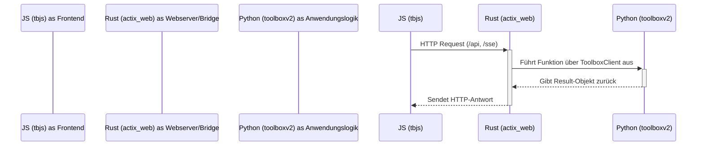
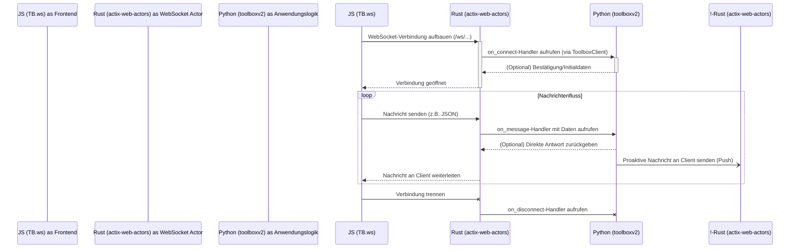

## Stack-Dokumentation:

Diese Dokumentation beschreibt die Architektur und den Datenfluss zwischen dem `tbjs`-Frontend, dem `actix_web`-Server in Rust und dem `toolboxv2`-Backend in Python.

### 1. Architekturübersicht

Ihr Stack besteht aus drei eng integrierten Schichten, die jeweils spezifische Aufgaben übernehmen:

*   **JavaScript (Frontend - `tbjs`)**: Eine modulare Framework, die für die Benutzeroberfläche und die Client-Logik verantwortlich ist. Sie initiiert die gesamte Kommunikation mit dem Server.
*   **Rust (Webserver/Bridge - `actix_web`)**: Dient als hochperformante und sichere Brücke. Er nimmt HTTP-Anfragen vom Client entgegen, verwaltet Benutzersitzungen und leitet Anfragen sicher an das Python-Backend weiter. Er ist die zentrale Schnittstelle, die die Typensicherheit von Rust mit der Flexibilität von Python verbindet.
*   **Python (Anwendungslogik - `toolboxv2`)**: Das "Gehirn" der Anwendung. Hier wird die gesamte Geschäftslogik ausgeführt, von der Datenverarbeitung über die Authentifizierung bis hin zur Dateiverwaltung. Die modulare Struktur ermöglicht eine einfache Erweiterung.

### 2. Detaillierter Request/Response-Lebenszyklus (HTTP)

Ein typischer API-Aufruf, wie z. B. das Hochladen einer Datei, durchläuft die folgenden Phasen:

#### Phase 1: Anfrage vom Client zum Server

1.  **JavaScript (`tbjs`)**:
    *   **Initiierung**: Eine Benutzeraktion (z. B. das Auswählen einer Datei) löst einen Aufruf von `TB.api.request('FileWidget', 'upload', formData, 'POST')` aus.
    *   **Payload-Verarbeitung**:
        *   Für JSON-Daten wird ein JavaScript-Objekt in einen JSON-String umgewandelt.
        *   Für Datei-Uploads wird ein `FormData`-Objekt erstellt. Der Browser setzt automatisch den korrekten `Content-Type: multipart/form-data` Header, inklusive des `boundary`.
    *   **Versand**: Ein `fetch`-Request wird an den Rust-Server gesendet (z. B. an `/api/FileWidget/upload`). Der `Authorization: Bearer <token>` Header wird automatisch angefügt, falls ein Token im `TB.state` vorhanden ist.

2.  **Rust (`actix_web`)**:
    *   **Routing & Middleware**: `actix_web` leitet die Anfrage an den `api_handler`. Middleware wie `SessionMiddleware` und `Logger` werden ausgeführt.
    *   **Sitzungsvalidierung**: Der Handler prüft, ob das aufgerufene Modul (`FileWidget`) geschützt ist. Falls ja, wird die Sitzung validiert. Ist die Sitzung ungültig, wird ein `401 Unauthorized` zurückgegeben.
    *   **Payload-Parsing**: Der Handler inspiziert den `Content-Type` Header:
        *   `application/json`: Der Body wird als JSON deserialisiert.
        *   `multipart/form-data`: Der `api_handler` parst den multipart-Stream. Textfelder werden als normale Key-Value-Paare extrahiert. **Dateien werden vollständig in den Speicher gelesen und ihr Inhalt wird Base64-kodiert.** Das Ergebnis ist eine `HashMap`, die eine Struktur wie `{ "file": { "filename": "...", "content_base64": "..." } }` enthält.
    *   **Python-Aufruf**: Der Handler ruft die `run_function` des globalen `ToolboxClient` auf. Modulname, Funktionsname und die aufbereiteten `kwargs` (inklusive der geparsten Payload und Request-Metadaten) werden übergeben.

3.  **Python (`toolboxv2`)**:
    *   **Instanz-Management (in Rust)**: Der `ToolboxClient` wählt eine verfügbare Python-Instanz aus dem Pool aus (oder erstellt eine neue) und stellt sicher, dass das `FileWidget`-Modul geladen ist.
    *   **Datenübergabe (`pyo3`)**: Die `serde_json::Value` aus Rust wird mithilfe von `pyo3` in Python-Typen (z. B. `dict`, `list`, `str`) umgewandelt.
    *   **Ausführung**: Die `handle_upload`-Funktion im `FileWidget`-Modul wird ausgeführt. Sie erhält die `form_data` als Python-`dict` und kann direkt auf den Base64-kodierten Inhalt der Datei zugreifen, ihn dekodieren und verarbeiten (z. B. Chunks zusammenfügen und im `BlobStorage` speichern).

#### Phase 2: Antwort vom Server zum Client

1.  **Python (`toolboxv2`)**:
    *   **Ergebnis-Kapselung**: Die Python-Funktion schließt ihre Arbeit ab und gibt das Ergebnis in einem `Result.ok(...)` oder `Result.default_user_error(...)` Objekt zurück. Dies standardisiert die Antwortstruktur.

2.  **Rust (`actix_web`)**:
    *   **Datenrückgabe (`pyo3`)**: Das Python-`Result`-Objekt wird von der `py_to_value`-Funktion in eine `serde_json::Value` für Rust umgewandelt.
    *   **Antwort-Verarbeitung**: Der `api_handler` empfängt diese `serde_json::Value` und parst sie in die Rust-Struktur `ApiResult`. Die Hilfsfunktion `parse_response` analysiert dieses Objekt:
        *   Sie prüft das Feld `data_type` (z. B. `json`, `html`, `binary`).
        *   Sie erstellt die entsprechende `HttpResponse` mit dem korrekten `Content-Type` und Body.

3.  **JavaScript (`tbjs`)**:
    *   **Empfang**: Das `Promise` des `fetch`-Aufrufs in `TB.api.request` wird aufgelöst.
    *   **Antwort-Wrapper**: Die Funktion `wrapApiResponse` stellt sicher, dass die empfangenen Daten (auch bei Fehlern) konsistent als `tbjs`-`Result`-Objekt formatiert sind.
    *   **UI-Update**: Die Anwendungslogik verarbeitet das `Result`-Objekt und aktualisiert die Benutzeroberfläche (z. B. durch Anzeigen einer Erfolgsmeldung oder das Neuladen der Dateiliste).

### 3. Streaming-Architektur (Server-Sent Events - SSE)

Der SSE-Mechanismus folgt einem ähnlichen, aber auf Streaming ausgerichteten Pfad:

1.  **JavaScript (`tbjs`)**: `TB.sse.connect('/sse/UltimateTTT/open_game_stream?game_id=...')` öffnet eine persistente HTTP-GET-Verbindung.
2.  **Rust (`actix_web`)**: Der `sse_handler` empfängt die Anfrage, validiert die Session und ruft `client.stream_sse_events(...)` auf.
3.  **Rust-Python-Bridge**:
    *   Diese Funktion ruft die Python-Generatorfunktion über `stream_generator` auf.
    *   Sie startet eine `tokio::task`, die in der Python-Funktion auf Ergebnisse wartet.
    *   Die `yield`-Anweisungen der Python-Generatorfunktion senden Daten zurück an Rust.
4.  **Rust (`actix_web`)**: Der `sse_handler` empfängt die Daten-Chunks vom Python-Generator, formatiert jeden Chunk als SSE-Nachricht (`data: ...\n\n`) und streamt sie sofort an den Client. Ein Heartbeat wird ebenfalls gesendet, um die Verbindung offen zu halten.
5.  **JavaScript (`tbjs`)**: Der `EventSource`-Listener in `TB.sse` empfängt die Nachrichten und löst entsprechende Events im `TB.events`-Bus aus, was zu UI-Updates führt.

***

## Konzept: WebSocket-Implementierung

Die Hinzufügung von WebSockets ermöglicht eine echte bidirektionale Echtzeitkommunikation, die ideal für interaktive Features wie Chats oder Live-Kollaboration ist. Hier ist ein Entwurf, wie dies in Ihren Stack integriert werden kann.

### 1. Motivation

*   **Bidirektionale Kommunikation**: Im Gegensatz zu SSE, bei dem nur der Server senden kann, ermöglichen WebSockets die Kommunikation in beide Richtungen über eine einzige Verbindung.
*   **Geringere Latenz**: Ideal für Anwendungen, die schnelle, wiederholte Interaktionen erfordern (z. B. Multiplayer-Spiele), da der Overhead von HTTP-Anfragen entfällt.

### 2. Vorgeschlagene Architekturanpassungen

