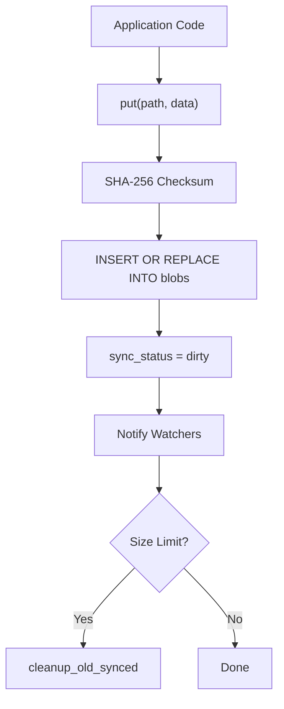

# BlobDB Reference

> **File:** `toolboxv2/utils/extras/db/mobile_db.py`
> SQLite-based offline-first blob storage with dirty tracking, conflict resolution, and auto-size management.

## How It Works

`MobileDB` is a thread-safe, SQLite-backed key-value blob store designed for mobile and offline scenarios. Every blob write is tracked with a `sync_status` (`dirty` → `synced` / `deleted` / `conflict`). The database uses WAL journaling, thread-local connections, and auto-vacuum for crash safety and performance.



## Core API

### CRUD Operations

| Method | Signature | Description |
|--------|-----------|-------------|
| `put` | `put(path, data, content_type, encrypted, skip_sync) → BlobMetadata` | Store blob. Sets `sync_status=DIRTY` unless `skip_sync=True` |
| `get` | `get(path) → Optional[bytes]` | Retrieve blob data (skips deleted) |
| `delete` | `delete(path, hard_delete) → bool` | Soft delete (`sync_status=deleted`) or hard delete (row removed) |
| `exists` | `exists(path) → bool` | Check if blob exists and not deleted |
| `list` | `list(prefix, include_deleted, sync_status) → List[BlobMetadata]` | List blobs with optional prefix/status filtering |

### Sync Operations

| Method | Signature | Description |
|--------|-----------|-------------|
| `get_dirty_blobs` | `→ List[BlobMetadata]` | All blobs needing cloud sync |
| `get_pending_deletes` | `→ List[BlobMetadata]` | All blobs marked for deletion |
| `mark_synced` | `mark_synced(path, cloud_timestamp)` | Mark blob as synced |
| `mark_conflict` | `mark_conflict(path)` | Flag sync conflict |
| `resolve_conflict` | `resolve_conflict(path, use_local)` | Keep local (`dirty`) or accept cloud (`hard_delete`) |
| `needs_sync` | `needs_sync(cloud_manifest) → Dict[path, action]` | Compare local vs cloud → `upload`/`download`/`conflict` |
| `get_sync_stats` | `→ Dict` | Count by status + total size |

### Watch System

| Method | Signature | Description |
|--------|-----------|-------------|
| `watch` | `watch(path_pattern, callback) → callback_id` | Subscribe to blob changes (glob pattern) |
| `unwatch` | `unwatch(callback_id)` | Remove subscription |
| `start_watch_poller` | `start_watch_poller(interval)` | Background thread polling `sync_log` for changes |

### Import/Export

| Method | Signature | Description |
|--------|-----------|-------------|
| `export_for_sync` | `→ Iterator[(path, data, metadata)]` | Stream dirty blobs for upload |
| `import_from_cloud` | `import_from_cloud(path, data, cloud_timestamp, checksum) → bool` | Verify checksum, detect conflicts, store |

## Schema

```sql
CREATE TABLE blobs (
    path TEXT PRIMARY KEY,
    data BLOB NOT NULL,
    size INTEGER NOT NULL,
    checksum TEXT NOT NULL,
    local_updated_at REAL NOT NULL,
    cloud_updated_at REAL,
    sync_status TEXT NOT NULL DEFAULT 'dirty',
    version INTEGER NOT NULL DEFAULT 1,
    content_type TEXT NOT NULL DEFAULT 'application/octet-stream',
    encrypted INTEGER NOT NULL DEFAULT 1,
    created_at REAL NOT NULL DEFAULT (julianday('now'))
);
```

## SyncStatus Enum

| Value | Meaning |
|-------|---------|
| `dirty` | Local change, needs cloud upload |
| `synced` | In sync with cloud |
| `deleted` | Soft-deleted, needs cloud delete |
| `conflict` | Local and cloud both changed |

## SQLite Pragmas

```sql
PRAGMA journal_mode=WAL;          -- Crash-safe concurrent reads
PRAGMA synchronous=NORMAL;        -- Balance safety/performance
PRAGMA busy_timeout=30000;        -- 30s wait on lock
PRAGMA wal_autocheckpoint=1000;   -- Auto-checkpoint WAL
PRAGMA mmap_size=134217728;       -- 128MB memory-mapped reads
PRAGMA auto_vacuum=INCREMENTAL;   -- Reclaim space incrementally
```

## Size Management

Auto-cleanup triggers when DB exceeds `max_size_mb` (default 500MB):
1. Advisory lock prevents concurrent cleanup (fcntl on Unix, direct on Windows)
2. Removes old synced blobs (default: >30 days)
3. Target: 80% of max size
4. `PRAGMA incremental_vacuum` reclaims freed pages

## Related

- [Storage Overview](index.md) — DB modes, BlobStorage facade
- [Blob Sharing API](blob_sharing_api.md) — user-to-user sharing
- [CloudM FolderSync](../mods/CloudM/folder_sync.md) — encrypted folder sync (deprecated)
- `LogSyncManager` in `toolboxv2/utils/system/tb_logger.py` — syncs MobileDB logs to MinIO
