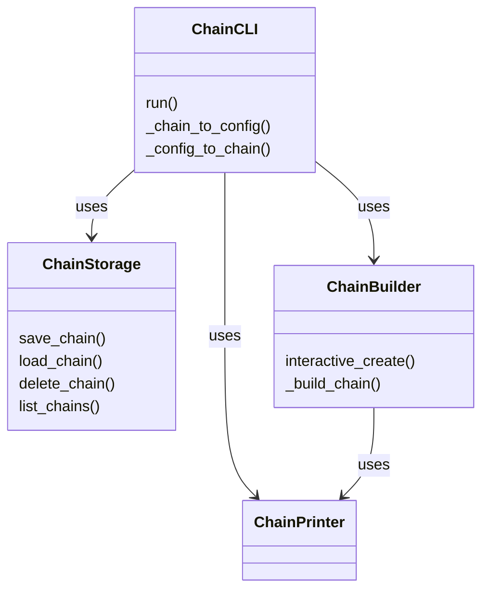

# chain

Interactive CLI for creating, testing, managing, and deploying AI agent chains. Provides a REPL with fuzzy-tab-completion, JSON-based persistence, and service deployment via ISAA's agent hosting.

## Why This Matters

When you need to compose multiple AI agents into sequential, parallel, conditional, or error-handling pipelines, this module gives you an interactive console to build, save, test, and deploy those chains without writing code. It bridges the gap between individual agent definitions and production-ready chain services.

## How It Works

The module is organized in three layers. `ChainStorage` handles JSON file persistence and metadata caching in a `chains/` directory. `ChainBuilder` drives an interactive prompt loop for assembling agents, formatters, conditionals, and parallel groups into a `Chain` object. `ChainCLI` is the top-level REPL that orchestrates both, dispatching user commands to storage, builder, chain serialization/deserialization, or ISAA's deployment API. Chains are serialized to JSON configs (with a recursive component serializer) and deserialized back at load time, reconstructing Pydantic models from saved schemas.

## API Reference

### Classes

#### `ChainStorage`

Handles chain persistence and metadata management. Stores chain configs as individual JSON files and maintains a shared `metadata.json` cache.

| Method | Signature | Description |
|--------|-----------|-------------|
| `__init__` | `def __init__(self, app_instance)` | Creates `chains/` directory under app data dir, loads existing metadata cache |
| `save_chain` | `def save_chain(self, name: str, chain_config: dict, metadata: ChainMetadata) -> bool` | Save chain configuration and metadata. Updates `modified_at` timestamp |
| `load_chain` | `def load_chain(self, name: str) -> dict or None` | Load chain configuration from JSON file |
| `delete_chain` | `def delete_chain(self, name: str) -> bool` | Delete chain file and remove from metadata cache |
| `list_chains` | `def list_chains(self) -> list[tuple[str, ChainMetadata]]` | List all available chains with metadata |
| `get_metadata` | `def get_metadata(self, name: str) -> ChainMetadata or None` | Get metadata for a specific chain from cache |
| `_load_metadata` | `def _load_metadata(self)` | Load chain metadata from storage into cache |
| `_save_metadata` | `def _save_metadata(self)` | Persist metadata cache to `metadata.json` |

#### `ChainBuilder`

Interactive chain builder with guided creation. Walks the user through adding agents, parallel groups, conditionals, and formatters.

| Method | Signature | Description |
|--------|-----------|-------------|
| `__init__` | `def __init__(self, isaa_tools, printer: ChainPrinter)` | Initialize with ISAA tools reference and printer |
| `interactive_create` | `async def interactive_create(self, name: str) -> Chain or None` | Create a chain through interactive prompts. Returns tuple of `(Chain, user_metadata)` or `None` |
| `_build_chain` | `def _build_chain(self, components: list) -> Chain` | Build chain from components using `>>` operator for sequential composition |
| `_format_chain_display` | `def _format_chain_display(self, chain_agents) -> str` | Format chain for display with `>>` separators between components |

#### `ChainCLI`

Modern minimalistic chain management console. Create, test, manage, and deploy AI agent chains with intuitive commands.

| Method | Signature | Description |
|--------|-----------|-------------|
| `__init__` | `def __init__(self, app_instance)` | Initializes storage, builder, printer, prompt session with fuzzy completion, and command map |
| `run` | `async def run(self)` | Main CLI event loop. Initializes ISAA, renders prompt, dispatches commands |
| `_get_prompt` | `def _get_prompt(self) -> str` | Generate dynamic prompt based on current state, showing active chain name |
| `_build_completions` | `def _build_completions(self) -> dict` | Build command completions with chain names as sub-completions |
| `_process_command` | `async def _process_command(self, command_line: str)` | Parse and dispatch command line to registered command handler |

**Chain Management Commands:**

| Method | Signature | Description |
|--------|-----------|-------------|
| `cmd_create` | `async def cmd_create(self, args: list[str])` | Create new chain interactively via ChainBuilder |
| `cmd_load` | `async def cmd_load(self, args: list[str])` | Load existing chain from storage |
| `cmd_save` | `async def cmd_save(self, args: list[str])` | Save current chain |
| `cmd_delete` | `async def cmd_delete(self, args: list[str])` | Delete chain with confirmation prompt |
| `cmd_list` | `async def cmd_list(self, args: list[str])` | List all available chains |

**Chain Operation Commands:**

| Method | Signature | Description |
|--------|-----------|-------------|
| `cmd_show` | `async def cmd_show(self, args: list[str])` | Visualize chain structure using built-in graph rendering |
| `cmd_test` | `async def cmd_test(self, args: list[str])` | Test chain execution with optional input |
| `cmd_run` | `async def cmd_run(self, args: list[str])` | Run chain with input, displays output |
| `cmd_deploy` | `async def cmd_deploy(self, args: list[str])` | Deploy chain as service via ISAA's `publish_and_host_agent`. Supports `remote` flag for registry server selection |

**Information Commands:**

| Method | Signature | Description |
|--------|-----------|-------------|
| `cmd_help` | `async def cmd_help(self, args: list[str])` | Show help information. Supports specific command help via args |
| `cmd_info` | `async def cmd_info(self, args: list[str])` | Show chain metadata (name, description, version, author, complexity, features) |
| `cmd_status` | `async def cmd_status(self, args: list[str])` | Show CLI status (current chain, total chains, available agents, session ID) |
| `cmd_agents` | `async def cmd_agents(self, args: list[str])` | List available agents from ISAA config |

**Utility Commands:**

| Method | Signature | Description |
|--------|-----------|-------------|
| `cmd_export` | `async def cmd_export(self, args: list[str])` | Export chain config and metadata to JSON file |
| `cmd_import` | `async def cmd_import(self, args: list[str])` | Import chain from file with overwrite confirmation |
| `cmd_clear` | `async def cmd_clear(self, args: list[str])` | Clear screen |
| `cmd_exit` | `async def cmd_exit(self, args: list[str])` | Exit CLI by raising `EOFError` |

**Serialization & Analysis Methods:**

| Method | Signature | Description |
|--------|-----------|-------------|
| `_chain_to_config` | `def _chain_to_config(self, chain: Chain) -> dict` | Recursively serialize chain components (agents, formats, conditionals, parallels, fallbacks) to JSON-compatible dict |
| `_config_to_chain` | `async def _config_to_chain(self, config: dict) -> Chain` | Recursively deserialize chain components. Reconstructs Pydantic models from saved JSON schemas |
| `_analyze_chain` | `def _analyze_chain(self, chain: Chain, name: str) -> ChainMetadata` | Analyze chain and generate metadata (complexity, agent count, feature flags) |
| `_count_agents` | `def _count_agents(self, chain) -> int` | Count total agents in chain |
| `_count_components` | `def _count_components(self, chain) -> int` | Count total components in chain recursively |
| `_extract_agent_names` | `def _extract_agent_names(self, chain) -> list[str]` | Extract all unique agent names from chain |
| `_has_formatting` | `def _has_formatting(self, chain) -> bool` | Check if chain has formatting components |
| `_has_conditions` | `def _has_conditions(self, chain) -> bool` | Check if chain has conditional components |
| `_calculate_complexity` | `def _calculate_complexity(self, chain) -> int` | Calculate complexity score: base=1pt, parallel=+2, conditional=+3, error handling=+2, format extraction=+1 |
| `_print_execution_stats` | `def _print_execution_stats(self, events: list[ProgressEvent])` | Print execution statistics (total events, completed, failed) |
| `_cleanup` | `async def _cleanup(self)` | Cleanup resources. Closes current chain if it has a `close` method |

### Functions

#### `run(app_instance, *args)`

Entry point for Chain CLI. Instantiates `ChainCLI` and starts its event loop.

**Parameters:**
- `app_instance` — Application instance with `get_mod("isaa")` support
- `*args` — Additional arguments (unused)

**Returns:** `None` (async — runs until interrupted or exited)

## Dependencies

- [`ChainPrinter`](chainprinter.md) — used for colored terminal output in `ChainBuilder` and `ChainCLI`
- [`ChainMetadata`](chainmetadata.md) — dataclass for chain metadata used by `ChainStorage` and `ChainCLI`
- ISAA module (`app_instance.get_mod("isaa")`) — provides agent management, deployment via `publish_and_host_agent`, and agent retrieval via `get_agent`
- `Chain`, `ParallelChain`, `ConditionalChain` — chain composition types from the flows framework
- `prompt_toolkit` — REPL with `PromptSession`, `FuzzyCompleter`, `NestedCompleter`, `FileHistory`

## Used By

- Referenced by `cmd_show` in [`manifest_cli`](manifest_cli.md)
- Referenced by `_get_prompt_message` in [`minicli`](minicli.md)
- Referenced by `_get_prompt_text` in [`_isaa_cli_lagicy`](_isaa_cli_lagicy.md)
- Referenced by `cmd_delete` in [`ContainerManager/cli`](containermanager_cli.md)
- Referenced by `cmd_delete` in [`user_manager`](user_manager.md)
- Referenced by `cmd_status` in [`db_cli_manager`](db_cli_manager.md)
- Referenced by `cmd_status` in [`llm_gateway_cli`](llm_gateway_cli.md)
- Referenced by `cmd_status` in [`manifest_cli`](manifest_cli.md)
- Referenced by `cmd_status` in [`observability_helper`](observability_helper.md)
- Referenced by `cmd_test_mic` in [`vad_interactive`](vad_interactive.md)

## Known Issues

- **`_count_agents` (line 1055):** Bare `except:` clause silently swallows all exceptions, returning 0.
- **`_analyze_chain` (line 1037):** Bare `except:` clause silently swallows all exceptions, returning a minimal `ChainMetadata`.
- **`_cleanup` (line 1486):** Bare `except: pass` silently ignores any errors during resource cleanup.
- **`_process_command` (line 511):** Passes the return value of `traceback.print_exc()` (which is `None`) into `print_error()`, so the error message in non-debug mode will be `"Command failed: None"`.