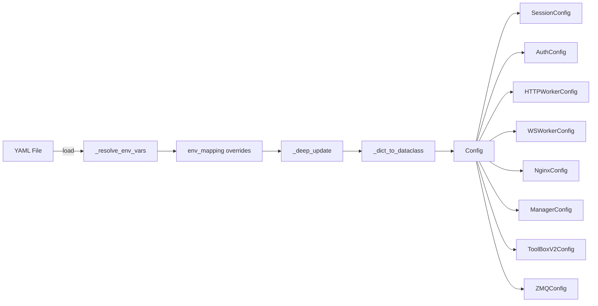

# Config

Centralized configuration system for ToolBoxV2 workers. Defines typed dataclass schemas for HTTP, WebSocket, Nginx, ZeroMQ, sessions, authentication, and module access control — loaded from YAML files with environment variable overrides.

## Why This Matters

When you deploy ToolBoxV2 across environments (development, production, Tauri desktop), you need a single source of truth for hostnames, ports, secrets, and access levels. This module provides that: a validated, type-safe config tree that merges YAML defaults with `${ENV_VAR}` substitution and `TB_*` environment variable overrides.

## Quick Start

```python
from toolboxv2.utils.workers.config import load_config

config = load_config()  # auto-discovers config.yaml in CWD, home, or /etc
print(config.http_worker.port)   # 8000
print(config.environment)        # "development"
```

## Usage Guide

### Basic Usage

Load configuration with automatic file discovery — searches CWD, `~/.toolboxv2/`, and `/etc/toolboxv2/`:

```python
from toolboxv2.utils.workers.config import load_config, Config

config = load_config()
```

Serialize the full config to a dictionary:

```python
data = config.to_dict()
```

Reconstruct a `Config` from a dictionary:

```python
restored = Config.from_dict(data)
```

### Advanced Usage

Generate a commented default YAML configuration file:

```python
from toolboxv2.utils.workers.config import get_default_config_yaml

yaml_str = get_default_config_yaml()
with open("config.yaml", "w") as f:
    f.write(yaml_str)
```

Use the built-in CLI to generate, validate, or inspect configs:

```bash
# Generate default config
python -m toolboxv2.utils.workers.config generate -o config.yaml

# Validate an existing config
python -m toolboxv2.utils.workers.config validate -c config.yaml

# Show the fully-resolved config as JSON
python -m toolboxv2.utils.workers.config show -c config.yaml
```

Detect the runtime environment:

```python
from toolboxv2.utils.workers.config import Environment

if Environment.is_tauri():
    print("Running inside Tauri desktop app")
elif Environment.is_production():
    print("Production deployment")
else:
    print(f"Mode: {Environment.get_mode()}")
```

## How It Works

`load_config` searches a prioritized list of file paths (explicit path → `TB_CONFIG` env → CWD → home → `/etc`). The YAML content passes through `_resolve_env_vars`, which substitutes `${VAR}` and `${VAR:default}` patterns inline. Then environment variables in the `env_mapping` dict (`TB_HTTP_PORT`, `TB_COOKIE_SECRET`, etc.) are applied as typed overrides via `_deep_update`. Finally, `_dict_to_dataclass` recursively constructs the typed `Config` dataclass tree from the merged dictionary.



## API Reference

### Classes

#### `Environment`

Detect runtime environment. All methods are static.

| Method | Signature | Description |
|--------|-----------|-------------|
| `is_tauri` | `def is_tauri() -> bool` | Check if running inside Tauri. Checks `TAURI_ENV` env var and `sys.executable`. |
| `is_production` | `def is_production() -> bool` | Check if production mode. Checks `TB_ENV` env var. |
| `is_development` | `def is_development() -> bool` | Check if development mode. Returns `not is_production()`. |
| `get_mode` | `def get_mode() -> str` | Get current mode string. Returns `"tauri"`, `"production"`, or `"development"`. |

#### `AccessLevel`

User access levels for authorization. Class constants:

| Constant | Value | Meaning |
|----------|-------|---------|
| `ADMIN` | `-1` | Full access to everything |
| `NOT_LOGGED_IN` | `0` | Anonymous user, only public endpoints |
| `LOGGED_IN` | `1` | Authenticated user |
| `TRUSTED` | `2` | Trusted/verified user |

#### `ZMQConfig`

ZeroMQ configuration.

| Field | Type | Default |
|-------|------|---------|
| `pub_endpoint` | `str` | `"tcp://127.0.0.1:5555"` |
| `sub_endpoint` | `str` | `"tcp://127.0.0.1:5556"` |
| `req_endpoint` | `str` | `"tcp://127.0.0.1:5557"` |
| `rep_endpoint` | `str` | `"tcp://127.0.0.1:5557"` |
| `http_to_ws_endpoint` | `str` | `"tcp://127.0.0.1:5558"` |
| `hwm_send` | `int` | `10000` |
| `hwm_recv` | `int` | `10000` |
| `reconnect_interval` | `int` | `1000` |
| `heartbeat_interval` | `int` | `5000` |

#### `SessionConfig`

Session/Cookie configuration.

| Field | Type | Default |
|-------|------|---------|
| `cookie_name` | `str` | `"tb_session"` |
| `cookie_secret` | `str` | `""` |
| `cookie_max_age` | `int` | `604800` (7 days) |
| `cookie_secure` | `bool` | `True` |
| `cookie_httponly` | `bool` | `True` |
| `cookie_samesite` | `str` | `"Lax"` |
| `payload_fields` | `List[str]` | `["user_id", "session_id", "level", "spec", "user_name", "exp"]` |

#### `AuthConfig`

Authentication configuration.

| Field | Type | Default |
|-------|------|---------|
| `jwt_algorithm` | `str` | `"HS256"` |
| `jwt_expiry` | `int` | `3600` |
| `api_key_header` | `str` | `"X-API-Key"` |
| `bearer_header` | `str` | `"Authorization"` |
| `ws_require_auth` | `bool` | `False` |
| `ws_allow_anonymous` | `bool` | `True` |

#### `HTTPWorkerConfig`

HTTP worker configuration.

| Field | Type | Default |
|-------|------|---------|
| `host` | `str` | `"localhost"` |
| `port` | `int` | `8000` |
| `workers` | `int` | `4` |
| `max_concurrent` | `int` | `100` |
| `timeout` | `int` | `30` |
| `keepalive` | `int` | `65` |
| `backlog` | `int` | `2048` |
| `instance_prefix` | `str` | `"http"` |

#### `WSWorkerConfig`

WebSocket worker configuration.

| Field | Type | Default |
|-------|------|---------|
| `host` | `str` | `"localhost"` |
| `port` | `int` | `8100` |
| `max_connections` | `int` | `10000` |
| `ping_interval` | `int` | `30` |
| `ping_timeout` | `int` | `10` |
| `max_message_size` | `int` | `1048576` |
| `compression` | `bool` | `True` |
| `instance_prefix` | `str` | `"ws"` |

#### `NginxConfig`

Nginx reverse proxy configuration.

| Field | Type | Default |
|-------|------|---------|
| `enabled` | `bool` | `True` |
| `config_path` | `str` | `"/etc/nginx/sites-available/toolboxv2"` |
| `symlink_path` | `str` | `"/etc/nginx/sites-enabled/toolboxv2"` |
| `pid_file` | `str` | `"/run/nginx.pid"` |
| `access_log` | `str` | `"/var/log/nginx/toolboxv2_access.log"` |
| `error_log` | `str` | `"/var/log/nginx/toolboxv2_error.log"` |
| `server_name` | `str` | `"localhost"` |
| `listen_port` | `int` | `80` |
| `listen_ssl_port` | `int` | `443` |
| `ssl_enabled` | `bool` | `False` |
| `ssl_certificate` | `str` | `""` |
| `ssl_certificate_key` | `str` | `""` |
| `static_root` | `str` | `"./tb_dist"` |
| `static_enabled` | `bool` | `True` |
| `rate_limit_enabled` | `bool` | `True` |
| `rate_limit_zone` | `str` | `"tb_limit"` |
| `rate_limit_rate` | `str` | `"10r/s"` |
| `rate_limit_burst` | `int` | `20` |
| `auth_rate_limit_rate` | `str` | `"5r/s"` |
| `auth_rate_limit_burst` | `int` | `10` |
| `upstream_http` | `str` | `"tb_http_backend"` |
| `upstream_ws` | `str` | `"tb_ws_backend"` |
| `max_http_workers` | `int` | `8` |
| `max_ws_workers` | `int` | `4` |

#### `ManagerConfig`

Worker manager configuration.

| Field | Type | Default |
|-------|------|---------|
| `web_ui_host` | `str` | `"127.0.0.1"` |
| `web_ui_port` | `int` | `9005` |
| `control_socket` | `str` | `""` |
| `pid_file` | `str` | `""` |
| `log_file` | `str` | `""` |
| `health_check_interval` | `int` | `10` |
| `restart_delay` | `int` | `2` |
| `max_restart_attempts` | `int` | `5` |
| `rolling_update_delay` | `int` | `5` |

#### `ToolBoxV2Config`

ToolBoxV2 integration configuration with access control.

| Field | Type | Default |
|-------|------|---------|
| `modules_preload` | `List[str]` | `[]` |
| `api_prefix` | `str` | `"/api"` |
| `api_allowed_mods` | `List[str]` | `[]` |
| `auth_module` | `str` | `"CloudM.Auth"` |
| `verify_session_func` | `str` | `"validate_session"` |
| `open_modules` | `List[str]` | `[]` |
| `default_required_level` | `int` | `AccessLevel.LOGGED_IN` (1) |
| `level_requirements` | `Dict[str, int]` | `{}` |
| `admin_modules` | `List[str]` | `["CloudM.Auth", "ToolBox"]` |

#### `Config`

Main configuration container. Composes all sub-configs as dataclass fields.

| Field | Type | Default |
|-------|------|---------|
| `session` | `SessionConfig` | `SessionConfig()` |
| `auth` | `AuthConfig` | `AuthConfig()` |
| `http_worker` | `HTTPWorkerConfig` | `HTTPWorkerConfig()` |
| `ws_worker` | `WSWorkerConfig` | `WSWorkerConfig()` |
| `nginx` | `NginxConfig` | `NginxConfig()` |
| `manager` | `ManagerConfig` | `ManagerConfig()` |
| `toolbox` | `ToolBoxV2Config` | `ToolBoxV2Config()` |
| `environment` | `str` | `"development"` |
| `debug` | `bool` | `False` |
| `log_level` | `str` | `"INFO"` |
| `data_dir` | `str` | `""` |

| Method | Signature | Description |
|--------|-----------|-------------|
| `to_dict` | `def to_dict(self) -> Dict[str, Any]` | Convert config to dictionary for serialization. |
| `from_dict` | `def from_dict(cls, data: Dict[str, Any]) -> Config` | Reconstruct config from dictionary. |

### Functions

#### `load_config(config_path: Optional[str] = None) -> Config`

Load configuration from YAML file with environment overrides. Searches a prioritized list: explicit path → `TB_CONFIG` env → `config.yaml` in CWD → `config.yml` in CWD → `toolbox.yaml` in CWD → `~/.toolboxv2/config.yaml` → `/etc/toolboxv2/config.yaml`. Resolves `${VAR}` patterns inline, then applies `TB_*` environment variable overrides with type coercion.

#### `get_default_config_yaml() -> str`

Generate default configuration YAML with comments. Includes inline documentation for every field and uses `${ENV_VAR:default}` patterns for overridable values.

#### `_deep_update(base, updates) -> dict`

Deep merge dictionaries. Recursively merges nested dicts; leaf values from `updates` overwrite `base`.

#### `_resolve_env_vars(obj: Any) -> Any`

Resolve `${ENV_VAR}` and `${ENV_VAR:default}` patterns in configuration values. Recursively processes strings, dicts, and lists.

#### `_dict_to_dataclass(cls, data: dict) -> Any`

Convert dict to dataclass recursively. Handles nested dataclass fields by recursing into them; passes through generic types and raw values unchanged.

#### `main()`

CLI for configuration management. Supports three subcommands: `generate` (write default YAML), `validate` (load and confirm config is valid), `show` (print resolved config as JSON).

## Dependencies

No indexed upstream dependencies from other modules. This module uses Python standard library (`os`, `sys`, `re`, `argparse`, `dataclasses`, `pathlib`, `json`, `typing`) and the `yaml` package (PyYAML).

## Used By

- Referenced by `NginxConfig` in [schema](../../manifest/schema.md)
- Referenced by `ZMQConfig` in [schema](../../manifest/schema.md)
- Referenced by `from_dict` in [PasswordManager](../../mods/PasswordManager.md)
- Referenced by `from_dict` in [Minu/shared](../../mods/Minu/shared.md)
- Referenced by `from_dict` in [isaa/extras/obsidian/mcp_server](../../mods/isaa/extras/obsidian/mcp_server.md)
- Referenced by `is_service_running` in [service_manager](../clis/service_manager.md)
- Referenced by `get_from_environ` in [session](session.md)