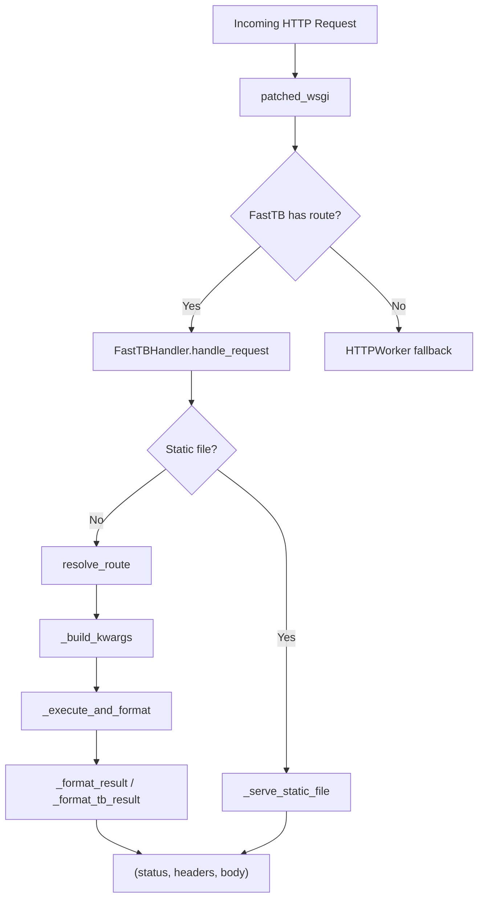

# FastTBHandler

Dispatch engine for FastTB routes — resolves incoming HTTP requests to registered handlers, injects parameters via signature inspection, and converts return values into WSGI-compatible `(status, headers, body)` tuples. Also manages static file serving, SSE streaming, WebSocket infrastructure, and development-mode hot reload.

## Why This Matters

When building a web application with FastTB's decorator-based routing, you need a layer that bridges those registered routes to a real WSGI server. `FastTBHandler` is that bridge. It handles the full request lifecycle — route matching, parameter injection (path, query, body, session), response formatting, and static files — so your handler functions stay focused on business logic. For development, it also provides hot-module-reload via filesystem watching.

## Quick Start

```python
from toolboxv2.utils.workers.fast_tb_handler import FastTBHandler

# handler is typically created internally by FastTB
handler = FastTBHandler(fast_tb_app=my_app)

# Get a full WSGI app with HTTPWorker infrastructure baked in
wsgi_app = handler.as_wsgi_app()

# Serve with any WSGI server (e.g. waitress)
from waitress import serve
serve(wsgi_app, host="0.0.0.0", port=8080)
```

## Usage Guide

### Basic Usage — Standalone WSGI Server

The `as_wsgi_app()` method produces a complete WSGI callable that reuses HTTPWorker's infrastructure (sessions, auth, CORS, built-in endpoints) while adding FastTB's route resolution:

```python
handler = FastTBHandler(my_fast_tb_app)
app = handler.as_wsgi_app()

# app is a standard WSGI callable: (environ, start_response) -> [bytes]
```

### Advanced Usage — WebSocket Support + Hot Reload

When WebSocket routes are registered (or `enable_ws=True` is passed), `as_wsgi_app` automatically starts the full WS stack:

```python
app = handler.as_wsgi_app(enable_ws=True)
# Internally starts:
#   1. ZMQ broker (inter-thread messaging)
#   2. WS worker (persistent WebSocket connections)
#   3. Event bridge (wires WS connect/message/disconnect to handlers)
```

Hot reload monitors registered directories for file changes and broadcasts reload events to connected WS clients:

```python
handler._start_hot_reload(app, config, get_loop_fn)
# Watches .py, .js, .css, .html, .jsx, .ts, .tsx, .vue, .svelte files
# Reloads Python modules in-place, preserving ReactiveState values
```

## How It Works

`FastTBHandler` operates as a three-layer dispatch pipeline. First, `handle_request` resolves the incoming path+method to a registered `Route` object (or a static file). Second, `_build_kwargs` inspects the handler's function signature using `inspect.signature` and injects parameters from the request — path params, query params, JSON body fields, the `ParsedRequest` itself, or session data — with automatic type coercion for `int`, `float`, and `bool`. Third, `_format_result` normalizes whatever the handler returns (dict, list, str, bytes, tuple, async generator, ToolBoxV2 `Result` object) into a standard `(status, headers, body)` triple.

For streaming, `_async_gen_to_sync` bridges async generators to WSGI's synchronous iteration model by running coroutines on a background event loop via `run_coroutine_threadsafe`, with 30-second chunk timeouts that emit SSE keepalive comments. The `as_wsgi_app` method wraps everything in a patched WSGI callable that tries FastTB routes first, then falls through to HTTPWorker's built-in endpoints.



## API Reference

### Classes

#### `FastTBHandler`

Dispatch engine for FastTB routes. Matches incoming path+method to a registered Route, inspects handler signature and injects the right parameters, and converts return values to WSGI-compatible `(status, headers, body)` tuples.

| Method | Signature | Description |
|--------|-----------|-------------|
| `__init__` | `def __init__(self, fast_tb_app: "FastTB", session_manager=None)` | Initialize with a FastTB instance and optional SessionManager for standalone mode. |
| `has_route` | `def has_route(self, path: str, method: str) -> bool` | Check if FastTB can handle this path+method. |
| `handle_request` | `async def handle_request(self, request: ParsedRequest) -> Tuple[int, Dict[str, str], bytes]` | Resolve route, inject params, execute handler, format response. Also serves static files from mounted directories. |
| `as_wsgi_app` | `def as_wsgi_app(self, config=None, app=None, enable_ws: bool \| None = None) -> Callable` | Return a WSGI app that wraps HTTPWorker with FastTB routes. Reuses HTTPWorker's full infrastructure. Starts WS infrastructure automatically when websocket routes exist. |
| `_build_kwargs` | `def _build_kwargs(self, handler: Callable, request: ParsedRequest, path_params: Dict[str, str]) -> Dict[str, Any]` | Inspect handler signature and build kwargs. Resolution order: request injection → session injection → path params → query params → body fields. |
| `_coerce` | `def _coerce(value: str, annotation) -> Any` | Coerce string value to annotated type (int, float, bool). |
| `_missing_param_error` | `def _missing_param_error(param_name: str)` | Return error dict that `_execute_and_format` will detect. Raises `ValueError`. |
| `_execute_and_format` | `async def _execute_and_format(self, handler: Callable, kwargs: Dict[str, Any]) -> Tuple[int, Dict[str, str], bytes]` | Execute handler (async or sync) and convert return value to response tuple. |
| `_format_result` | `def _format_result(result) -> Tuple[int, Dict[str, str], bytes]` | Convert handler return value to `(status, headers, body)`. Supports: tuple passthrough, Result objects, dict/list → JSON, str → HTML or JSON, bytes → raw, generators → streaming. |
| `_format_tb_result` | `def _format_tb_result(result) -> Tuple[int, Dict[str, str], Any]` | Convert a ToolBoxV2 Result object to response tuple. Handles: stream, html, special_html, redirect, file_path, file, binary, json. |
| `_serve_static_file` | `def _serve_static_file(file_path: str) -> Tuple[int, Dict[str, str], bytes]` | Serve a static file with correct content-type and cache headers (immutable for hashed filenames, 1h otherwise). |
| `_start_ws_infrastructure` | `def _start_ws_infrastructure(self, config, app, worker, get_loop_fn)` | Start ZMQ broker, WS worker, and event bridge in background threads. Called by `as_wsgi_app()` when WebSocket routes are registered. |
| `_start_hot_reload` | `def _start_hot_reload(self, app, config, get_loop_fn)` | Start file watcher for hot-reload in development mode. Uses watchdog; falls back to no-op if not installed. |

#### `ReloadHandler(FileSystemEventHandler)`

Inner class (defined inside `_start_hot_reload`) that handles filesystem change events for hot-module-reload. Debounces changes (0.5s), filters by extension, skips cache/git directories, reloads Python modules via AST-based safe extraction, and broadcasts reload events to WS clients.

| Method | Signature | Description |
|--------|-----------|-------------|
| `on_modified` | `def on_modified(self, event)` | Delegate to `_handle`. |
| `on_created` | `def on_created(self, event)` | Delegate to `_handle`. |
| `_handle` | `def _handle(self, event)` | Debounced file change handler. Filters by extension and path, reloads .py modules, broadcasts reload to WS clients. |
| `_exec_reload` | `def _exec_reload(self, filepath)` | Reload a Python file by extracting only function/class definitions via AST parsing. Skips module-level side effects. |
| `_reload_python_module` | `def _reload_python_module(self, filepath)` | Reload a Python module and update MinuBridge view classes. Preserves existing ReactiveState values while swapping in new class definitions (render, handlers). |

### Functions

#### `_file_iter(file_obj, chunk_size: int = 65536)`

Generator for streaming a file object as WSGI response body. Reads in chunks until exhausted, then closes the file object in a `finally` block.

**Parameters:**
- `file_obj` — open file object to read from
- `chunk_size` — bytes per read iteration (default 65536)

**Returns:** Generator yielding bytes chunks.

---

#### `_async_gen_to_sync(async_gen, loop)`

Convert async generator to sync iterator for WSGI streaming. Each `__next__` blocks the Waitress thread until the next chunk arrives. Timeout per chunk: 30s. Sends SSE keepalive comment (`": keepalive\n\n"`) on timeout to prevent proxy/browser disconnect.

**Parameters:**
- `async_gen` — async generator to bridge
- `loop` — event loop to run coroutines on

**Returns:** Synchronous iterator yielding bytes.

---

#### `_maybe_inject_style(html_str: str) -> str`

Inject Paper CSS into HTML responses that lack TBJS web_context. Skips injection if the string is empty, `inject_style` is globally disabled, the HTML already contains TBJS markers (`tbjs-main`, `TB.init`, `web_context`), or already has substantial user CSS (>200 chars in a `<style>` block not from `_SHARED_CSS`/`ftb-wrap`). Injects fonts + main.css + paper.css and adds `data-style="paper"` to the `<html>` tag.

**Parameters:**
- `html_str` — HTML string to potentially inject styles into

**Returns:** Modified or unmodified HTML string.

---

#### `_is_hashed_filename(path: str) -> bool`

Check if filename contains a content hash (e.g. `main-5d3f7ed2.js`). Hashed files are treated as immutable for caching purposes.

**Parameters:**
- `path` — file path string to check

**Returns:** `True` if the basename matches the pattern `[-_.][0-9a-f]{6,}.`.

## Dependencies

- [ZMQEventManager](event_manager.md) from `toolboxv2/utils/workers/event_manager.py` — pub/sub messaging and WS event dispatch
- [WSWorker](ws_worker.md) from `toolboxv2/utils/workers/ws_worker.py` — persistent WebSocket connection handling
- [install_ws_bridge](ws_bridge.md) from `toolboxv2/utils/workers/ws_bridge.py` — bridges WS send/broadcast onto the app
- [HTTPWorker](server_worker.md) from `toolboxv2/utils/workers/server_worker.py` — WSGI infrastructure, sessions, auth, CORS
- [load_config](config.md) from `toolboxv2/utils/workers/config.py` — worker configuration loading
- [FastTB](fast_tb.md) from `toolboxv2/utils/workers/fast_tb.py` — route registration and resolution
- [fast_tb_defaults](fast_tb_defaults.md) from `toolboxv2/utils/workers/fast_tb_defaults.py` — `_MAIN_CSS`, `_PAPER_CSS`, `_FONTS` constants

## Used By

- Referenced by `enhanced_on_message` in [WhatsAppTb/server](../../../mods/WhatsAppTb/server.md)
- Referenced by `_coerce` in [manifest_cli](../../../utils/clis/manifest_cli.md)
- Referenced by `_coerce` in [toolbox_admin](../../../flows/toolbox_admin.md)
- Referenced by `_run_ws_worker_process` in [cli_worker_manager](../../../utils/clis/cli_worker_manager.md)
- Referenced by `_render_quick_mode`, `_render_discovery_mode`, `_render_profiles_mode`, `_render_success` in [adaptive_prompt_system](../../../flows/adaptive_prompt_system.md)
- Referenced by `_handle_macro_command` in [minicli](../../../flows/minicli.md)
- Referenced by `_format_results_as_str` in [ai_semantic_memory](../../../mods/isaa/base/ai_semantic_memory.md)