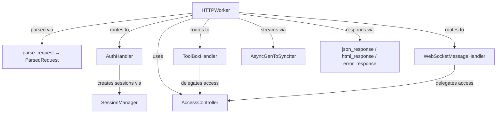

# server_worker

Das HTTP-Server-Modul von ToolBoxV2 — ein kompletter WSGI-Worker mit Authentifizierung, Zugriffskontrolle, WebSocket-Bridge, Datei-Upload und API-Routing. Verarbeitet eingehende HTTP-Anfragen, leitet sie an ToolBoxV2-Module weiter und verwaltet Sessions über Cookies und JWT-Token.

## Warum dieses Modul wichtig ist

Dieses Modul ist das zentrale HTTP-Frontend des ToolBoxV2-Frameworks. Ohne dieses Modul gibt es keine HTTP-API, keine Authentifizierung und keine WebSocket-Kommunikation. Du greifst darauf zu, wenn du den HTTP-Worker startest, eigene Endpunkte absicherst oder OAuth-Flows implementierst.

## Schnellstart

```python
from toolboxv2.utils.workers.server_worker import HTTPWorker, load_config

config = load_config("config.toml")
worker = HTTPWorker("http_1", config)
worker.run(host="0.0.0.0", port=5000)
```

## Architektur



## Funktionsweise

Der `HTTPWorker` betreibt einen WSGI-Server (bevorzugt `waitress`, Fallback auf `wsgiref`). Eingehende Anfragen werden über `parse_request` in `ParsedRequest`-Objekte umgewandelt. Je nach Pfad werden sie an `AuthHandler` (Auth-Endpunkte), `ToolBoxHandler` (API-Aufrufe an Module), `WebSocketMessageHandler` (WS-Events) oder interne Endpunkte (Health, Metrics, Geo) geroutet. Ein Hintergrund-Event-Loop verarbeitet asynchrone Coroutines und ZMQ-Events. CORS wird automatisch für lokale und Tauri-Ursprünge konfiguriert. Datei-Uploads werden über `multipart` mit Disk-Buffering unterstützt (bis 1,5 GB pro Upload).

## API-Referenz

### Klassen

#### `AccessLevel`

Benutzerzugriffsebenen. Statische Konstanten:

| Konstante | Wert | Beschreibung |
|-----------|-------|-------------|
| `ADMIN` | `-1` | Voller Zugriff auf alles |
| `NOT_LOGGED_IN` | `0` | Nicht authentifiziert |
| `LOGGED_IN` | `1` | Authentifizierter Benutzer |
| `TRUSTED` | `2` | Vertrauenswürdiger Benutzer |

---

#### `UploadedFile`

Wrapper für hochgeladene Dateien. Dataclass mit Feldern: `filename`, `content_type`, `size`, `temp_path`, `field_name`.

| Methode | Signatur | Beschreibung |
|---------|----------|-------------|
| `read` | `def read(self) -> bytes` | Liest gesamte Datei in den Speicher. Vorsicht bei großen Dateien! |
| `save_to` | `def save_to(self, destination: str) -> str` | Verschiebt Datei zum Ziel. Gibt finalen Pfad zurück. |
| `copy_to` | `def copy_to(self, destination: str) -> str` | Kopiert Datei zum Ziel. Gibt finalen Pfad zurück. |
| `stream` | `def stream(self, chunk_size: int = 65536)` | Generator zum Streaming der Datei in Chunks. |

---

#### `ParsedRequest`

Geparste HTTP-Anfrage. Dataclass mit Feldern: `method`, `path`, `query_params`, `headers`, `content_type`, `content_length`, `body`, `form_data`, `json_data`, `files`, `session`, `client_ip`, `client_port`, `environ`.

| Methode | Signatur | Beschreibung |
|---------|----------|-------------|
| `is_htmx` | `@property → bool` | Wahr wenn `hx-request` Header gesetzt ist |
| `has_files` | `@property → bool` | Prüft ob Dateien hochgeladen wurden |
| `get_bearer_token` | `def get_bearer_token(self) -> Optional[str]` | Extrahiert Bearer-Token aus dem Authorization-Header |
| `get_session_token` | `def get_session_token(self) -> Optional[str]` | Holt Session-Token aus Body oder Authorization-Header |
| `get_user_id_from_body` | `def get_user_id_from_body(self) -> Optional[str]` | Holt User-ID aus dem Body |
| `to_toolbox_request` | `def to_toolbox_request(self) -> Dict[str, Any]` | Konvertiert in ToolBoxV2 RequestData-Format |

---

#### `AccessController`

Kontrolliert den Zugriff auf API-Endpunkte basierend auf: offenen Modulen, Funktionsnamen (die mit `open` beginnen sind öffentlich) und Benutzer-Level.

| Methode | Signatur | Beschreibung |
|---------|----------|-------------|
| `_load_config` | `def _load_config(self)` | Lädt offene Module aus der Konfiguration |
| `is_public_endpoint` | `def is_public_endpoint(self, module_name: str, function_name: str) -> bool` | Prüft ob Endpunkt öffentlich zugänglich ist |
| `check_access` | `def check_access(self, module_name, function_name, user_level, required_level) -> Tuple[bool, Optional[str]]` | Prüft Zugriff. Gibt (erlaubt, fehlermeldung) zurück |
| `get_user_level` | `def get_user_level(self, session) -> int` | Extrahiert Benutzer-Level aus der Session |

---

#### `AuthHandler`

Verarbeitet Authentifizierungs-Endpunkte: `/validateSession`, `/IsValidSession`, `/web/logoutS`, `/api_user_data`, OAuth-Routen (Discord, Google), Magic Link. Provider-unabhängig über `config.toolbox.auth_module`.

| Methode | Signatur | Beschreibung |
|---------|----------|-------------|
| `validate_session` | `async def validate_session(self, request) -> Tuple` | Validiert JWT-Token via Auth-Modul |
| `is_valid_session` | `async def is_valid_session(self, request) -> Tuple` | Prüft ob aktuelle Session gültig ist |
| `logout` | `async def logout(self, request) -> Tuple` | Logout: Token blacklisten + Session invalidieren |
| `get_user_data` | `async def get_user_data(self, request) -> Tuple` | Holt Benutzerdaten vom Auth-Modul |
| `get_discord_auth_url` | `async def get_discord_auth_url(self, request) -> Tuple` | Gibt Discord OAuth URL zurück |
| `discord_callback` | `async def discord_callback(self, request) -> Tuple` | Discord OAuth Callback |
| `get_google_auth_url` | `async def get_google_auth_url(self, request) -> Tuple` | Gibt Google OAuth URL zurück |
| `google_callback` | `async def google_callback(self, request) -> Tuple` | Google OAuth Callback |
| `magic_link_verify` | `async def magic_link_verify(self, request) -> Tuple` | Verifiziert Magic Link Token |
| `_handle_oauth_result` | `def _handle_oauth_result(self, result, request) -> Tuple` | Verarbeitet OAuth/Magic-Link-Ergebnis: erstellt Session + Token-Bridge-Seite |
| `_build_token_bridge_html` | `@staticmethod def _build_token_bridge_html(...) -> str` | Baut HTML-Seite die Tokens in localStorage speichert und redirected |
| `_verify_token` | `async def _verify_token(self, token) -> Tuple[bool, Optional[Dict]]` | Verifiziert JWT-Token via Auth-Modul |
| `_get_user_data` | `async def _get_user_data(self, user_id) -> Optional[Dict]` | Holt Benutzerdaten via Auth-Modul |

---

#### `ToolBoxHandler`

Handler für ToolBoxV2-Modul-Aufrufe mit Zugriffskontrolle.

| Methode | Signatur | Beschreibung |
|---------|----------|-------------|
| `is_api_request` | `def is_api_request(self, path) -> bool` | Prüft ob Pfad mit API-Prefix beginnt |
| `parse_api_path` | `def parse_api_path(self, path) -> Tuple[str\|None, str\|None]` | Zerlegt `/api/Module/function` in (module, function) |
| `handle_api_call` | `async def handle_api_call(self, request) -> Tuple` | Führt Modulfunktion mit Zugriffskontrolle aus |
| `_process_result` | `def _process_result(self, result, request) -> Tuple` | Verarbeitet ToolBoxV2 Result in HTTP-Response (JSON, HTML, Stream, File) |

---

#### `WebSocketMessageHandler`

Verarbeitet WebSocket-Nachrichten, die via ZMQ von WS-Workern weitergeleitet werden. Routet Nachrichten an registrierte `websocket_handler`-Funktionen in ToolBoxV2.

| Methode | Signatur | Beschreibung |
|---------|----------|-------------|
| `handle_ws_connect` | `async def handle_ws_connect(self, event)` | Behandelt WS-Connect-Event |
| `handle_ws_message` | `async def handle_ws_message(self, event)` | Behandelt WS-Nachricht mit Zugriffskontrolle |
| `handle_ws_disconnect` | `async def handle_ws_disconnect(self, event)` | Behandelt WS-Disconnect-Event |
| `_get_handler_from_path` | `def _get_handler_from_path(self, path) -> str \| None` | Extrahiert Handler-ID aus WS-Pfad. Unterstützt `/ws/Module/handler` und `/ws/handler` |
| `_get_handler_from_message` | `def _get_handler_from_message(self, payload) -> str \| None` | Sucht Handler basierend auf Nachrichtinhalt. Prüft `handler`-Feld und HUD-Action-Typen |
| `_call_handler` | `async def _call_handler(self, handler, **kwargs) -> Any` | Ruft Handler-Funktion auf (sync oder async) |
| `_handle_hud_message` | `async def _handle_hud_message(self, payload, conn_id, session)` | Verarbeitet HUD-spezifische WS-Nachrichten (widget_action, get_widget, etc.) |
| `_handle_widget_action` | `async def _handle_widget_action(self, payload, conn_id, session)` | Verarbeitet Widget-Aktionen vom HUD |
| `_handle_get_widget` | `async def _handle_get_widget(self, payload, conn_id, session)` | Anfrage für ein einzelnes Widget |
| `_handle_get_widgets` | `async def _handle_get_widgets(self, payload, conn_id, session)` | Anfrage für alle Widgets |
| `_handle_get_status` | `async def _handle_get_status(self, payload, conn_id, session)` | Status-Anfrage verarbeiten |

---

#### `AsyncGenToSyncIter`

Adapter der eine AsyncGenerator in einen synchronen Iterator für WSGI umwandelt. Führt asynchrone Tasks auf einem spezifischen Event-Loop aus.

| Methode | Signatur | Beschreibung |
|---------|----------|-------------|
| `__init__` | `def __init__(self, async_gen, loop)` | Speichert Generator und Event-Loop |
| `__iter__` | `def __iter__(self)` | Gibt sich selbst zurück |
| `__next__` | `def __next__(self)` | Holt nächstes Element via `run_coroutine_threadsafe` auf dem Hintergrund-Loop |

---

#### `HTTPWorker`

HTTP-Worker mit roher WSGI-Applikation und Auth-Endpunkten. Hauptklasse des Moduls.

**Konstruktor:** `HTTPWorker(worker_id: str, config, app=None)`

Initialisiert Metriken, Referenzen auf Handler, Session-Manager, Event-Manager und Event-Loop.

| Methode | Signatur | Beschreibung |
|---------|----------|-------------|
| `_init_toolbox` | `def _init_toolbox(self)` | Initialisiert ToolBoxV2 App-Instanz |
| `_init_session_manager` | `def _init_session_manager(self)` | Initialisiert SessionManager mit Cookie-Konfiguration |
| `_init_access_controller` | `def _init_access_controller(self)` | Initialisiert AccessController |
| `_init_auth_handler` | `def _init_auth_handler(self)` | Initialisiert AuthHandler |
| `_init_event_manager` | `async def _init_event_manager(self)` | Initialisiert ZMQEventManager und WS-Bridge |
| `_register_event_handlers` | `def _register_event_handlers(self)` | Registriert ZMQ-Event-Handler (Shutdown, Config-Reload, WS-Connect/Message/Disconnect) |
| `_is_auth_endpoint` | `def _is_auth_endpoint(self, path) -> bool` | Prüft ob Pfad ein Auth-Endpunkt ist |
| `_get_cors_headers` | `def _get_cors_headers(self, environ) -> Dict[str, str]` | Gibt CORS-Header zurück. Erlaubt localhost und Tauri-Ursprünge |
| `wsgi_app` | `def wsgi_app(self, environ, start_response) -> List[bytes]` | WSGI-Einstiegspunkt. Parst Request, routet, behandelt CORS, Sessions, Streaming |
| `_run_async` | `def _run_async(self, coro) -> Any` | Führt async Coroutine aus sync-Kontext über Hintergrund-Loop aus |
| `_file_iterator` | `def _file_iterator(self, file_obj, chunk_size=65536)` | Generator für File-Streaming als WSGI-Fallback. 64KB Chunks |
| `_handle_health` | `def _handle_health(self) -> Tuple` | Health-Check-Endpunkt (`/health`) |
| `_handle_metrics` | `def _handle_metrics(self) -> Tuple` | Metriken-Endpunkt (`/metrics`) mit Request-Statistiken |
| `_handle_ip_request` | `def _handle_ip_request(self, request) -> Tuple` | Gibt Client-IP zurück (`/api/ip`) |
| `_handle_ping_request` | `def _handle_ping_request(self) -> Tuple` | Latenz-Messung (`/api/ping`), antwortet sofort |
| `_handle_geo_request` | `def _handle_geo_request(self, request) -> Tuple` | Geo-IP-Lokalisierung (`/api/geo`) |
| `_get_geo_locally` | `def _get_geo_locally(self, ip) -> dict` | Lokale GeoIP-Suche via MMDB-Datei ohne externe API |
| `_handle_client_logs` | `def _handle_client_logs(self, request) -> Tuple` | Browser-Log-Ingestion (`/api/client-logs`). Unterstützt Audit-Einträge |
| `run` | `def run(self, host=None, port=None, do_run=True)` | Startet den Worker. Initialisiert alle Komponenten, startet Event-Loop-Thread und WSGI-Server |
| `_cleanup` | `def _cleanup(self)` | Räumt Ressourcen auf |

**Auth-Endpunkt-Routing-Tabelle** (in `AUTH_ENDPOINTS`):

| Pfad | Handler-Methode |
|------|-----------------|
| `/validateSession` | `validate_session` |
| `/IsValidSession` | `is_valid_session` |
| `/web/logoutS` | `logout` |
| `/api_user_data` | `get_user_data` |
| `/auth/discord/url` | `get_discord_auth_url` |
| `/auth/discord/callback` | `discord_callback` |
| `/auth/google/url` | `get_google_auth_url` |
| `/auth/google/callback` | `google_callback` |
| `/auth/magic/verify` | `magic_link_verify` |

---

#### `ShutdownableWSGIServer(WSGIServer)`

Fallback-WSGI-Server für Entwicklung (wenn `waitress` nicht installiert). Unterstützt sauberes Shutdown via Event.

| Methode | Signatur | Beschreibung |
|---------|----------|-------------|
| `__init__` | `def __init__(self, *args, **kwargs)` | Initialisiert Shutdown-Event |
| `serve_forever` | `def serve_forever(self)` | Wartet auf Shutdown-Event |
| `shutdown` | `def shutdown(self)` | Setzt Shutdown-Event |

---

### Funktionen

#### `parse_request(environ: Dict, upload_temp_dir: str = None) -> ParsedRequest`

Parst WSGI-environment in ein strukturiertes `ParsedRequest`-Objekt. Behandelt multipart/form-data mit Disk-Buffering (bis 1,5 GB), URL-encoded Forms, JSON-Bodies und Datei-Uploads.

**Parameter:**
- `environ` — WSGI environment dict
- `upload_temp_dir` — Temp-Verzeichnis für Datei-Uploads (Default: System-Temp)

**Rückgabe:** `ParsedRequest` Instanz

---

#### `json_response(data: Any, status: int = 200, headers: Dict = None) -> Tuple`

Erstellt eine JSON-HTTP-Response.

---

#### `html_response(content: str, status: int = 200, headers: Dict = None) -> Tuple`

Erstellt eine HTML-HTTP-Response.

---

#### `error_response(message, status, error_type) -> Tuple`

Erstellt eine Fehler-HTTP-Response.

---

#### `redirect_response(url, status) -> Tuple`

Erstellt eine Redirect-HTTP-Response.

---

#### `api_result_response(error, origin, data, data_info, data_type, exec_code, help_text, status) -> Tuple`

Erstellt eine ToolBoxV2-API-Ergebnis-Response. Strukturiert als `{error, origin, result: {data_to, data_info, data, data_type}, info: {exec_code, help_text}}`.

---

#### `format_sse_event(data: Any, event: str = None, event_id: str = None) -> str`

Formatiert ein Server-Sent-Events-konformes Datenpaket.

---

#### `get_location(ip_address) -> dict`

GeoIP-Lookup via `ipapi.co` API. Gibt JSON-Antwort mit Standortdaten zurück.

---

#### `main()`

CLI-Einstiegspunkt für den HTTP-Worker. Parst Argumente (`-c config`, `-H host`, `-p port`, `-w worker-id`, `-v verbose`), lädt Konfiguration und startet den Worker.

---

## Abhängigkeiten

- `DataAccessLog` aus [UserDataAPI](../../../mods/CloudM/UserDataAPI.md)
- `a_format_class` aus [flow_agent](../../../mods/isaa/base/Agent/flow_agent.md)
- `get_filename` aus [gist_control](../../../utils/extras/gist_control.md)
- `decrypt_bytes` aus [tcm_p2p_cli](../../../utils/clis/tcm_p2p_cli.md)
- `_generate_with_banana` aus [image_generator](../../../mods/videoFlow/engine/generators/image_generator.md)
- `_save_discord_audio_as_wav` aus [voice_mode](../../../mods/isaa/extras/discord_interface/voice_mode.md)
- `_save_temp_audio` aus [Stt](../../../mods/isaa/base/audio_io/Stt.md)
- `visit_AsyncFunctionDef` aus [live](../../../mods/isaa/CodingAgent/live.md)

## Verwendet von

- [builder](../../../mods/isaa/base/Agent/builder.md) — `_load_config`
- [toolbox_integration](../toolbox_integration.md) — `_load_config`, `check_access`
- [minio_manager](../../../utils/extras/db/minio_manager.md) — `_load_config`
- [db_cli_manager](../../../utils/clis/db_cli_manager.md) — `_load_config`
- [file_handler](../../../utils/system/file_handler.md) — `__iter__`
- [icli](../../../flows/icli.md) — `cli_create_job`
- [pyshell](../../../flows/pyshell.md) — `_is_complete`
- [story_generator](../../../flows/story_generator.md) — `StoryGenerator`