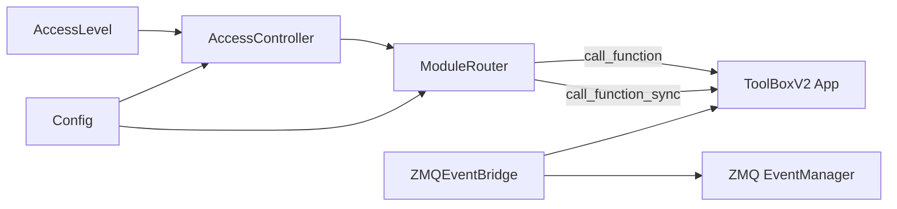

Now I'll produce the final documentation:

# Toolbox Integration

Integration layer that connects worker processes to the ToolBoxV2 core application. Provides config-driven access control, API request routing to module functions, session verification, and event bridging between ZeroMQ and the ToolBoxV2 EventManager.

## Why This Matters

Any worker that needs to call ToolBoxV2 module functions — whether over HTTP, WebSocket, or ZMQ — needs a consistent way to resolve, authorize, and dispatch those calls. This module is that bridge. It turns raw requests into authorized module invocations with structured error handling, so workers don't need to know the internals of the ToolBoxV2 app.

## Quick Start

```python
from toolboxv2.utils.workers.toolbox_integration import create_worker_app

app, router, controller = create_worker_app(instance_id="my-worker", config=my_config)
```

## Usage Guide

### Basic Usage — Routing an API Request

```python
from toolboxv2.utils.workers.toolbox_integration import create_worker_app

app, router, controller = create_worker_app("worker-1", config)

# Parse and dispatch a request
module, func = router.parse_path("/api/CloudM.Auth/verify_session")
result = await router.call_function(module, func, {"token": "abc123"}, session=user_session)
```

### Advanced Usage — Custom Access Control

```python
from toolboxv2.utils.workers.toolbox_integration import (
    AccessLevel, AccessController, ModuleRouter, get_toolbox_app
)

app = get_toolbox_app(instance_id="custom")
controller = AccessController(config)
controller.reload_config(new_config)

router = ModuleRouter(app, api_prefix="/api/v2", access_controller=controller)
result = router.call_function_sync("MyMod", "do_work", {"key": "val"}, check_access=True)
```

### Event Bridging

```python
from toolboxv2.utils.workers.toolbox_integration import ZMQEventBridge

bridge = ZMQEventBridge(app, zmq_event_manager)
bridge.connect()  # Registers event forwarders between ZMQ and ToolBoxV2 EventManager
```

## How It Works

The module operates in three tiers. **Authorization** is handled by `AccessLevel` constants and `AccessController`, which reads config to classify endpoints as public, admin-only, or level-restricted. **Routing** is handled by `ModuleRouter`, which parses API paths into `(module, function)` pairs, checks access via the controller, and dispatches calls through `app.run_any` (sync) or `app.a_run_any` (async). Results are normalized into a standard dict format with `error`, `origin`, `result`, and `info` keys. **Event bridging** via `ZMQEventBridge` optionally forwards ZMQ custom events into the ToolBoxV2 EventManager. Factory functions (`create_worker_app`, `create_access_controller`) wire everything together.



## API Reference

### Classes

#### `AccessLevel`

User access levels for authorization. Used as constants, not instantiated.

| Constant | Value | Meaning |
|----------|-------|---------|
| `ADMIN` | `-1` | Full access to everything |
| `NOT_LOGGED_IN` | `0` | Anonymous user, only public endpoints |
| `LOGGED_IN` | `1` | Authenticated user |
| `TRUSTED` | `2` | Trusted/verified user |

#### `AccessController`

Controls access to API endpoints based on config-driven rules: open modules, admin modules, function-name conventions (functions starting with `open` are public), user level, and per-module/function level overrides.

| Method | Signature | Description |
|--------|-----------|-------------|
| `__init__` | `def __init__(self, config=None)` | Initialize with optional config; calls `_load_config` if provided. |
| `_load_config` | `def _load_config(self)` | Load access control settings from config (`toolbox.open_modules`, `toolbox.admin_modules`, `toolbox.default_required_level`, `toolbox.level_requirements`). |
| `reload_config` | `def reload_config(self, config=None)` | Reload configuration. Accepts optional new config object. |
| `is_public_endpoint` | `def is_public_endpoint(self, module_name: str, function_name: str) -> bool` | Check if endpoint is publicly accessible (module in open_modules or function name starts with `open`). |
| `is_admin_only` | `def is_admin_only(self, module_name: str, function_name: str = None) -> bool` | Check if endpoint requires admin level. |
| `get_required_level` | `def get_required_level(self, module_name: str, function_name: str) -> int` | Get the required access level for an endpoint. Checks public → admin → per-function override → per-module override → default. |
| `check_access` | `def check_access(self, module_name: str, function_name: str, user_level: int) -> Tuple[bool, Optional[str]]` | Check if user has access to endpoint. Returns `(allowed, error_message)`. |
| `get_user_level` | `def get_user_level(session) -> int` | Extract user level from session object. Tries `session.level`, `session.live_data['level']`, `session.to_dict()['level']`, or `session['level']`. |

#### `ModuleRouter`

Routes API requests to ToolBoxV2 module functions with access control.

| Method | Signature | Description |
|--------|-----------|-------------|
| `__init__` | `def __init__(self, app, api_prefix: str = "/api", access_controller: AccessController = None)` | Initialize with a ToolBoxV2 app instance, API path prefix, and optional access controller. |
| `parse_path` | `def parse_path(self, path: str) -> Tuple[Optional[str], Optional[str]]` | Parse `/api/Module/function` into `(module, function)`. Returns `(None, None)` for invalid paths. |
| `check_access` | `def check_access(self, module_name: str, function_name: str, session) -> Tuple[bool, Optional[str], int]` | Check access for a request. Returns `(allowed, error_message, user_level)`. |
| `call_function` | `async def call_function(self, module_name: str, function_name: str, request_data: Dict, session=None, check_access: bool = True, **kwargs) -> Dict[str, Any]` | Call a ToolBoxV2 module function asynchronously with optional access check. Uses `app.a_run_any`. |
| `call_function_sync` | `def call_function_sync(self, module_name: str, function_name: str, request_data: Dict, session=None, check_access: bool = True, **kwargs) -> Dict[str, Any]` | Sync version of `call_function`. Uses `app.run_any`. |
| `_convert_result` | `def _convert_result(self, result, module_name: str, function_name: str) -> Dict` | Convert ToolBoxV2 Result to API response format. Handles `to_api_result()`, error objects, and raw values. |

#### `ZMQEventBridge`

Bridge between ToolBoxV2 EventManager and ZeroMQ. Forwards ZMQ custom events (with `forward_to_tb` payload flag) into the ToolBoxV2 EventManager.

| Method | Signature | Description |
|--------|-----------|-------------|
| `__init__` | `def __init__(self, app, zmq_event_manager)` | Initialize with ToolBoxV2 app and ZMQ event manager. |
| `connect` | `def connect(self)` | Connect to ToolBoxV2 EventManager if available via `app.get_mod("EventManager")`. |
| `_register_bridges` | `def _register_bridges(self)` | Register event bridges between ZMQ and ToolBoxV2. Forwards `EventType.CUSTOM` events with `forward_to_tb` flag. |

### Functions

#### `get_toolbox_app(instance_id: str = "worker", **kwargs) -> App`

Get ToolBoxV2 App instance using `server_helper`. Delegates to `toolboxv2.__main__.server_helper`. Raises `ImportError` if ToolBoxV2 is not available.

**Parameters:**
- `instance_id` — Identifier for the app instance (default `"worker"`)
- `**kwargs` — Forwarded to `server_helper`

#### `verify_session_via_auth(app, session_token: str, auth_module: str = "CloudM.Auth", verify_func: str = "verify_session") -> Tuple[bool, Optional[Dict]]`

Verify session using CloudM.Auth. Calls the specified auth module's verify function via `app.run_any`.

**Parameters:**
- `app` — ToolBoxV2 app instance
- `session_token` — Token to verify
- `auth_module` — Module name for authentication (default `"CloudM.Auth"`)
- `verify_func` — Function name to call for verification (default `"verify_session"`)

**Returns:** `(True, session_data)` if valid, `(False, None)` otherwise.

#### `verify_session_via_auth_async(app, session_token: str, auth_module: str = "CloudM.Auth", verify_func: str = "verify_session") -> Tuple[bool, Optional[Dict]]`

Async version of `verify_session_via_auth`. Uses `app.a_run_any` instead of `app.run_any`.

**Parameters:** Same as `verify_session_via_auth`.

**Returns:** `(True, session_data)` if valid, `(False, None)` otherwise.

#### `create_worker_app(instance_id: str, config) -> Tuple[Any, ModuleRouter, AccessController]`

Create ToolBoxV2 app, router, and access controller for a worker. Reads `config.toolbox.modules_preload` and `config.toolbox.api_prefix` to configure the stack.

**Parameters:**
- `instance_id` — Identifier for the worker's app instance
- `config` — Configuration object with optional `toolbox` attribute

**Returns:** Tuple of `(app, ModuleRouter, AccessController)`.

#### `create_access_controller(config) -> AccessController`

Create an `AccessController` from config.

**Parameters:**
- `config` — Configuration object passed to `AccessController.__init__`

**Returns:** A new `AccessController` instance.

## Known Issues

- **`get_user_level` missing `self` parameter:** The method signature `def get_user_level(session)` (line 259) lacks the `self` parameter, which means calling it as an instance method will shift arguments. This is likely a bug — it should be `def get_user_level(self, session)`.

## Dependencies

- `server_helper` from `toolboxv2/__main__.py`
- `EventType`, `Event` from [event_manager](../workers/event_manager.md)

## Used By

- [server_worker](../workers/server_worker.md) — uses `check_access`, `AccessLevel`, `AccessController`, `is_public_endpoint`
- [config](../workers/config.md) — uses `AccessLevel`
- [session](../workers/session.md) — uses `AccessLevel`
- [adaptive_prompt_system](../../../flows/adaptive_prompt_system.md) — references in `__init__`
- [chain](../../../flows/chain.md) — references in `__init__`