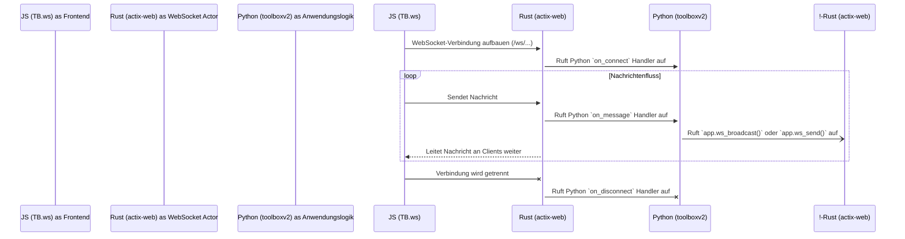

# ToolBoxV2 Developer Guide

Based on the provided documentation, here's a comprehensive guide on how to use the ToolBoxV2 framework for building applications.

## Introduction

ToolBoxV2 is a Python framework that provides a structured approach to building applications with standardized request handling and response formatting. It consists of two main components:

1. **RequestData Classes** - For handling HTTP requests with strong typing
2. **Result Class** - For standardized response handling and error management

## Setting Up Your Application

### Creating a Module

Start by initializing your application module:

```python
from toolboxv2 import get_app, App, RequestData, Result
from typing import Dict, Optional

# Define your module
MOD_NAME = "YOUR_MODULE_NAME"
version = "1.0"
export = get_app("{MODULE-NAME.SUB-MODULE}").tb
```

### Registering Functions

Use the `@export` decorator to register functions within your module:

```python
@export(mod_name=MOD_NAME, version=version)
def your_function():
    # Function logic here
    return Result.ok(data="Success")
```

## Function Types

### Standard System Functions

```python
# Basic function with App parameter
@export(mod_name=MOD_NAME, version=version, row=True)
def system_function(app: App):
    # Implementation
    return "Raw return value"  # Will be returned as-is because row=True

# Function without App parameter
@export(mod_name=MOD_NAME, version=version)
def function_without_app():
    # Implementation
    return Result.ok(data="Success")

# Function with arguments
@export(mod_name=MOD_NAME, version=version)
def function_with_args(name: str) -> Result:
    # Implementation
    return Result.ok(data=name)

# Function returning raw data
@export(mod_name=MOD_NAME, version=version, row=True)
def function_with_args_kwargs(name: str, nickname: Optional[str]=None) -> str:
    if nickname is None:
        nickname = ""
    return name + nickname  # Returned as raw string
```

### Async Functions

```python
@export(mod_name=MOD_NAME, version=version, row=True)
async def async_function(app: App):
    # Async implementation
    result = await some_async_operation()
    return result
```

### API Endpoints

```python
# API endpoint with request parameter
@export(mod_name=MOD_NAME, api=True, version="1.0", request_as_kwarg=True)
async def get_data(request: Optional[RequestData]=None):
    if request:
        query_params = request.query_params
        # Process query parameters
    return Result.json(data={"status": "success"})

# API endpoint with App and Request parameters
@export(mod_name=MOD_NAME, api=True, version="1.0", request_as_kwarg=True)
async def get_user_data(app, request: Optional[RequestData]=None):
    # Implementation using app and request
    return Result.ok(data={"user": "data"})

# API endpoint with specific HTTP methods
@export(mod_name=MOD_NAME, api=True, version="1.0", api_methods=['PUT', 'POST'])
async def update_data(app, data: Dict):
    # Process the JSON data received in the request body
    return Result.ok(data=data)

# API endpoint handling form data
@export(mod_name=MOD_NAME, api=True, version="1.0", api_methods=['PUT', 'POST'])
async def submit_form(app, form_data: Dict):
    # Process form data
    return Result.ok(data=form_data)
```

## Working with Request Data

### Accessing Request Information

```python
@export(mod_name=MOD_NAME, api=True, version="1.0", request_as_kwarg=True)
async def process_request(request: Optional[RequestData]=None):
    if request:
        # Access method and path
        method = request.method
        path = request.path

        # Access headers
        user_agent = request.headers.user_agent
        content_type = request.headers.content_type
        custom_header = request.headers.extra_headers.get('x-custom-header')

        # Access query parameters
        query_params = request.query_params
        search_term = query_params.get('search')

        # Access form data or JSON body
        if request.form_data:
            form_values = request.form_data

        if request.body and request.content_type == 'application/json':
            json_data = request.body

    return Result.ok(data="Request processed")
```

### Accessing Session Information

```python
@export(mod_name=MOD_NAME, api=True, version="1.0", request_as_kwarg=True)
async def get_user_session(request: Optional[RequestData]=None):
    if request and hasattr(request, 'session'):
        # Access session data
        session_id = request.session.SiID
        user_name = request.session.user_name
        session_level = request.session.level

        # Access custom session data
        custom_data = request.session.extra_data.get('custom_key')

    return Result.ok(data={"user": user_name})
```

## Working with Results

### Creating Different Types of Responses

```python
@export(mod_name=MOD_NAME, api=True, version="1.0")
async def response_examples(app):
    # Choose the appropriate response type based on your needs

    # 1. Standard success response
    return Result.ok(
        data={"key": "value"},
        info="Operation completed successfully"
    )

    # 2. JSON response
    return Result.json(
        data={"status": "online", "version": "1.0"},
        info="API status retrieved"
    )

    # 3. HTML response
    return Result.html(
        data="<html><body><h1>Welcome</h1></body></html>",
        info="Page rendered"
    )

    # 4. Text response
    return Result.text(
        text_data="Plain text content",
        content_type="text/plain"
    )

    # 5. Binary file response
    return Result.binary(
        data=binary_data,
        content_type="application/pdf",
        download_name="report.pdf"
    )

    # 6. Redirect response
    return Result.redirect(
        url="/dashboard",
        status_code=302
    )
```

### Error Handling

```python
@export(mod_name=MOD_NAME, version=version)
def process_with_validation(user_input):
    # Validate input
    if not user_input:
        return Result.default_user_error(
            info="Empty input is not allowed",
            exec_code=400
        )

    # Process valid input
    try:
        processed_data = process_data(user_input)
        return Result.ok(data=processed_data)
    except Exception as e:
        return Result.default_internal_error(
            info=f"Processing error: {str(e)}",
            exec_code=500
        )
```

### Using lazy_return for Simplified Error Handling

```python
@export(mod_name=MOD_NAME, version=version)
def validate_and_process(data):
    # Validate data
    validation_result = validate_data(data)

    # If validation fails, return the error
    # If validation succeeds, return the processed data
    return validation_result.lazy_return(
        'user',  # Use user error if validation fails
        data={"processed": True, "original": data}  # Return this if successful
    )
```

### Streaming Responses

```python
@export(mod_name=MOD_NAME, api=True, version="1.0")
async def stream_data():
    async def generator():
        for i in range(10):
            yield {"chunk": i}
            await asyncio.sleep(0.5)

    async def cleanup():
        # Cleanup resources when the stream closes
        print("Stream closed, performing cleanup")

    return Result.stream(
        stream_generator=generator(),
        info="Streaming data chunks",
        cleanup_func=cleanup
    )
```

## Advanced Features

### Caching

```python
# Memory caching
@export(mod_name=MOD_NAME, version=version, memory_cache=True,
        memory_cache_max_size=100, memory_cache_ttl=300)
def cached_function(key):
    # Expensive operation here
    return Result.ok(data=compute_expensive_data(key))

# File caching
@export(mod_name=MOD_NAME, version=version, file_cache=True)
def file_cached_function(key):
    # Expensive operation here
    return Result.ok(data=compute_expensive_data(key))
```

### Background Functions

```python
# Memory caching
@export(mod_name=MOD_NAME, version=version)
def function_with_log_running_bg_call():
    # Expensive operation here
    def sync_bg_function():
        print("running in gb")
        compute_expensive_function()

    return Result.ok(data="Starting processing").task(sync_bg_function)

# File caching
@export(mod_name=MOD_NAME, version=version)
async def function_with_log_running_bg_call():
    # Expensive operation here
    async def bg_function():
        print("running in gb")
        await compute_expensive_function()
    return Result.ok(data="Starting processing").task(bg_function())

```

### Lifecycle Management

```python
# Initialization function
@export(mod_name=MOD_NAME, version=version, initial=True)
def initialize_module(app: App):
    # Called when the module is loaded
    print(f"Initializing {MOD_NAME} module")
    # Set up resources, connections, etc.
    return Result.ok(info="Module initialized")

# Exit function
@export(mod_name=MOD_NAME, version=version, exit_f=True)
def cleanup_module(app: App):
    # Called when the application is shutting down
    print(f"Cleaning up {MOD_NAME} module")
    # Release resources, close connections, etc.
    return Result.ok(info="Module cleaned up")
```

### Pre/Post Compute Functions

```python
def log_before_execution(func, *args, **kwargs):
    print(f"Executing {func.__name__} with args: {args}, kwargs: {kwargs}")
    return args, kwargs

def log_after_execution(result, func, *args, **kwargs):
    print(f"Function {func.__name__} returned: {result}")
    return result

@export(mod_name=MOD_NAME, version=version,
        pre_compute=log_before_execution,
        post_compute=log_after_execution)
def monitored_function(name):
    # Function logic
    return Result.ok(data=f"Hello, {name}!")
```

## Dokumentation: WebSocket-Kommunikation

Diese Dokumentation beschreibt, wie Sie die WebSocket-Funktionalität für bidirektionale Echtzeitkommunikation zwischen dem `tbjs`-Frontend und dem `toolboxv2`-Backend nutzen können.

### Architekturübersicht

Die WebSocket-Kommunikation wird durch einen zentralen **Rust Actor** auf dem `actix_web`-Server verwaltet. Dieser Actor agiert als intelligente Brücke, die Verbindungen von Clients entgegennimmt, Nachrichten an die entsprechenden Python-Handler weiterleitet und Push-Nachrichten vom Python-Backend an die Clients sendet.



---

### Teil 1: Verwendung in JavaScript (`tbjs`)

Das `TB.ws`-Modul stellt eine einfache Schnittstelle zur Verwaltung von WebSocket-Verbindungen bereit.

#### `TB.ws.connect(url, options)`

Baut eine WebSocket-Verbindung zu einem bestimmten Endpunkt auf.

*   **`url` (String)**: Der Pfad zum WebSocket-Endpunkt auf dem Server. Das Format ist `/ws/{Modulname}/{HandlerName}`, z. B. `/ws/ChatModule/public_room`.
*   **`options` (Object, optional)**: Ein Objekt mit Callback-Funktionen:
    *   `onOpen(event)`: Wird aufgerufen, wenn die Verbindung erfolgreich hergestellt wurde.
    *   `onMessage(data, event)`: Wird bei jeder eingehenden Nachricht aufgerufen. `data` enthält die bereits als JSON geparsten Daten.
    *   `onClose(event)`: Wird aufgerufen, wenn die Verbindung geschlossen wird.
    *   `onError(event)`: Wird aufgerufen, wenn ein Fehler auftritt.

#### `TB.ws.send(payload)`

Sendet Daten an den Server.

*   **`payload` (Object)**: Ein JavaScript-Objekt, das als JSON-String an den Server gesendet wird.
    *   **Best Practice**: Verwenden Sie ein konsistentes Format wie `{ "event": "event_name", "data": { ... } }`, um die Verarbeitung auf der Serverseite zu vereinfachen.

#### `TB.ws.disconnect()`

Schließt die aktive WebSocket-Verbindung manuell.

#### Event-basiertes Lauschen

Zusätzlich zu den `onMessage`-Callbacks können Sie den globalen `TB.events`-Bus verwenden, um auf Nachrichten zu lauschen. Dies ist ideal für die Entkopplung Ihrer UI-Komponenten.

*   `TB.events.on('ws:message', ({ data, originEvent }) => { ... })`: Lauscht auf alle eingehenden WebSocket-Nachrichten.
*   `TB.events.on('ws:event:{event_name}', ({ data, originEvent }) => { ... })`: Wenn die eingehende Nachricht ein `{ "event": "event_name", ... }`-Format hat, wird dieses spezifische Event ausgelöst. **Dies ist die empfohlene Methode.**

#### Beispiel: Ein einfacher Chat-Client

```html
<!-- UI für den Chat -->
<div id="chat-log" style="height: 200px; border: 1px solid #ccc; overflow-y: scroll; padding: 5px;"></div>
<input type="text" id="chat-input" placeholder="Nachricht eingeben..." />
<button id="send-button">Senden</button>
```

```javascript
// JavaScript-Logik
function initializeChat() {
    const chatLog = document.getElementById('chat-log');
    const chatInput = document.getElementById('chat-input');
    const sendButton = document.getElementById('send-button');

    // 1. Verbindung aufbauen
    TB.ws.connect('/ws/ChatModule/public_room', {
        onOpen: () => {
            chatLog.innerHTML += '<div><em>Verbindung zum Chat hergestellt.</em></div>';
        },
        onClose: () => {
            chatLog.innerHTML += '<div><em>Verbindung zum Chat verloren.</em></div>';
        }
    });

    // 2. Auf neue Nachrichten vom Server lauschen (Best Practice)
    TB.events.on('ws:event:new_message', ({ data }) => {
        const message = data.data; // Die Struktur ist { event: '...', data: { user: '..', text: '..' } }
        const messageDiv = document.createElement('div');
        messageDiv.innerHTML = `<strong>${message.user}:</strong> ${message.text}`;
        chatLog.appendChild(messageDiv);
        chatLog.scrollTop = chatLog.scrollHeight;
    });

    // Lauschen auf andere Events
    TB.events.on('ws:event:user_joined', ({ data }) => {
        chatLog.innerHTML += `<div><em>${data.data}</em></div>`;
    });
     TB.events.on('ws:event:user_left', ({ data }) => {
        chatLog.innerHTML += `<div><em>${data.data}</em></div>`;
    });


    // 3. Nachricht senden, wenn der Button geklickt wird
    sendButton.addEventListener('click', () => {
        const messageText = chatInput.value;
        if (messageText.trim() === '') return;

        TB.ws.send({
            event: "chat_message", // Entspricht dem Python-Handler
            data: {
                message: messageText
            }
        });

        chatInput.value = '';
    });
}

// Initialisiere den Chat, sobald tbjs bereit ist
TB.events.on('tbjs:initialized', initializeChat, { once: true });
```

---

### Teil 2: Implementierung in Python (`toolboxv2`)

Die serverseitige Logik wird durch einen speziellen `@export`-Decorator und `async`-Handler-Funktionen definiert.

#### `@export(websocket_handler="handler_name")`

Dieser Decorator registriert eine Initialisierungsfunktion für einen WebSocket-Endpunkt.

*   **`websocket_handler` (String)**: Definiert den Namen des Handlers. Der vollständige Endpunkt-Pfad für den Client lautet dann `/ws/{mod_name}/{handler_name}`.
*   Die dekorierte Funktion **muss** ein Dictionary zurückgeben, das die `async`-Funktionen für die WebSocket-Events (`on_connect`, `on_message`, `on_disconnect`) zuordnet.

#### Event-Handler

Jeder Handler ist eine `async`-Funktion und erhält die folgenden Argumente:

*   **`app: App`**: Die globale `App`-Instanz.
*   **`conn_id: str`**: Eine eindeutige ID für die WebSocket-Verbindung des Clients.
*   **`session: dict`**: Die Sitzungsdaten des verbundenen Benutzers.
*   **`payload: dict` (nur für `on_message`)**: Die vom Client gesendeten und als Dictionary geparsten JSON-Daten.

#### Server-Push-Funktionen

Die `App`-Instanz bietet zwei `async`-Methoden, um Nachrichten proaktiv an Clients zu senden:

*   **`await app.ws_send(conn_id: str, payload: dict)`**:
    *   Sendet eine Nachricht an eine **einzelne, spezifische Verbindung** (1-zu-1).
    *   Ideal für private Nachrichten oder Bestätigungen.

*   **`await app.ws_broadcast(channel_id: str, payload: dict, source_conn_id: str = "")`**:
    *   Sendet eine Nachricht an **alle Clients**, die mit einem bestimmten Kanal verbunden sind (1-zu-N).
    *   `channel_id`: Muss dem `{mod_name}/{handler_name}` entsprechen.
    *   `source_conn_id` (optional): Wenn angegeben, wird die Nachricht nicht an diesen Client zurückgesendet (verhindert Echos).

#### Beispiel: Das Chat-Modul-Backend

```python
# toolboxv2/mods/chat_module.py

from toolboxv2 import get_app, App
from toolboxv2.utils.system.types import Result

app = get_app("ChatModule")
export = app.tb
Name = "ChatModule"

# --- 1. Definiere die asynchronen Event-Handler ---

async def on_user_connect(app: App, conn_id: str, session: dict):
    """Wird aufgerufen, wenn ein neuer Client eine Verbindung herstellt."""
    username = session.get("user_name", "Anonymous")
    app.print(f"WS CONNECT: User '{username}' connected with conn_id: {conn_id}")

    # Sende eine Willkommensnachricht nur an den neuen Benutzer
    await app.ws_send(conn_id, {"event": "welcome", "data": f"Welcome, {username}!"})

    # Informiere alle anderen im Raum über den neuen Benutzer
    await app.ws_broadcast(
        channel_id="ChatModule/public_room",
        payload={"event": "user_joined", "data": f"{username} has joined the chat."},
        source_conn_id=conn_id  # Verhindert, dass der neue User seine eigene "joined"-Nachricht erhält
    )

async def on_chat_message(app: App, conn_id: str, session: dict, payload: dict):
    """Wird aufgerufen, wenn eine Nachricht vom Client empfangen wird."""
    username = session.get("user_name", "Anonymous")
    # Der Payload vom Client hat die Struktur: { "event": "chat_message", "data": { "message": "..." } }
    message_text = payload.get("data", {}).get("message", "").strip()

    if not message_text:
        return # Leere Nachrichten ignorieren

    app.print(f"WS MESSAGE from {username} ({conn_id}): {message_text}")

    # Sende die formatierte Nachricht an alle im Raum (inklusive Absender)
    await app.ws_broadcast(
        channel_id="ChatModule/public_room",
        payload={"event": "new_message", "data": {"user": username, "text": message_text}}
    )

async def on_user_disconnect(app: App, conn_id: str, session: dict):
    """Wird aufgerufen, wenn ein Client die Verbindung trennt."""
    username = session.get("user_name", "Anonymous")
    app.print(f"WS DISCONNECT: User '{username}' disconnected (conn_id: {conn_id})")

    # Informiere alle verbleibenden Benutzer
    await app.ws_broadcast(
        channel_id="ChatModule/public_room",
        payload={"event": "user_left", "data": f"{username} has left the chat."}
    )

# --- 2. Registriere die Handler mit dem Decorator ---

@export(mod_name=Name, websocket_handler="public_room")
def register_chat_handlers(app: App):
    """
    Diese Funktion wird beim Laden des Moduls aufgerufen.
    Sie gibt ein Dictionary zurück, das die Handler für die WebSocket-Events definiert.
    """
    return {
        "on_connect": on_user_connect,
        "on_message": on_chat_message,
        "on_disconnect": on_user_disconnect,
    }
```

## URL Patterns for API Endpoints

API endpoints are accessible using the following URL patterns:

- Regular API: `/api/MOD_NAME/{function_name}?param1=value1&param2=value2`
- Server-Sent Events (streaming): `/sse/MOD_NAME/{function_name}?param1=value1&param2=value2`
