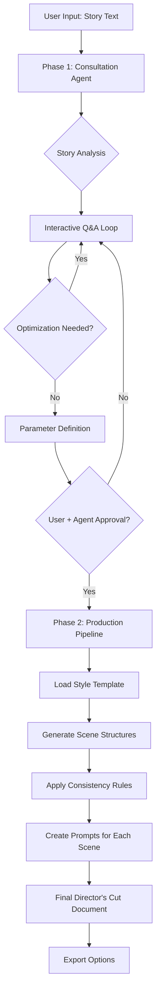

# Director's Cut Pipeline - Technical Specifications v1.0

## Systemübersicht

Ein zweistufiges KI-gestütztes System zur Transformation von Story-Input in strukturierte, konsistente Director's Cut Prompts für Bild- und Video-Generatoren.

---

## Phase 1: Interactive Story Consultation Loop

### Agent-Rolle: Story & Viral Optimization Specialist

#### Aufgaben
1. **Story-Analyse**
   - Input-Story auf virale Eignung prüfen
   - Emotionale Trigger identifizieren (Freude, Trauer, Überraschung, Nostalgie, etc.)
   - Konflikt-Struktur bewerten (Fallhöhe, Stakes, Veränderung)
   - Spannungsbogen analysieren (Hook, Build-up, Climax, Resolution)

2. **Interaktive Optimierung**
   - Kritische Fragen stellen:
     * "Welche Emotion soll dominieren?"
     * "Wer ist die Zielgruppe?"
     * "Welche Plattform (TikTok/Instagram/YouTube)?"
     * "Gewünschte Gesamtlänge?"
     * "Wie viele Szenen sind optimal? (Empfehlung basierend auf Story-Komplexität)"

3. **Konstruktive Kritik**
   - **Wenn Story viral-geeignet**: Stärken hervorheben, Optimierungsvorschläge
   - **Wenn Story problematisch**: Klare Kritik mit Verbesserungsvorschlägen
     * "Diese Geschichte fehlt emotionale Wucht - füge einen persönlichen Verlust hinzu"
     * "Der Konflikt ist zu schwach - erhöhe die Stakes"
     * "Keine klare Transformation erkennbar - definiere Anfang vs. Ende"

4. **Parameter-Definition**
   ```yaml
   story_parameters:
     total_scenes: 8-12 (abhängig von Komplexität)
     total_duration: "2-5 Minuten"
     target_platform: ["TikTok", "Instagram", "YouTube", "Universal"]
     primary_emotion: ["Joy", "Sadness", "Surprise", "Fear", "Nostalgia"]
     secondary_emotions: []
     art_style: "definiert in Phase 2"
     pacing: ["slow", "medium", "fast", "variable"]
   ```

#### Approval-Gate
- User und Agent müssen explizit bestätigen: **"Story approved for production"**
- Erst dann erfolgt Übergang zu Phase 2

---

## Phase 2: Director's Cut Production Pipeline

### Generator-Agent: Technical Director's Cut Creator

#### Input-Requirements

```yaml
required_inputs:
  story_text: "Vollständiger Story-Text"
  approved_parameters: "Aus Phase 1"
  style_template: "Optional: Custom Style Compilation"

optional_inputs:
  reference_images: []
  reference_videos: []
  custom_music_preferences: {}
  brand_guidelines: {}
```

#### Output-Struktur

Für **jede Szene** wird ein vollständiger Prompt-Block erstellt:

```yaml
scene_structure:
  scene_number: 1-N
  scene_title: "Beschreibender Titel"
  duration: "15-30 Sekunden"

  # STORY CONTEXT
  narrative:
    what_happens: "Detaillierte Beschreibung der Handlung"
    character_actions: "Was tun die Charaktere?"
    dialogue: "Optional: Gesprochene Worte"
    emotional_beat: "Welche Emotion wird hier getriggert?"

  # VISUAL SPECIFICATIONS
  cinematography:
    camera_type: ["Wide Shot", "Medium Shot", "Close-Up", "Extreme Close-Up", "POV", "Drone Shot"]
    camera_movement: ["Static", "Pan", "Tilt", "Dolly", "Tracking", "Handheld", "Crane"]
    lens: ["Wide Angle 24mm", "Standard 50mm", "Portrait 85mm", "Telephoto 200mm"]
    focal_length_changes: "Optional"

  lighting:
    time_of_day: ["Dawn", "Morning", "Noon", "Afternoon", "Dusk", "Night"]
    lighting_setup: ["Natural", "Three-Point", "Dramatic", "Flat", "Silhouette"]
    color_temperature: ["Warm 3200K", "Neutral 5600K", "Cool 7000K"]
    mood: ["Bright", "Dim", "Moody", "High-Contrast", "Low-Key"]

  art_direction:
    art_style: "Konsistent über alle Szenen"
    color_palette: ["Primärfarben", "Sekundärfarben", "Akzentfarben"]
    visual_effects: ["None", "Lens Flare", "Bloom", "Vignette", "Grain", "Chromatic Aberration"]
    atmosphere: ["Clear", "Foggy", "Rainy", "Dusty", "Ethereal"]

  # SPATIAL & TEMPORAL CONSISTENCY
  location:
    setting: "Genauer Ort (muss über Szenen konsistent bleiben)"
    coordinates: "Optional: GPS oder beschreibend"
    environment_details: ["Architektur", "Vegetation", "Wetter", "Tageszeit"]

  temporal:
    story_time: "Wann in der Gesamtgeschichte?"
    real_time_duration: "Tatsächliche Szenen-Länge"
    time_relation_to_previous: ["Immediately after", "5 minutes later", "Next day", "Flashback"]

  # CHARACTER CONTINUITY
  characters:
    - name: "Charaktername"
      appearance: "Physische Beschreibung (Alter, Kleidung, Haare, etc.)"
      position: "Wo im Frame?"
      action: "Was tut die Person?"
      expression: "Gesichtsausdruck"
      consistency_note: "Referenz zu vorherigen Szenen"

  # AUDIO DESIGN
  audio:
    music:
      type: ["Ambient", "Piano", "Strings", "Electronic", "None"]
      mood: "Emotional Quality"
      volume: ["Low", "Medium", "High"]
      transition: ["Fade In", "Cut", "Crossfade", "Fade Out"]

    sound_effects:
      - type: "Effekt-Name"
        timing: "Wann im Clip?"
        volume: "Lautstärke"

    dialogue:
      - speaker: "Wer spricht?"
        text: "Gesprochener Text"
        delivery: ["Calm", "Excited", "Sad", "Angry", "Whispering"]

    ambient_sound: "Hintergrundgeräusche"

  # EDITING SPECIFICATIONS
  editing:
    cut_type_in: ["Hard Cut", "Fade", "Dissolve", "Wipe", "Match Cut"]
    cut_type_out: ["Hard Cut", "Fade", "Dissolve", "J-Cut", "L-Cut"]
    pace: ["Slow", "Medium", "Fast"]
    special_transitions: "Optional: Besondere Übergänge"

  # GENERATOR PROMPTS
  prompts:
    image_generator: |
      [Vollständiger Prompt für Midjourney/DALL-E/Stable Diffusion]
      Enthält: Style, Subject, Lighting, Camera, Mood, Technical specs

    video_generator: |
      [Vollständiger Prompt für Runway/Pika/Stable Video]
      Enthält: Movement, Duration, Transitions, Continuity notes

    audio_generator: |
      [Prompt für Music/Sound Generation]
      Enthält: Mood, Instruments, Tempo, Duration
```

#### Konsistenz-Regeln

```yaml
consistency_enforcement:

  visual_continuity:
    - Art Style muss über ALLE Szenen identisch sein
    - Charaktere müssen visuell konsistent bleiben (Kleidung nur ändern bei Story-Bedarf)
    - Locations müssen räumlich logisch sein
    - Licht muss zeitlich passen (Dämmerung → Nacht, nicht umgekehrt)

  temporal_continuity:
    - Szenen müssen chronologisch oder klar als Flashback markiert sein
    - Zeit-Übergänge müssen explizit kommuniziert werden
    - Keine zeitlichen Paradoxien

  narrative_continuity:
    - Jede Szene baut auf vorheriger auf
    - Emotionaler Bogen muss kohärent sein
    - Charakterentwicklung muss nachvollziehbar sein

  technical_continuity:
    - Kamera-Stil sollte konsistent bleiben (außer bei bewussten Stil-Brüchen)
    - Audio-Stil muss harmonieren
    - Schnitt-Rhythmus sollte der Story-Phase entsprechen
```

---

## Style Templates System

### Custom Style Compilation

Ermöglicht es, vordefinierte oder custom Style-Pakete zu laden:

```yaml
style_template_structure:

  template_name: "Beispiel: Cinematic Nostalgia"

  visual_style:
    art_direction: "35mm film, slight grain, muted colors, vintage film look"
    color_grading: "Warm tones, desaturated, slightly faded"
    camera_preference: "Handheld, intimate framing"
    lighting_approach: "Natural light, golden hour preference"

  audio_style:
    music_genre: "Indie folk, acoustic, melancholic"
    sound_design: "Realistic, organic, minimal"

  pacing_style:
    cut_rhythm: "Slow, contemplative"
    scene_duration_preference: "Longer scenes (20-30s)"

  narrative_approach:
    storytelling_method: "Non-linear, memory-based"
    emotional_focus: "Nostalgia, bittersweet"
```

### Vordefinierte Templates

```yaml
available_templates:

  1. "Viral TikTok Energy":
     - Fast cuts, high energy, trending audio
     - Vertical format optimiert
     - Hook in ersten 3 Sekunden

  2. "YouTube Documentary":
     - Professionell, informativ
     - Medium pacing
     - Voice-over fokussiert

  3. "Cinematic Short Film":
     - Slow, artistic
     - Film-look (Grain, Aspect Ratio)
     - Atmospheric audio

  4. "Instagram Story Flow":
     - Episodisch, 15s segments
     - Text overlays
     - Quick emotional beats

  5. "Paranormal Mystery":
     - Wie im Beispiel-Dokument
     - Surreal, dreamlike
     - Cool tones, ambient audio
```

### Custom Template Creation

User kann eigene Templates kompilieren:

```python
# Pseudo-Code
custom_template = {
    "name": "My Brand Style",
    "visual": {
        "colors": ["#FF5733", "#C70039"],
        "film_stock": "ARRI ALEXA LF",
        "aspect_ratio": "2.39:1"
    },
    "audio": {
        "signature_sound": "Synthwave pads",
        "sfx_library": "custom_library.zip"
    }
}

pipeline.load_template(custom_template)
```

---

## Workflow-Ablauf



---

## Export-Formate

### 1. **Master Document** (Markdown)
```markdown
# Director's Cut - [Story Title]

## Production Metadata
- Total Scenes: 10
- Total Duration: 4:30
- Art Style: Cinematic Nostalgia
- Target Platform: YouTube

---

## Scene 1: [Title]
[Vollständiger Scene Block wie oben]

---

## Scene 2: [Title]
...
```

### 2. **JSON für API-Integration**
```json
{
  "project": {
    "title": "Story Title",
    "metadata": {},
    "scenes": [
      {
        "scene_number": 1,
        "prompts": {
          "image": "...",
          "video": "...",
          "audio": "..."
        }
      }
    ]
  }
}
```

### 3. **Shot List (Produktion)**
Excel/CSV mit allen technischen Details für echte Film-Produktion

### 4. **Generator-Ready Prompts**
Separate Text-Dateien pro Generator:
- `midjourney_prompts.txt`
- `runway_prompts.txt`
- `suno_music_prompts.txt`

---

## Qualitätssicherung

### Automated Checks

```yaml
quality_checks:

  consistency_validation:
    - Prüfe: Alle Szenen haben gleichen Art Style
    - Prüfe: Charaktere bleiben konsistent
    - Prüfe: Zeitliche Logik
    - Prüfe: Räumliche Kohärenz

  completeness_validation:
    - Prüfe: Alle Felder ausgefüllt
    - Prüfe: Prompts für alle Generatoren vorhanden
    - Prüfe: Audio für jede Szene definiert

  viral_potential_score:
    - Emotional Hooks: 0-10
    - Shareability: 0-10
    - Pacing: 0-10
    - Hook-Qualität: 0-10
    - Gesamt-Score: 0-40
```

---

## Implementierungs-Schritte

### Phase 1 Implementation

```python
class StoryConsultationAgent:
    def __init__(self):
        self.conversation_history = []

    def analyze_story(self, story_text):
        """Analysiert Story auf virale Eignung"""
        return {
            "emotional_triggers": [],
            "conflict_strength": 0-10,
            "viral_potential": 0-10,
            "optimization_suggestions": []
        }

    def interactive_loop(self):
        """Führt durch Optimierung"""
        while not self.is_approved():
            self.ask_questions()
            self.provide_feedback()
            self.suggest_improvements()

        return self.finalize_parameters()
```

### Phase 2 Implementation

```python
class DirectorsCutGenerator:
    def __init__(self, story_params, style_template):
        self.params = story_params
        self.style = style_template

    def generate_scene_structure(self, scene_number):
        """Erstellt vollständige Szenenstruktur"""
        scene = {
            "scene_number": scene_number,
            "narrative": self._generate_narrative(),
            "cinematography": self._generate_camera_specs(),
            "lighting": self._generate_lighting(),
            # ... alle Felder
        }
        return scene

    def ensure_consistency(self, scenes):
        """Validiert und erzwingt Konsistenz"""
        self._check_visual_continuity(scenes)
        self._check_temporal_logic(scenes)
        self._check_character_consistency(scenes)

    def export_prompts(self, format="markdown"):
        """Exportiert in gewünschtem Format"""
        pass
```

---

## Beispiel-Output

Siehe separate Datei: `example_directors_cut.md`

---

## Erweiterungen & Roadmap

### V1.1
- Multi-Language Support
- Storyboard-Generierung (visuelle Thumbnails)
- Automatische Musik-Empfehlungen via AI

### V2.0
- Direktes API-Integration mit Midjourney/Runway
- Automatisches Rendering
- A/B Testing verschiedener Schnitte

### V3.0
- Community Style Library
- Kollaborative Bearbeitung
- Echtzeit-Preview

---

## Technologie-Stack Empfehlung

```yaml
backend:
  - Python 3.11+
  -   - ToolBOXV2
  - FastAPI (API Server)
  - ISAA (Agent Orchestration)
  - Claude 4.5 Sonnet (Consultation Agent)
  - qwen-3 (Backup)

frontend:
  - TBjs custom
  -  Flow (Workflow Visualization)

storage:
  - ToolBoxV2 DB (Persistent Storage)

integrations:
  - Midjourney API (Bilder)
  - Runway API (Videos)
  - Suno API (Musik)
```

---

## Lizenz & Credits

System Design: Based on viral storytelling principles and cinematic best practices.

---

**Version:** 1.0
**Last Updated:** 2025-11-15
**Status:** Specification Complete - Ready for Implementation
